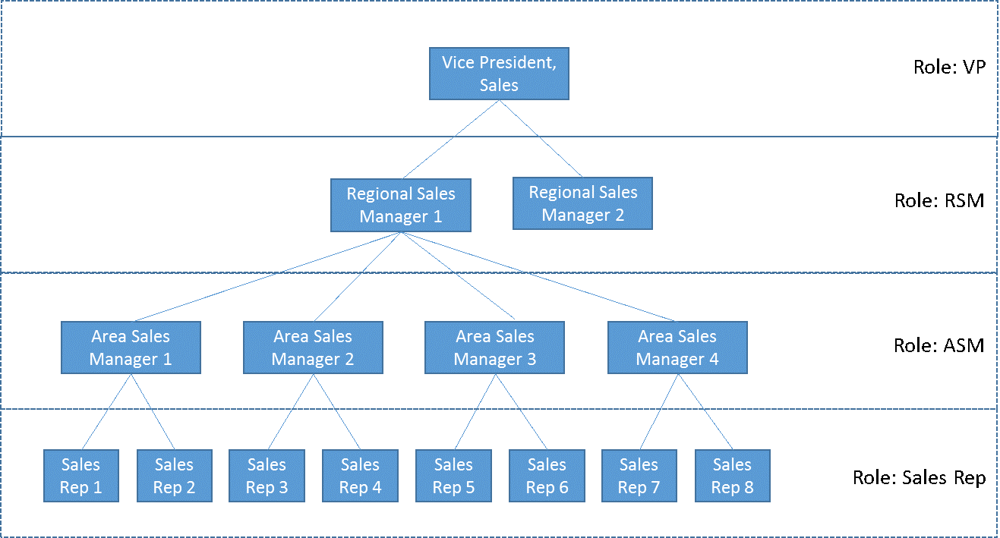

# Platform Fundamentals

## What is Salesforce platform about?

### Salesforce Apps

#### User Interface Components

#### Chatter

### How to use Salesforce?

### Editions

## Users

### Security

#### Roles

#### Profiles

#### Permissions

#### Permission Sets

### Licenses

## Salesforce AppExchange

## Data Security

## Workshop

Complete the following tasks.

| No. | Type    | Description                                      | Time (hrs) |
| --- | ------- | ------------------------------------------------ | ---------- |
| 1   | Do      | Install apps from AppExchange                    | 0.5        |
| 2   | Present | Differences between trial, test drive trialforce | 0.5        |
| 3   | Do      | App licenses                                     | 0.5        |
| 4   | Do      | Security                                         | 0.5        |
| 5   | Do      | Create role hierarchy and explore                | 0.5        |
| 6   | Do      | Create profile/permission sets and explore       | 1          |
| 7   | Do      | Enable Chatter                                   | 0          |

### Install Apps

Install following apps in your dev org.

1. [Volunteers for Salesforce](https://appexchange.salesforce.com/appxListingDetail?listingId=a0N30000003JBggEAG)
2. [Salesforce Adoption Dashboards](https://appexchange.salesforce.com/appxListingDetail?listingId=a0N30000004gHhLEAU)
3. [Conga composer](https://appexchange.salesforce.com/appxListingDetail?listingId=a0N300000016b7FEAQ)
4. [Survey Monkey](https://appexchange.salesforce.com/appxListingDetail?listingId=a0N3A00000EOBliUAH)
5. Make note of where can you see the installed packages in the application
6. Go to the package. Select any `App` created by one of the packages. Copy the name.
7. Create a new `App` by the same name. Will Salesforce allow you to create such an app? Why?

### Differences between trial, test drive trialforce

1. List at least 3 differences between how AppExchange enables trial, test-drive and trialforce apps.
2. Imagine you will create an app called “KEvents” to enable users to manage events like corporate events, teaching and education, professional training for medical reps. You will put a cost of \$500 / org. Do you enable trial for the app? If yes, how? Outline why you chose an option
3. You will release the second version of “KEvents” with map integration, travel ticket booking for attendees including availability checks, hotel booking for attendees incl. best rate checks and a cool function to showcase “sights to visit” in the event city. You will increase the cost to \$5000 / org. Will this impact your earlier decision? If yes, how and why?

### App licenses

1. Create user `sr1`, and do not assign any license. Login as SR1. Which apps does the user see – list them? Why does she see any views/ data if no license is assigned?
2. Assign license `Work.com only` to `sr1`. Will she now be able to see the app? Why / why not?
3. Where can you find out how many licenses are available/consumed in your Salesforce app?

### Security

1. Change login time range for `sr1` to 08:00 AM EST to 6:00 PM EST. Save record
2. Logout of `sr1` session if you have logged in. Can you login during IST day time now?
3. Remove login time restrictions
4. Add password string restrictions to contain at least one capital letter, two special characters. Test functionality by trying to reset password for `sr1`

### Create role hierarchy and explore

1. Create the following role hierarchy
   
1. Create user `sr1`, and assign role as `Sales Rep 1`
1. Create user `sm1` and assign role as `Area Sales Manager 1`
1. Login as `sr1`. Create 5 accounts, create 5 tasks
1. Login as `sm1`. Is the user able to see accounts and tasks? List why?

### Create profiles/permission sets and explore

1. Create the following profiles
   - UC Admin – clone from System Administrator
   - UC Sales Rep – clone from Standard User
2. What gets copied over from the roles? List down 3 reasons to clone profiles rather than creating them afresh.
3. Create permission set - `UC Sales Rep Order Super Editor`.
   - Provide “Edit Activated Orders” app permission
   - Provide “Edit” object permission for Orders object
   - Remove ‘Export Reports’ system permission
4. Create following profile – UC Sales Rep No Order
   - Remove order edit object permission
5. Assign the profile and permission set to `sr1`. Is the user able to edit activated order?
6. Create profile – `UC Sales Mgr No Sales`
   - Remove view/edit permissions on sales app
7. Assign `UC Sales Mgr No Sales` to `sm1`. Logout and log back in. Will manager still be able to see sales app?
8. Create a permission set called `UC Sale Sale`. Add permission set to `sm1`. Logout and log back in. Will `sm1` see `Sales` app now? Why?

### Enable Chatter

1. Enable Chatter feed in your org.
2. Follow 2 of your favourite accounts. List down how account updates are mentioned in Chatter. How will you get notified?

## Teaching Aids

### Presentation

#### 1. Platform Fundamentals: SF-Monkey

&nbsp;

  <iframe src="https://docs.google.com/presentation/d/e/2PACX-1vSNcT_AgPRtmWBlz2Xe0tpX8Pb7hpENWGWlgVwmAJIOJ40G2AI71i7zi_VZ_S6WOg/embed?start=false&loop=false&delayms=60000" frameborder="0" width="800" height="600" allowfullscreen="true" mozallowfullscreen="true" webkitallowfullscreen="true"></iframe>

[More info](/misc/pricing#sf-monkey)
