# Platform Fundamentals

At this point, you have gone through what salesforce is. We will see what components make up Salesforce and how it behaves for various types of users and organizations.

## What is Salesforce platform about?

Out of the box, Salesforce provides you with a standard core CRM product, a sales product, service product and so on - the functionality depends on which product or edition you choose. You build applications on top of the product/platform and customise for your need.

And.. by "platform" - we mean the base product that comes with Salesforce. The platform enables you to carry out customisations to tailor the out of the box (OOB) Salesforce product. The customisations can be with or without using code - administrators or developers can change application behaviour for all users.

- Add new fields or entities
- Change validation
- Enable system to automatically send emails when you change opportunity status

The users themselves have some freedom to decide how they use the application. For .e.g they can set default filters on screens, change appearance, change locale etc.

A "product" can be referred to the set of specific functions like sales or service built on top of the Salesforce platform. A product may also be licensed from third parties from AppExchange - for e.g. Veeva product is available on AppExchange and is mainly targeted at Pharma companies.

Companies and people may just refer to the product they have licensed from Salesforce (& third parties) as the platform, and start adding more customisations on top of the product. This is ok for the real world.

### Terms associated with Salesforce

Here are a few terms that get associated with Salesforce.

#### Multitenant cloud

A "tenant" is a group of users with access to common functionality and data on Salesforce. A tenant may be a single organisation, a division of a company, an adhoc group focused on a function (e.g. high-value sales team) etc.

Salesforce supports multiple tenants on its platform - you and thousands of other companies logon to the same platform. But individually, each of those tenants have access to their own functions/data and nothing else.

#### Cloud-based Platform

Almost all of salesforce is accessible and usable through a simple browser. The platform resides on servers available across different locations over the globe, but a tenant or user doesn't really care about the infrastructure and how all of it functions. A user just needs Internet to achieve nirvana.

Also see what cloud computing description in the previous section.

#### Pay as you go

There are no costs affixed to "owning the platform", no costs to buy infrastructure and "set everything up".

All you need to do is -

1. Determine the functionality (and editions)
1. Determine number of users
1. Customise the app when needed
1. Start using the application

You vary the costs depending on users active on the system, and can vary the number of users at any time.

You can also stop using the app for whatever reason at any time (there are yearly payment plans and longer commitments - but you get the gist).

Salesforce applications load the "operational expenses" (OpEx) part of company's expenses since the costs tend to be distributed over the usage period.

Traditional software applications have focused on selling "licenses" that demanded upfront costs for licenses and maintenance through a procurement process at the beginning of a lifecycle. They typically would be considered "capital expense" (CapEx) since that commitment was at the beginning, (mostly) irreversible and did not quite depend on whether you had more or fewer users (again, typical case - there are more exceptions here than stars in Andromeda).

#### Super scalable

Salesforce supports hundreds of thousands of users on its platform. As a user you just spin up an instance and can scale that to

- any number of other users /collaborators
- more functions

(we will get to the limits of the system later)

#### Customisable to suite your unique needs

Saleforce provides all aspects of functionality that a modern enterprise needs - out of the box customer functions, industry standard authentication, role-based authorization, data security including powerful filter rules, validations and data encryption, and more.

At the same time Salesforce supports powerful configuration & customisation of screens and business layer objects including creation of new entities/fields, data access rules, validation rules and automation logic. Companies can also use one or more apps from AppExchange (or from elsewhere, for that matter) to further extend the functionality from Salesforce.

Each of these customisations are applicable to the particular instance used by the tenant (also called a Salesforce "org"). The customisations are done by changing "metadata" (= data about data) for the org.

## Underlying Components in Salesforce

We will delve a bit more into components that make up Salesforce.

### Layered Architecture

Any application /system will have multiple layers to do its job. You can visualise those layers with the following diagram.

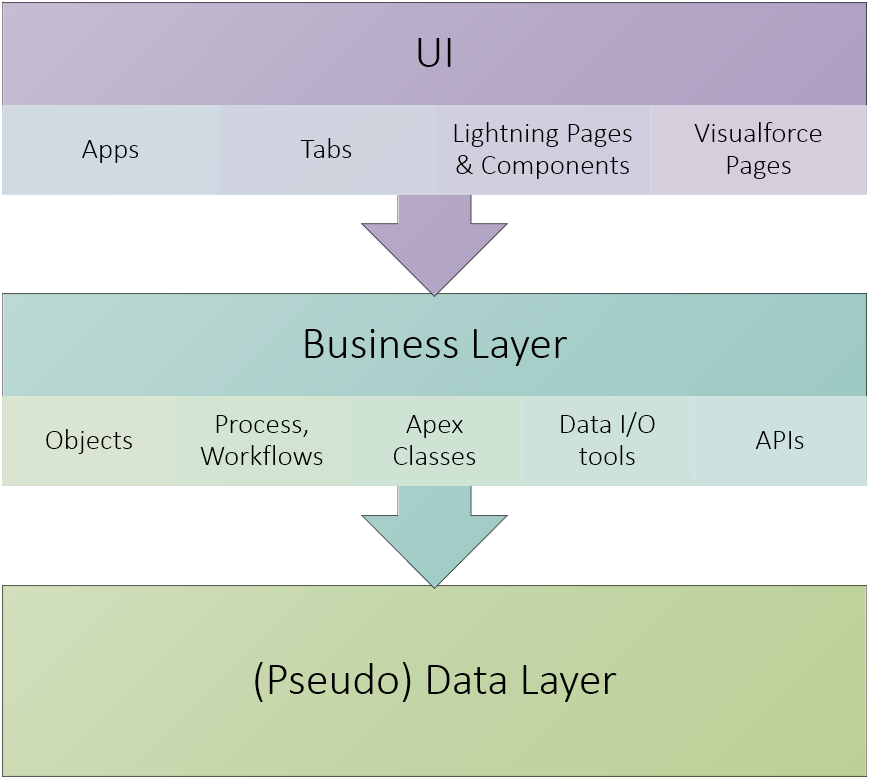

- The User Interface ("UI") layer has apps (a group of tabs), tabs that you can click on to navigate to different pages, and custom-built pages / components of pages that use Lightning or Visualforce
- The business layer supports UI by providing a window to data after applying security rules and data manipulation logic. It also enables data validation rules and business automation
- Data layer can be just imagined as a underlying database that exists somewhere in the background. It is abstracted from us using business layer, which serves as the foundational layer in salesforce

The customisation of a Salesforce app consists of designing and developing an app. This typically consists of two major steps -

**Design top-down**

Start with what users want to see and where do they want to see them, and how do they carry out their tasks. Then design the business layer including business objects, validation rules and automation routines.

**Develop bottom-up**

Start developing the business layer - from business objects before moving on to the UI layer.

If you think the above clear-cut process sounds too good to be true, you will be right. It is representational - any design/development process will iterate amongst all layers.

### User Interface Components

Users interact with the application through UI (the name gives away all the suspense).

UI consists of -

- apps: containers of all goodness
- tabs: click on 'em to get to pages
- elements that make up a page
  - input elements like fields (text fields, drop-downs), buttons
  - display elements like labels, image galleries
  - complex elements that are made up of other UI elements and data - like forms, list views, charts, etc.

You can create UI in Salesforce through drag/drop action

### Salesforce Apps

Apps lead you into the wonderful world of salesforce applications. While they are the starting point, you can see that the user interface ("UI") is made up of many, many more elements.

At the same time, UI is all but a layer that relies on other layers to fetch data, do validations etc.

Salesforce apps can be seen as a bunch of screens that provides a nice boxed layout for related functionality.

The app consists of -

1. One or more tabs
1. A logo
1. Little else

An "app" is just a starting point of your amazing application. Salesforce gives you apps based on what you purchased and you can create your own apps.

You access the app through the navigation bar - by clicking on 'app launcher' button.

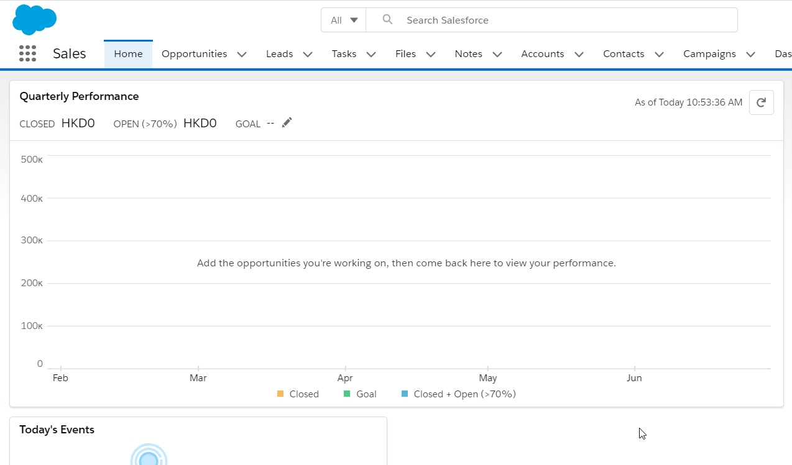

The product you license from salesforce (like sales cloud) determine which app you have access to. But, guess what - you could always create more apps on existing functionality. Yay!

For e.g. if you have Sales Cloud, nothing will prevent you from having 'Sales - Retail', 'Sales - Wholesale' apps targeting two different groups and having two distinct set of tabs.

To see available apps in your "org" or salesforce instance -

1. Go to **Setup** > **Platform Tools** > **Apps** > **App Manager** [once again, though we outline navigation for completeness, you should be using **Quick Find** box in **Setup** to directly go to **App Manager**]
1. You can click on the drop-down button and select **Edit** to edit an app. You cannot change the logo or label for standard apps

You can modify a few properties by editing an app -

1. Modify app to be a 'Custom App' or 'Console' app. We will deal with custom only for now
1. Change basic attributes like name, label. Change logo
1. You can Select tabs visible in the app. Note that the tabs provide a way for users to easily navigate to the functionality. Users can search for a tab even when they are "hidden" in app and access the tab
1. Assign tab to profiles - you can also make different tabs as default against individual profiles
1. Click **Save** to finally save the app

The above behaviour is the default behaviour for creating new apps in Salesforce Classic.

In Salesforce Lightning Experience, which should be the default for all new orgs, we have a new improved functionality. To create a new app, just click on **New Lightning App** button from the same App configuration screen -

1. Select App Name, Label and Logo
1. Select supported navigation style (again - standard or console) and form factors
1. Add 'Utility Items' - quick ways to perform an action (e.g. publish something to Chatter)
1. Select tabs and select user profiles for which the application is visible
1. Click on **Save & Finish** to save the new app

You will start seeing the new app from the 'App Launcher'.

Confused on the outlined UI experience differences for editing apps/creating new apps? See [Lightning experience vs. classic UI in Salesforce](/admin-guide/configure-custom-functionality/#revisiting-user-interface).

### Tabs

Tabs expose a business entity & function on UI. You click on a tab to reach pages that consist of UI elements like charts, list views or detail views.

When you choose a typical app (example image depicted above), you can see a bunch of tabs for cases, accounts, reports etc. Clicking on the tab will get you access to the pages associated to the app -

1. Sales app may have opportunities, orders, activities tabs
1. Service app may have cases, service orders, activities tabs

Tabs can lead to the same function/entity (e.g. activities) in more than one app.

Tabs are directly mapped to business object in the business layer - however, there can be more than one tab on a single business object. Remember that we said "typically" - there are exceptions abound to this non-rule. For e.g. home / report tabs can have dashboards that are based on unrelated components.

Any page reached by clicking through a tab is typically based on the root business object that the tab is based on or a related entity. This makes sense since we (pretend to ) learn our organizational skills from 'day 0'.

You can create tabs for -

1. Any objects that you create
1. Any Lightning or Visualforce pages that you create
1. Lightning Components can be housed in a tab as well
1. Any external web pages that need to be displayed in a separate tab

To create a tab -

1. Navigate to **Setup**
1. Find for **Tabs**
1. Create away them tabs

### Pages and Views

You click on tabs to go to pages that contain list or detail views. These typically show UI elements like labels, fields, buttons or more complex elements like graphs, tables, etc.

Here's an example from salesforce that depicts tabs and detail page along with the nomenclature.

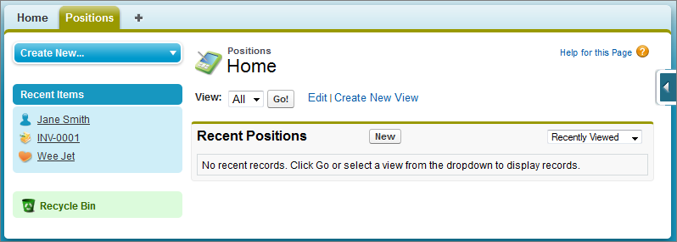
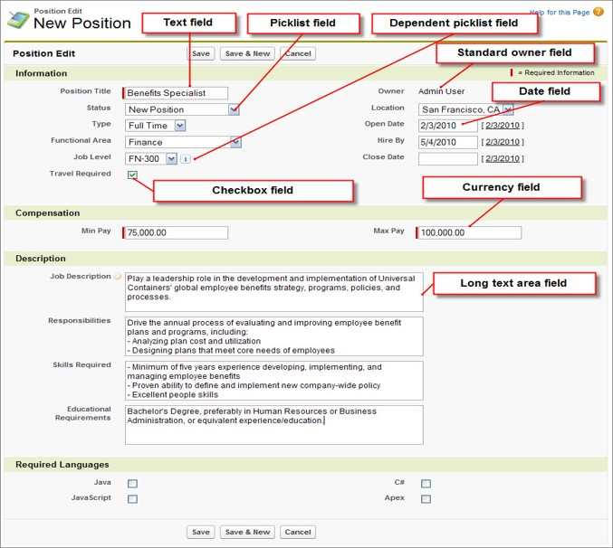  _src: salesforce_

List views on pages are similar to detail views, but may show more than one record in a list that is subject to filters or sort order from the org rules and/or from users.

You can create a new page layout against an object -

1. Go to **Setup** > Click on **Object Manager** tab
1. Click on **Page Layouts** in the left navigation bar
1. Click **New**
1. You can then create the new layout from scratch. Or, do the smart thing - and copy over an existing layout that you can modify
1. Drag and drop away fields and buttons
1. Add or remove related lists (the child tabs that you see in a detail page)
1. You can add more complex UI elements too
1. Preview your work (you can do that for different profiles too!)
1. Save your work by clicking on **Save**

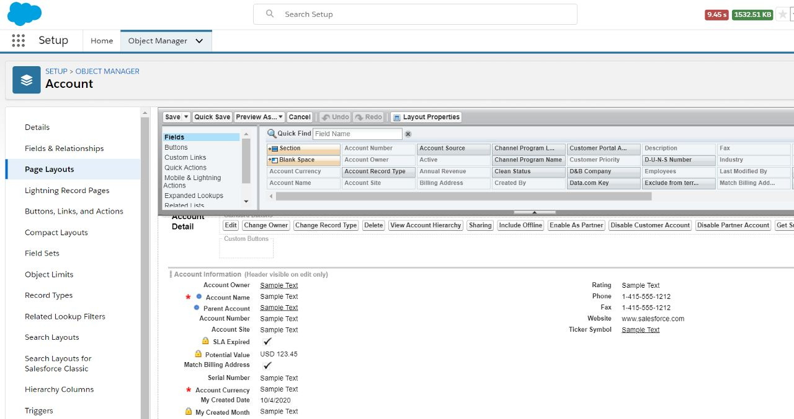

You have to assign the layout to a profile / permission set before seeing it on your page.

There are other specialised types of layouts that you can see in the Object Manager -

1. Compact layouts - the layout of fields and controls (buttons etc.) that you see when you click on a popup to view details or when displaying only key fields in the top parent record in a detail view
1. Search layout - the name says it all
1. Mini page layout - create a mini page layout against each layout by clicking on the **Mini page layout** button in layout editor. You can select few fields and limited related lists for displaying key information for an object

You create list views by directly going to the object tab > default list view.

1. Click on the `gear` icon
1. Click **New** to create new list
1. You can keep the list private (any user can do this), share the view with select users
1. Add or remove fields [`gear` icon > **Select Fields to Display**], change filter criteria [`gear` icon > **Edit List Filters**]
1. Click **Save** to save your work

In list views - you can not only see records in a list (ha!), but also -

1. See reports (create your own reports and select them here)
1. Show records grouped under a field value and visualise records in a Kanban view
1. Carry out bulk operations. For e.g. you can select and add multiple contacts to a campaign, or send emails to multiple people in one go

We will come back to layouts in a bit.

### Related List

A related list depicts data in context of a related entity.

For e.g. in the Account page (a detail view to be specific), you can have contacts listed for the account, a list of activities done for the account, and so on.

You can view related lists when defining the detail layout of an object. You can add new related lists in the same place.

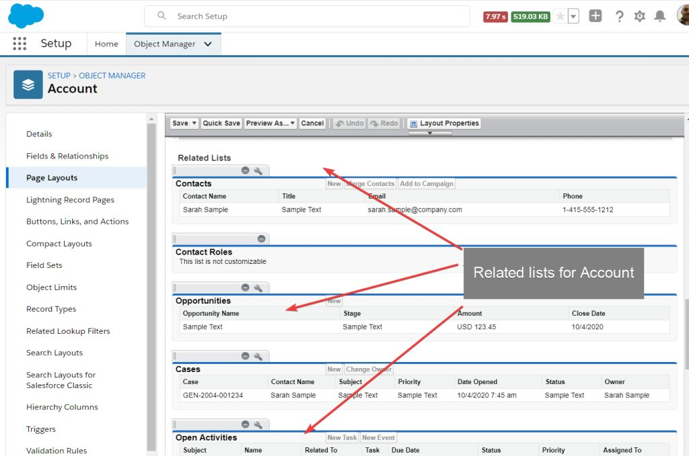

You cannot change the fields that appear in the related list from here. You can also add/remove fields from the related lists while defining the layout.

### So yes - UI layer in salesforce is awesome

UI in salesforce is often driven through the above base concepts. Often as administrators we find ourselves getting configuration requests to show/hide a field, create new reports, provide permissions to see a tab/UI component, and more. With exceptions in Community Cloud, Marketing Cloud and additional niche products, Salesforce has this standard UI pattern for showing contextual data.

You may also take note that Salesforce provides the standard UI pattern not only for the typical workstations but also for tablets, and mobile phones.

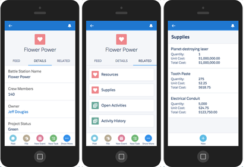  _src: salesforce_

This was a brief introduction to how to use Salesforce and the nomenclature of the UI elements. If that made you incredibly curious about the supporting business layer, and you can't wait to configure all this for your own app - yep, that's coming soon in the next chapter! Meanwhile, let's also check out other elements that make up the salesforce ecosystem in general.

## Collaboration

Salesforce equips you with collaboration tools to work with others in your organisation and with external stakeholders including partners and customers.

> No company is an island.  &nbsp;&nbsp;&nbsp; - _Old Jungle Saying_

Enabling collaboration can take many forms in Salesforce -

1. Email
   - Directly email stakeholders through application
   - Use templates and fill in values from salesforce app
   - Maintain context of data (e.g. an opportunity for which email is sent)
   - Track emails and responses easily within the app
1. Chat
   - Chat with your customers, partners, or company collaborators
   - Share documents, knowledge articles and more
   - Track activity against interested accounts, opportunities or orders through a feed of updates
1. Voice calls
   - Receive voice calls from customers or partners, and track those activities
1. .. more.

### Chatter

Chatter at its heart is a chat app and forum put into one - for an enterprise.

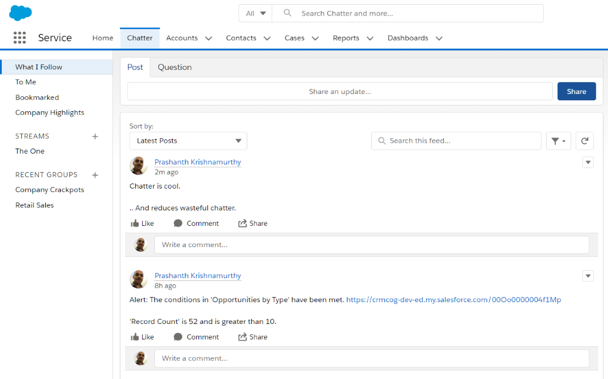

Chatter enables users to -

1. Collaborate with other users and groups
1. Share posts, links and documents. Comments are enabled to work together, garner feedback etc.
1. Configure feeds that enable you to track activities against a record - account, contact, opportunity, etc.
1. Form private or public interest groups focused on a function or topic
1. Send approval requests and approve requests

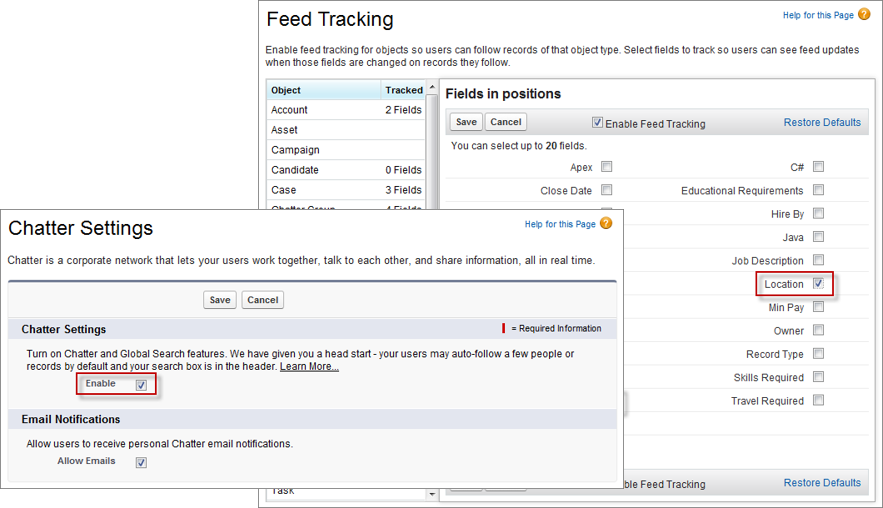

Chatter sends you in-app notifications - in browser or salesforce app. These are typically found to be better than emails since user has complete context on any activity.

Chatter is a concept that appears so simple to read but is invaluable in day-to-day work.

## How to get started on Salesforce?

A typical cycle for procuring anything in medium to large enterprises goes like this -

1. Identify the business problem or a situation that is necessitating a change
1. Identify technology options that can solve the problem
1. Carry out cost-benefit analysis to validate how the proposed technology or proposed solution will improve efficiencies of the current process.
1. Compare available technology options and finalise one or more options
1. Implement solution - finalise architecture, carry out technology changes, test and deploy
1. Validate benefits from the new system. Maintain platform

Demos of the products, short proof of concept applications (POCs) may be demanded and provided by Information Technology (IT) staff of the company, external consultants, and/or product teams.

Salesforce products and editions (see below) are determined based on features required by business and costing considerations.

The process may be quicker and not have iterations in smaller organisations.

As an administrator or developer, you create "developer edition" orgs that allow you to experiment with salesforce features in a secluded environment. Dev edition is free and you should [sign up for your own dev edition](https://developer.salesforce.com/signup) if you have not done that already.

A developer edition allows you to use most of salesforce features, but has limited users and space. You should not use the development environment for any real-world applications.

More on the actual salesforce editions below.

### Editions

Salesforce provides different products focused on specific customer functions. These include -

1. Sales
1. Service
1. Marketing
1. Community
1. Commerce
1. Core platform
1. etc.

In each of these products, there are tiers that provide you varied pricing depending on the functionality that you need. For e.g. in Sales Cloud we have Essential, Professional, Enterprise, and Unlimited. Pricing (cost per seat) depends on the features offered by salesforce at its discretion.

Editions also have a say in the number of environments that you get for development/testing. More the complexity of the application - it is more likely that you need a more powerful edition.

Decisions on editions is typically carried out by business IT stakeholders by closely working with Salesforce Consultants and Salesforce Sales Teams.

The best place to find all about editions and pricing is on the [Salesforce Editions page](https://www.salesforce.com/editions-pricing/overview/).

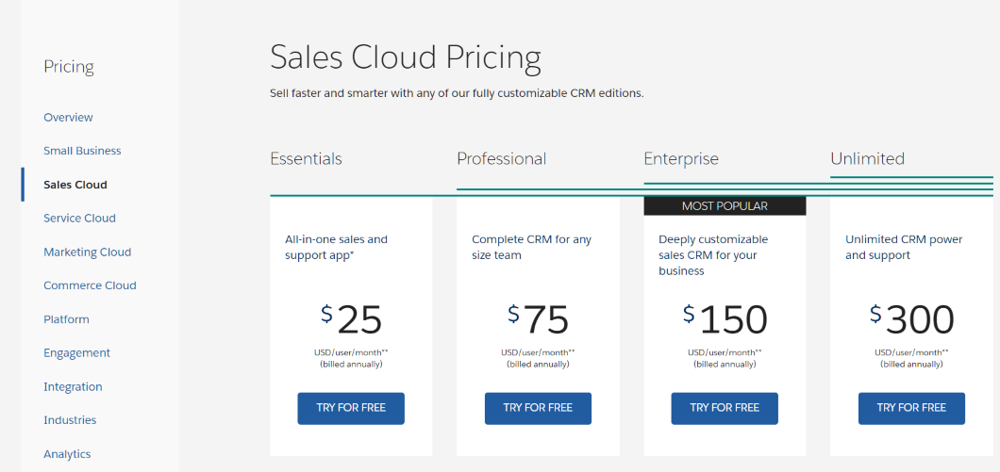

Explore editions by drilling-down on different products and compare feature-set and pricing.

### Licenses

Organisations choose licenses for the users of salesforce applications. There can be more than one types of users with different licensing needs -

1. Administrators
1. Sales management
1. Sales reps

A license gets each of these user types the access they need, and at the same time ensures that you do not overpay to provide functionality that your users may never use.

All users in Salesforce are associated to at least one license.

### Users

### Salesforce AppExchange

[AppExchange](https://appexchange.salesforce.com/) is the app store for salesforce.com.

AppExchange is the biggest advantages of using salesforce from our point of view. The app ecosystem supports hundreds of features not implemented in the salesforce core product and that can include -

1. Whole new functions targeted at specific industries (e.g. Veeva CRM)
1. Apps that add features (e.g. Conga offers document merge features)
1. Lightning components that improve usability (e.g. a Lightning grid that can work with any entity)

Salesforce apps can be free or paid - the complete life cycle of installing apps, using apps within salesforce org, and paying for apps is taken care by salesforce.

You can checkout applications and install them on your salesforce org - check out AppExchange (and see workshop page for sample apps that you can try out).

#### Choosing Salesforce Apps

Selecting an app from AppExchange is an involved process. Companies do this 'buy' vs 'build' decision considering the following -

1. Evaluate apps on AppExchange and carry out cost/benefit analysis **before** agreeing to any complex configuration or customization
1. Evaluate risks of using third party apps
1. Identify activities to deploy/maintain the packages that the apps come with

Salesforce provides app developers a standard way to provide different trial options for their customers.

1. Trial: simple trial with a set end date
1. Test-drive: Evaluate the app in an environment that is setup by app vendor
1. Trialforce: Allow users to play around with the app in a controlled environment setup by the app vendor

## Security

Security takes many forms and a web app must address the needs in all forms.

Salesforce enables multiple layers to protect customer data on its platform incl. -

1. Industry-standard authentication
1. Powerful authorisation configurable by customers
1. Different levels of encryption for fields or whole databases
1. Encryption of data during transmission
1. Controlled use of third party scripts
1. Data access rules

There are entire courses and guides dedicated to the topic.

- [Get started with Application Security](https://trailhead.salesforce.com/en/content/learn/trails/get-started-with-application-security)
- Advanced: [Develop secure web apps](https://trailhead.salesforce.com/en/content/learn/trails/security_developer)
- Advanced: [Application Security Guide](https://developer.salesforce.com/docs/atlas.en-us.securityImplGuide.meta/securityImplGuide/salesforce_security_guide.htm)

### Application Security

#### Access Control

Administrators can configure application to be accessible only during certain hours (e.g. day time IST)

#### Enable CORS and Trusted Sites

You can whitelist apps that request salesforce data for your org - this will need cross-origin resource sharing (CORS) to be turned on for specific sites.

Similarly you can allow requests from within salesforce to use specific Lightning components or access external sites. This needs you to establish those components/sites as "trusted" with content security policies.

#### User-specific policies

Control user-level security -

- password complexity and expiration
- login hours for specific groups
- specify IP ranges from which login to the org is allowed
- enable access to packages
- monitor user sessions
- setup audit trail to track user actions at a record level

We will see more of user access control in subsequent sections and chapters.

### Data Security

In the context of system administration, we focus a lot more on data security rules within Salesforce.

Data security refers to making data available to the right people - may it be sales reps, their managers, or other collaborators. It is possible to configure rules with increasing complexity to achieve this -

1. Make entire views available to certain people - for e.g. employee salary details are available only to HR Managers
1. Enable certain fields to be visible or updateable by specific groups

Data security is enforced using user profiles, permission sets, and roles.

Profiles and permission sets control which screens/views you see. Roles control what data you see in those screens.

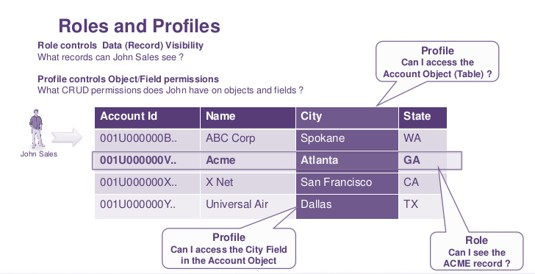

#### Data Security Layers

Salesforce typically works by securing all data (making everything most restrictive) and opening view/write/both access only to specified entities. This is done at individual entity level and is mondo useful.

The default access enabled at entity is called "Organisation-Wide Defaults" (or "OWD"). Roles and defined sharing rules enable accessing data secured by OWD to specific user groups or users.

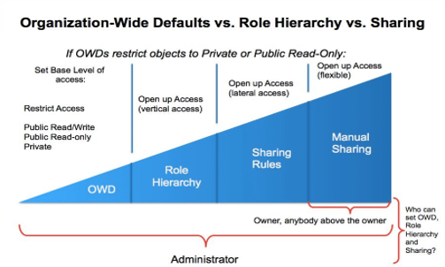

Data security can also be specified at a more granular level -

1. Object level: which objects are accessible
1. Field level: which fields are accessible

Each layer specifies whether the user or group has access to view and update data (or delete records - when specified at an object level).

#### Roles

Roles do not need to be same as org hierarchy, but is similar in most cases. It can be -

1. a representative who closely works with customers - 'Sales Rep - Timbuktu'
1. a regional manager- e.g. 'Sales Manager - South Mali'
1. an administrator
1. any role in the company

You do not create roles since a position exists, but create them per requirements to see specific data.

Roles follow a hierarchy similar to real-world. A 'sales rep' role can report to a 'sales manager' role, which in turn reports to a 'regional manager' role.

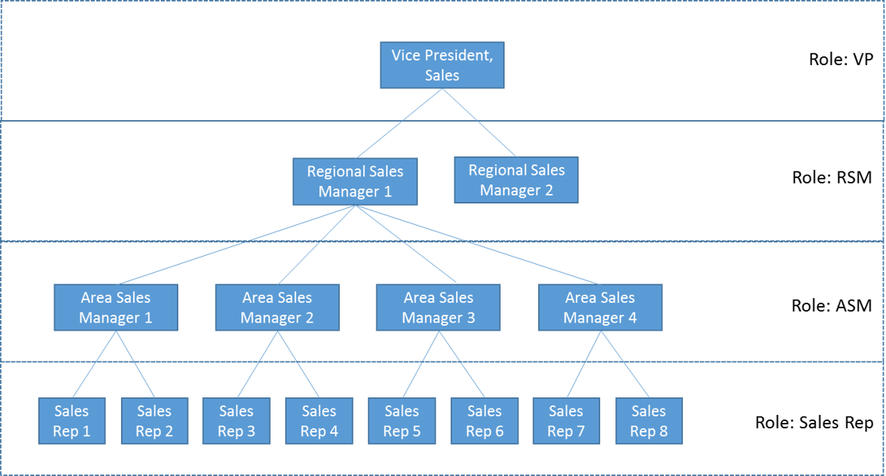

Roles are tagged to users to be useful. A user can -

- exist without a role (in which case she will not see data filtered to a role)
- (or) have exactly one role

Roles also enforce pre-defined privileges. For eg. a manager typically has access to all the data being worked upon by her subordinates.

Access or modify roles at **Setup** > **Users** > **Roles**

#### Profiles

Profile is a group of permissions and settings -

- enable access to specified UI functions like an app, workflows, custom Visualforce pages
- set security rules - define login hours, IP ranges and set password policies
- provide access to external data sources
- provide access to call Apex automation routines

Administrators create profiles in alignment to the application security constraints. Developers create custom UI keeping in mind the same security constraints.

Navigate to **Setup** > **Users** > **Profiles** to view, edit or create profiles.

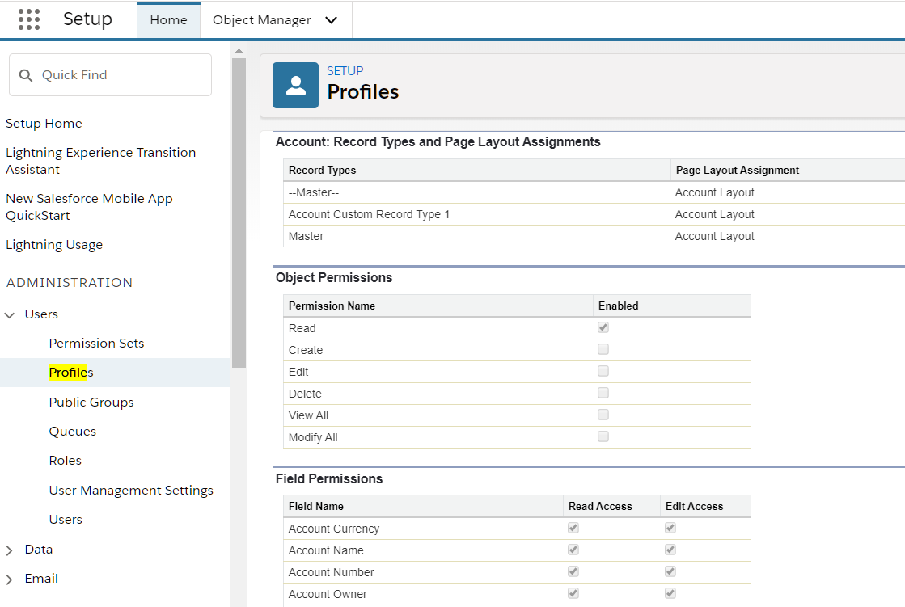

Also take note that you cannot modify any "important" properties in profiles provided by salesforce ("standard profiles"), but you can clone existing profiles or create your own profiles (also called "custom profiles"). You assign exactly one profile to each Salesforce user. You will see this pattern of "standard/salesforce-supplied stuff being read-only" repeated multiple times in salesforce app.

#### Permission Sets

Permission sets are similar to profiles, but allow you to go even more granular in controlling security. Rules and entities available in a profile are available against permission sets as well.

Users can be assigned zero or more permission sets. The least restrictive permissions will be applied if there are conflicting permissions.

In fact, you must use permission sets to define security rules rather than managing security rules through profiles.

Navigate to **Setup** > **Users** > **Permission Sets** to view, edit or create permission sets.

#### Other

There are other types of possible data security rules including -

- public groups
- access controlled by sharing rules
- queues
- .. and more

We will revisit this topic in later sections.

## Workshop

Complete the following tasks.

| No. | Type    | Description                                      | Time (hrs) |
| --- | ------- | ------------------------------------------------ | ---------- |
| 1   | Do      | Install apps from AppExchange                    | 0.5        |
| 2   | Present | Differences between trial, test drive trialforce | 0.5        |
| 3   | Do      | App licenses                                     | 0.5        |
| 4   | Do      | Security                                         | 0.5        |
| 5   | Do      | Create role hierarchy and explore                | 0.5        |
| 6   | Do      | Create profile/permission sets and explore       | 1          |
| 7   | Do      | Enable Chatter                                   | 0          |

### Install Apps

Install following apps in your dev org.

1. [Volunteers for Salesforce](https://appexchange.salesforce.com/appxListingDetail?listingId=a0N30000003JBggEAG)
2. [Salesforce Adoption Dashboards](https://appexchange.salesforce.com/appxListingDetail?listingId=a0N30000004gHhLEAU)
3. [Conga composer](https://appexchange.salesforce.com/appxListingDetail?listingId=a0N300000016b7FEAQ)
4. [Survey Monkey](https://appexchange.salesforce.com/appxListingDetail?listingId=a0N3A00000EOBliUAH)
5. Make note of where can you see the installed packages in the application
6. Go to the package. Select any `App` created by one of the packages. Copy the name.
7. Create a new `App` by the same name. Will Salesforce allow you to create such an app? Why?

### Differences between trial, test drive trialforce

1. List at least 3 differences between how AppExchange enables trial, test-drive and trialforce apps.
2. Imagine you will create an app called “KEvents” to enable users to manage events like corporate events, teaching and education, professional training for medical reps. You will put a cost of \$500 / org. Do you enable trial for the app? If yes, how? Outline why you chose an option
3. You will release the second version of “KEvents” with map integration, travel ticket booking for attendees including availability checks, hotel booking for attendees incl. best rate checks and a cool function to showcase “sights to visit” in the event city. You will increase the cost to \$5000 / org. Will this impact your earlier decision? If yes, how and why?

### App licenses

1. Create user `sr1`, and do not assign any license. Login as SR1. Which apps does the user see – list them? Why does she see any views/ data if no license is assigned?
2. Assign license `Work.com only` to `sr1`. Will she now be able to see the app? Why / why not?
3. Where can you find out how many licenses are available/consumed in your Salesforce app?

### Security

1. Change login time range for `sr1` to 08:00 AM EST to 6:00 PM EST. Save record
2. Logout of `sr1` session if you have logged in. Can you login during IST day time now?
3. Remove login time restrictions
4. Add password string restrictions to contain at least one capital letter, two special characters. Test functionality by trying to reset password for `sr1`

### Create role hierarchy and explore

1. Create the following role hierarchy
   
1. Create user `sr1`, and assign role as `Sales Rep 1`
1. Create user `sm1` and assign role as `Area Sales Manager 1`
1. Login as `sr1`. Create 5 accounts, create 5 tasks
1. Login as `sm1`. Is the user able to see accounts and tasks? List why?

### Create profiles/permission sets and explore

1. Create the following profiles
   - UC Admin – clone from System Administrator
   - UC Sales Rep – clone from Standard User
2. What gets copied over from the roles? List down 3 reasons to clone profiles rather than creating them afresh.
3. Create permission set - `UC Sales Rep Order Super Editor`.
   - Provide “Edit Activated Orders” app permission
   - Provide “Edit” object permission for Orders object
   - Remove ‘Export Reports’ system permission
4. Create following profile – UC Sales Rep No Order
   - Remove order edit object permission
5. Assign the profile and permission set to `sr1`. Is the user able to edit activated order?
6. Create profile – `UC Sales Mgr No Sales`
   - Remove view/edit permissions on sales app
7. Assign `UC Sales Mgr No Sales` to `sm1`. Logout and log back in. Will manager still be able to see sales app?
8. Create a permission set called `UC Sale Sale`. Add permission set to `sm1`. Logout and log back in. Will `sm1` see `Sales` app now? Why?

### Enable Chatter

1. Enable Chatter feed in your org.
2. Follow 2 of your favourite accounts. List down how account updates are mentioned in Chatter. How will you get notified?

## Teaching Aids

### Presentation

#### 1. Platform Fundamentals: sf-cog

&nbsp;

  <iframe src="https://docs.google.com/presentation/d/e/2PACX-1vSNcT_AgPRtmWBlz2Xe0tpX8Pb7hpENWGWlgVwmAJIOJ40G2AI71i7zi_VZ_S6WOg/embed?start=false&loop=false&delayms=60000" frameborder="0" width="800" height="600" allowfullscreen="true" mozallowfullscreen="true" webkitallowfullscreen="true"></iframe>

[More info](/misc/pricing#sf-cog)
