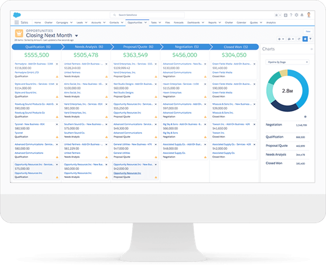
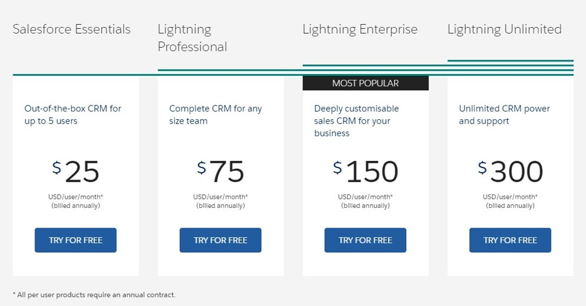
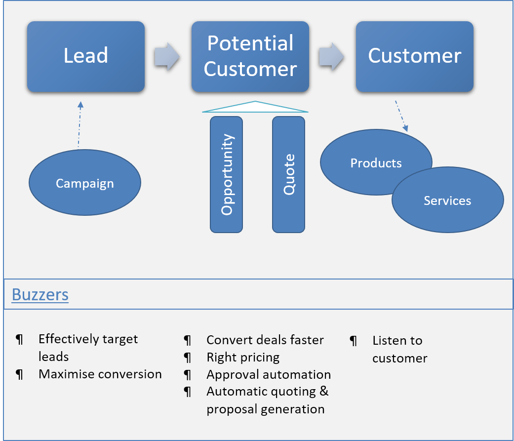
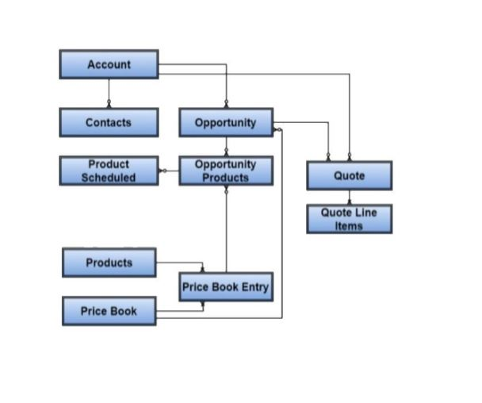
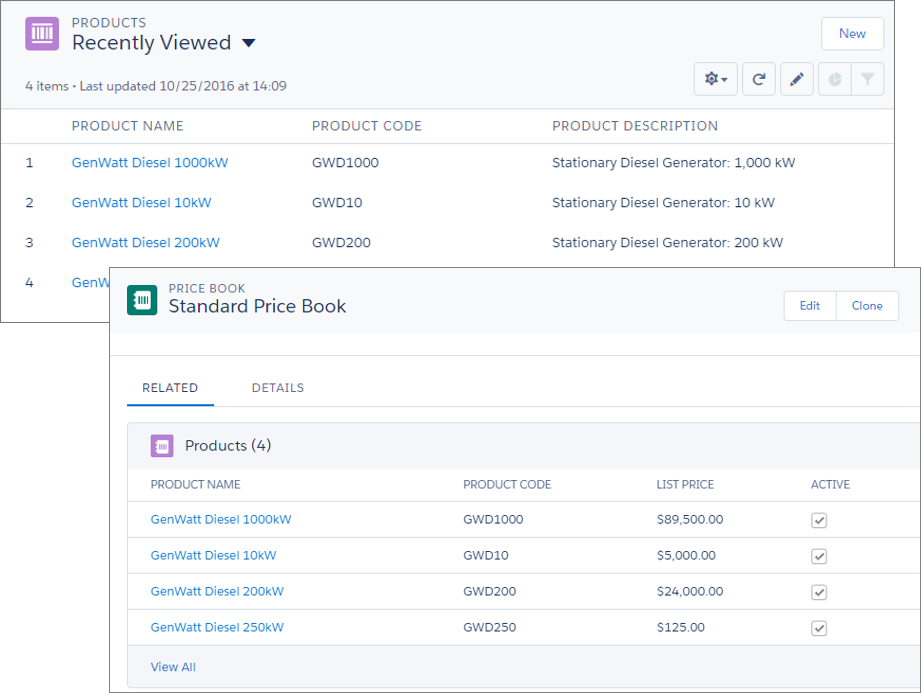
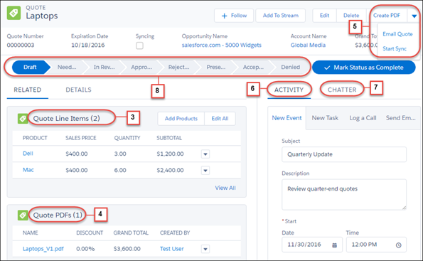
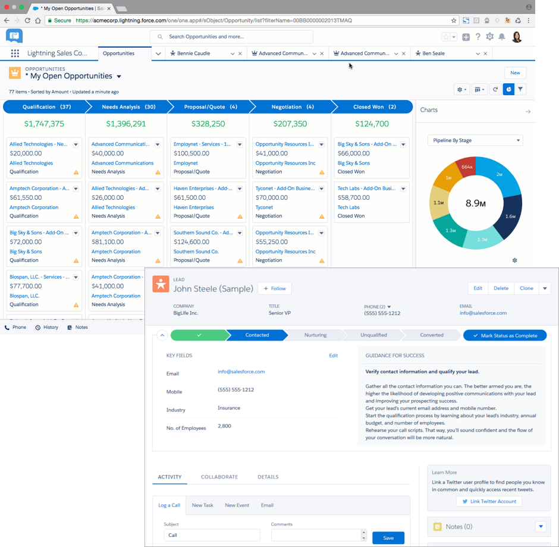
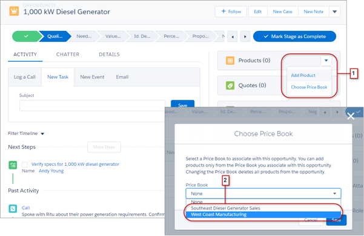

# Sales Cloud

Sales Cloud is the specialised part of Salesforce.com that focuses on sales functions.

You use sales cloud for -

- Enhancing sales team effectiveness
- End-to-end sales management – forecast, convert leads, track & close opportunities
- Typical processes for sales and sales support that are internal facing but have customer touch points – emails, notifications, conversations
- Manage sales partners



While we treat sales as the entry point for customers to start a loving relationship with our business, it can take various shapes and forms and is not always uniform.

Sales Cloud is considered a more specialised and a true-blue product, as let's say, the core salesforce CRM product. The pricing reflects that -

 <br> _src: [sales cloud pricing page](https://www.salesforce.com/in/products/sales-cloud/pricing/)_

### Who uses Sales Cloud?

- Sales Professionals & Leads:
  - Build sales pipeline, convert opportunities to customers
  - Strengthen customer relationships
- Sales Operations
  - Align processes to objectives
  - Increase productivity to improve sales
  - Improve financial reporting
- Budgets & forecasts
- Marketing Leaders
  - Bring high quality leads
- Service Professionals
  - Have visibility to sales processes to provide the right service to customer

## Processes

The typical processes associated with sales cloud are -

1. Lead management and tracking
1. Lead conversion
1. Account management
1. Pre-sales support
1. Sales order management

Sales typically hands over to the service organisation once a lead becomes a customer.

### Process Flow

A typical process flow may look like this-

- Marketing team runs campaigns
- Sales team finds and tracks leads against a campaign, or independently
- Lead 'converts' to potential (or actual) customers
- Track opportunity against potential customers
- Provide quotes to customers
- Lead/potential customer buys product or service to become a customer



## Entities

Typical entities in sales cloud -

| Entity                 | Description                                         | Attributes                                   |
| ---------------------- | --------------------------------------------------- | -------------------------------------------- |
| Accounts               | Businesses or individual customers                  | Name, Phone, Address, Industry, Revenue      |
| Contacts               | Individuals who are of interest to business         | Name, Phone, Address,                        |
| Opportunities (Deals)  | Service or product that customers are interested in | Revenue, Stage, Close Date                   |
| Quotes                 | Proposal to the customer. (Typically part of CPQ)   | Price. Has products and quantity associated. |
| Leads (Prospects)      | Potential customers                                 | Status, Campaign, Quality, Source            |
| Campaigns              | Focused event to get new business                   | Budget, Cost, Revenue, Start/end dates       |
| Territories            | Divide and conquer - for sales teams                | Name                                         |
| Partners               | Collaborators external to company                   | Name, Location, Address, Type                |
| Products & Price books | Products and services that the organization sells   | Description, Code, SKU, UoM, Family. Price.  |

The below diagram depicts the relationship between key entities.
<br> _src: salesforce.com_

Next up: we look at the details of few key entities.

## What "customer" means in Salesforce?

A customer management system revolves around, well, a "customer" record. A customer record shares all relevant information of the organisation's customer, but there are different ways of handling that information depending on the target audience.

Salesforce (including sales cloud) provides options to use two types of customers – Business Accounts (a typical organisation / another business) and Person Accounts (you are selling to individuals more than companies and do not need the complexity).

Personal accounts can be imagined as 'an account' (who you do business with) + 'a contact' ('contacts in your account') in one record. You have to work with Salesforce to enable personal accounts - it does not come configured with your application, and there are quite a few gotchas with the salesforce product and with apps on AppExchange for personal accounts.

Call us biased but we would just choose business accounts for everything in this day and age.

Business account -

1. Is the way (say it aloud in Mando style)
1. Accounts and contacts as separate, distinct records. Contacts can have a M:1 or M:M relationship with accounts

## Leads

While we are talking about customers, it may make sense to mention 'leads' as well.

Leads are entry points for potential customers and existing customers who may be targeted for other products/services. A lead record typically exists in the Marketing world, but can be an invaluable part of sales cloud as well.

Current or future customers (regardless of whether they are part of a campaign - see below) are identified are tracked as 'leads' in salesforce.

Leads can be directly identified, sourced from third parties, identified through a target audience in our social media ads, or people who respond to our ads.

A lead can be part of one or more campaigns. Campaigns are sustained, typically time-bound activities that are executed with specific objectives.

For e.g. -

1. Target our smart watch product to all people who visited our booth in the last tech exhibition
1. Create a campaign to sell our glue to customers who bought the toy boat (they will need that soon enough)

## Products and Pricing

Products are items or services that companies sell to customers.



Products are associated to a "Price book", which is a list of products and their associated prices. A price book determines the total pricing and calculations while selling the product to customer.

- Each product and its price is called a price book entry
- Price book can be standard or custom – possible to provide multiple prices for the products
- Price book can be divided based on regions, product categories, company entities, revenue streams or verticals

A product may also be associated to a 'product family', which is a term used to group related products (can also be used for forecasting).

A common way to initiate sales of the product is by using -

- quotes: create one or more quotes that include products, product bundles, pricing and discounts
- opportunities: record intent to buy

The sales process culminates into -

- orders: record intent to buy from customers that may have the products, quantity, price and delivery details
- post sales support: which may be managed through one or more entities here, or through the service organisation

## Quotes

Quotes provide a way to provide commitment to the customer for a product or service. It can be provided to the customer electronically or in printed format, and can include products, pricing, and sales terms.



Quotes in Salesforce -

- Enable reps to create response to a buying interest by customer
- Capture products and pricing
- Enable exporting of data in pre-defined formats to create quote documents (PDF) that is shared with customers
- Supports quote templates to quickly create quotes. This provides better standardization (for data capture / streamlined process) and is quicker & efficient

You can tag/ associate opportunity against a quote. Or, create one or more quotes against a single opportunity. The different quotes / versions of the quote may be used to offer different bundles, terms, and/or pricing during negotiations. Salesforce can sync accepted quote against opportunity to reflect the right value against the opportunity.

## Opportunity

A quote typically leads to (or, is created parallel to) an opportunity. An opportunity records the intent of customer to buy products/services. It may have one or more products, price book, potential sale date, etc.

An opportunity is super interesting since -

- It is at the core of what sales organisations do
  - .. and therefore it is also at the core entity of Sales Cloud :)
- Not all organisations use quotes, but an opportunity is an indicator of how business is faring in the market
- Managing an opportunity through various stages using an intuitive Kanban-like chart is super cool

 <br>_src: salesforce.com_

In Sales cloud you can -

- Associate products and pricing against opportunity
- Support multi-currency and international business
- Tag account and contact
- Collaborate with others throughout the life cycle of opportunity
- Have automated validations and approval requests at various stages/times of the life cycle
- Manage Sales cycle
  - Converting a lead to opportunity begins the sales cycle
  - Successful closure implies deal won and hands over to fulfilment

<br>_src:salesforce.com_

Users can add products individually or create schedules in an opportunity -

- Individually add products – pricing influenced by product list price (or the price determined by the price book) and quantity
- Product schedules: Used for creating default revenue & quantity schedules for products delivered (or paid) over a period of time (e.g. subscriptions)

## Workshop: Sales Cloud I

| No. | Type    | Description                   | Time (hrs) |
| --- | ------- | ----------------------------- | ---------- |
| 1   | Present | List all Sales Cloud entities | 0.5        |
| 2   | Do      | Create 2 email templates      | 0.5        |
| 3   | Do      | Convert 3 leads               | 0.5        |
| 4   | Do      | End to end customer flow      | 1          |
| 5   | Do      | Create custom record types    | 0          |
| 6   | Do      | Generate 2 reports            | 0.5        |

### List all Sales Cloud entities

Find out where you can find all Sales Cloud related entities in SFDC documentation / other sources. List all entities.

### Create 2 email templates

1. Create an email template “Lead New Customer Product Release” against Lead object

   ```
   Dear <firstname>
   Congrats on release of your newest product. It is amazing to see such quick but significant strides in <company>.

   I can see that your new product has all the inking of creating a revolution in <industry> industry.

   If you are willing, we can discuss how our <product interest> can help further your goals.

   Regards,
   <owner full name>
   ```

2. Use the email template to send an email to yourself against a lead record
3. Create an email template with below content

   ```
   Dear <contact first name>,
   We have recorded your query. We will respond within two business days from <Date Opened>.
   Please use reference number <case id> for any further communication.

   Regards,
   <case owner full name>
   <case owner phone> | <case owner email>

   ```

4. Go to Lead detail. Navigate to ‘Email’ tab. Select your template and send email to yourself

### Convert 3 Leads

1. Create a lead. Fill in all fields
2. Convert lead – create a new account, contact and opportunity
3. Create another lead. Fill in all fields
4. Convert lead – create a new opportunity, but use existing contact and account
5. Create yet another lead. Fill in all fields. Fill in different values for email and phone number
6. Convert lead – create new opportunity, but use existing contact and account. What happened to the information already there in the contact and the new information entered in the lead?

### End-to-end Customer Flow

1. Create campaign ‘5k Marathon’
2. Associate at least 5 existing contacts and 5 existing leads to the campaign
3. Import Leads and Contacts from file. Create a data file by exploring the template provided by Salesforce
4. Create at least 2 activities and 2 events against the campaign
5. Convert at least 3 leads by creating new opportunities, contacts and accounts
6. Convert at least 2 leads by merging into existing contacts and accounts
7. Update sales stages for opportunities. Create activities against newly created opportunity
8. Update sales stage to won for at least 2 opportunities and lost for 2 other opportunities
9. Create new contacts against the won accounts with distinct roles
10. Create a new email template that welcomes the new customers. Decide the content yourself, but merge content from the records
11. Email contacts welcoming them – email in one go
12. Create cases against the sold products to the customer – against account/contacts that have been newly created

### Create Custom Record Types

1. Create record type ‘Influencer’ under Contact. Change the layout for System Administrator from the default value

### Generate 2 Reports

1. Create one report each on Contact and Opportunity. Include your favourite fields (or accept defaults) and generate report

## Workshop: Sales Cloud II

| No. | Type | Description                   | Time (hrs) |
| --- | ---- | ----------------------------- | ---------- |
| 1   | Do   | Create products and pricebook | 0.5        |
| 2   | Do   | Currency setup                | 0.5        |
| 3   | Do   | Inline reports                | 0          |
| 4   | Do   | Create Quotes                 | 0.5        |
| 5   | Do   | Modify Sales Path             | 0.5        |

### Create products and pricebook

1. Create at least 2 products and 2 price books. Associate 1 product to 1 price book
2. Associate pricebook to opportunity. Do you see all products that can be associated with opportunity?
3. Change pricing of the product in the two pricebooks. What happens when you change the pricebook in the opportunity? Does the opportunity value change?

### Currency setup

1. Create an opportunity, provide a value against opportunity
2. Edit value of opportunity. Does the value get recalculated? Why / why not?
3. Change your currency in user record to INR. What happens to how opportunity value being displayed – will it continue in default currency /change to INR?
4. Go to Setup > Manage Currencies. Add INR, HKD. Set exchange rates
5. Do you now see any difference in calculation when opportunity currency is changed?

### Inline reports

1. Create 2 distinct inline reports against an opportunity list
2. Change the chart types
3. Change filter in the opportunity list. What happens to the chart?

### Create Quotes

1. Create at least 2 quotes, generate PDF
2. Create an email template to send quotes. Decide content yourself, but PDF of quote needs to be attached
3. Create multiple opportunities against quote – with a different pricebook

### Approval flows

1. Create a simple approval flow against opportunity with owner as SR1 so that approval needs to be sent to SM1
2. Create a simple approval flow against quote similar to the one you created above
3. Create opportunity/ quote to test approvals. Login as SM1 to test how to approve records

### Modify Sales Path

1. Create a new opportunity stage called ‘Olden’. Update stage to ‘Olden’ to at least 2 opportunities

## Teaching Aids

### Presentation

#### 1. Sales Cloud: sf-cog

&nbsp;

<iframe src="https://docs.google.com/presentation/d/e/2PACX-1vTaehspHKzHPTKM5dnq0MfsCNta-LnIK-H4SKeW99liVLL5yjxL5zIILRe55vNqEw/embed?start=false&loop=false&delayms=60000" frameborder="0" width="800" height="600" allowfullscreen="true" mozallowfullscreen="true" webkitallowfullscreen="true"></iframe>

[More info](/misc/pricing#sf-cog)
