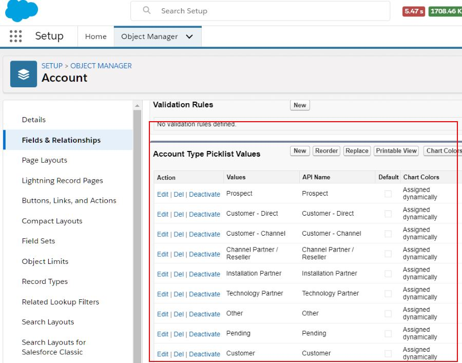
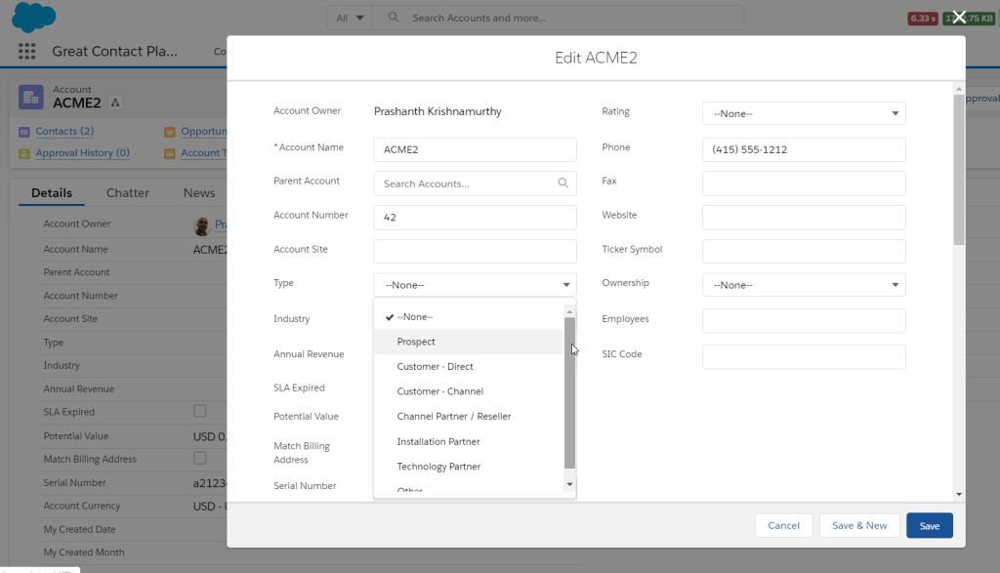
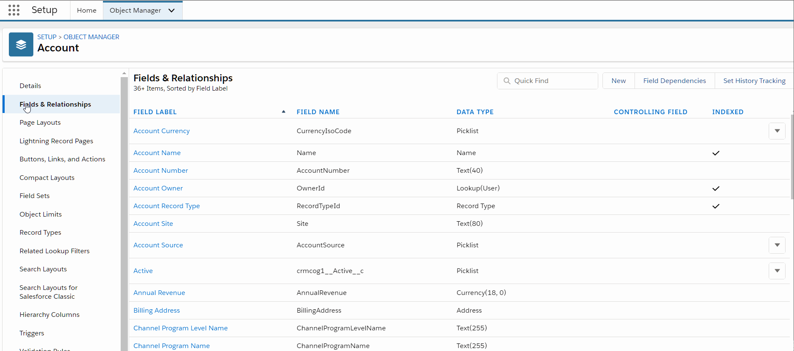
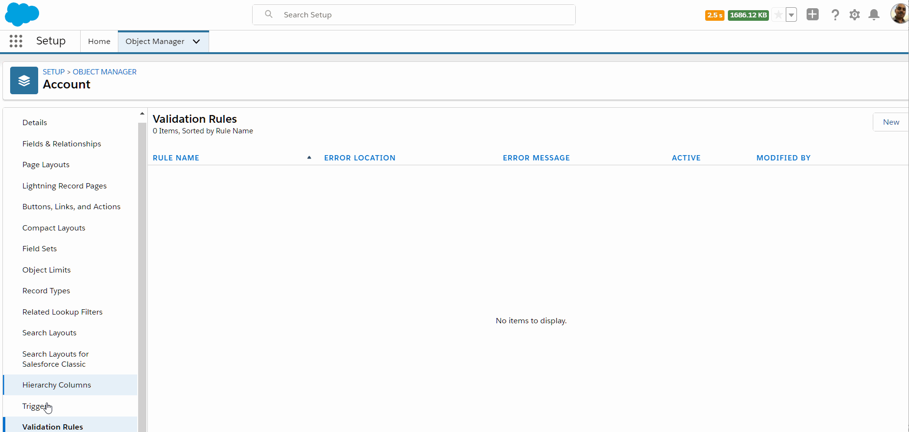
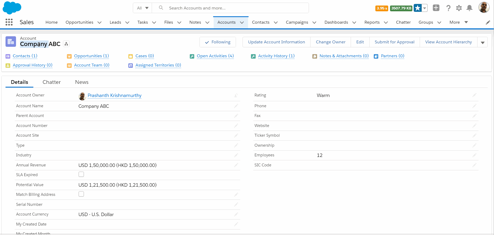

# Deep-dive Business Layer

We will delve a bit more in the business layer configuration in this section. It is time to see how they are developed, some of the limitations, and the things you have to keep in mind while designing relationships.

## Entity Relationships

In a previous chapter we saw the different possible relationships in Salesforce.

As you may have realised by now (or not - depending on your background) Salesforce relationships map back to the database design model. But, they are not the same at many levels – the objects and relationships are abstracted to become more powerful.

While dealing with relationships, get used to parent/child terminologies and where relationships are initiated from. They may be called related objects, master-detail, source / target - does not really matter. The big thing to remember is that you are viewing detail / related records in the context of the parent/source object.

Relationships decide the functionality that can be implemented in parent or child on many levels -

1. Data security rules applicable to the related record
1. Possible functions like roll-up summary on the parent object, or using a formula field to inherit something from parent

Design relationships for scale and performance -

1. Querying on M:M records is no joy
1. Designing something as 1:1 only to be changed to 1:M later is a lot of work
1. You will not be able to leverage salesforce provided functions by going out of the way with your own design - for e.g. not being able to inherit parent ownership rules for the detail record

## Master-Detail Relationship

You link two objects so that one becomes the master (a.k.a parent) in a master-detail relationship.

For example, there is a master-detail relationship on the 'account' object to 'attachments'.


So how about on the 'attachment' side of things? Should it relate back to account? Should it have any particular relationship? Well, the answer is - it really depends. Attachments may or may not independently exist without account. The two relationships may also be independent or not quite independent - they are distinct though.

In Master-Detail relationships -

- Parent controls detail and sub-detail record behaviour
- Deleting parent will delete child
- Detail will inherit and follow master’s visibility/sharing rules

When you are designing the Child record layout, you will see that the Master field is required on record layout.

Unique capabilities to master-detail relationships -

- Roll-up summary fields provided out of box. You can sum a field or provide count of records using a formula field on the parent object
- Administrators can enable reparenting function - you can change parent of a child record. This is useful in certain scenarios like when you are trying to transfer contacts to a new account

Limitations -

- Master detail has tougher limits as compared to other relationships - you can have only 2 master-detail relationships in a custom object.
- You cannot make a salesforce standard object as the detail object in the relationship.
- Not a hard limit but a best practice. Not more than 10,000 detail for per master record - in theory, you may have as many as you want

## Lookup Relationships

Lookup relationships are similar to master-detail relationships in a lot of ways. There can be 1:M or 1:1 relationship between two objects (or object relating to itself - self relationship) linked through a lookup. The looked up object's reference is stored in the source.

For example, Cases have a lookup relationship with Accounts.


A few interesting points about lookups -

- They don't support roll-up
- Related records are not automatically shared (or 'unshared') based on parent
- Deleting fields in a relationship is more tricky. You can choose how system should treat deletes -
  - `Clear the value of this field`: Deleting parent can clear parent from detail
  - `Don't allow deletion of the lookup record that's part of a lookup relationship`: Do not allow deletion of parent if detail is present
  - `Delete this record also`: Delete parent if child is deleted (only for custom objects)
  - `Delete this record also` can result in cascade delete. This has to be turned on by Salesforce (can delete detail records even if users can't see them)
- Detail deletion does not get logged in field history tracking if parent is deleted

## Other Relationships

#### M:M using junction object

M:M relationships in salesforce are a couple of 1:M relationships between the said objects and a third object called 'junction object'. The junction object is a simple object that typically stores ids of related records from two different objects. This is similar to the intersection table concept in relational databases

For e.g. a campaign can have one or more leads. A lead in-turn can be part of more than one campaign.


#### External lookup:

An external object is a Salesforce object representation of data structure that resides outside the org.

For e.g you can relate Salesforce accounts to orders stored in ERP. Then -

- orders are created as external objects within salesforce. It integrates using supported mechanisms to get data from the said external system
- a relationship field is created to relate those external records to account.

External look up fields specify an external object as parent and salesforce object as the child.

#### Indirect lookup

Again relates an external object to salesforce objects - only in this case, external object is child and parent is a custom/standard object.

This kind of relationship uses an unique external id as key.

#### Self relationship

A self-relationship is an object relating to the same object. It is not exactly a distinct type of relationship - it can be either 1:1 or 1:M.

For e.g. an account can have zero or more child accounts.


#### Hierarchical relationship

Hierarchical relationships define cascading relationships between records. In Salesforce it exists only for User object.

## Relationship Quick Reference

Different relationships in Salesforce -

 <br/>_src: salesforce.com_

It is also important for you to understand the different possible relationships with 'external' objects.

| External Lookup                                                                            | Indirect Lookup                                                                            |
| ------------------------------------------------------------------------------------------ | ------------------------------------------------------------------------------------------ |
| External object parent -> Custom or standard (or external) object detail                   | Custom or standard parent -> external object detail                                        |
| Use external id field on parent external object mapped to details’ ext. relationship field | Custom, unique external id in parent maps against child indirect lookup relationship field |

## More on Fields

> How many fields does a man need? <br> -- Totally not Tolstoy

We have seen how fields functions as attributes of an entity. But there are way more enchanting properties to them attributes than meets the common eye.

So.. here we're discussing the deeper philosophy of fields in Salesforce.

### Picklists

You may have noted in the previous chapter that fields can be of type 'picklists'.

Picklists all you to control what users enter against the field. Instead of typing away to glory, a picklist field presents a set of values that user can choose from (or they can start typing in and receive suggestions).

In practice, you create a picklist field against the object and provide the values.



.. and see it in action on the actual screen.



You may also configure a 'multi-select picklist'. As the name suggests, the user can select more than one value against the field.

Picklists can also depend on each other. For e.g. -

1. The list of valid 'Account Sub Type' values may depend on which 'Account Type' value is selected
1. A 'Case Sub Status' may show only specific values depending on whether 'Case Status' is 'In Progress' or 'Closed'

In dependent picklists -

1. The picklist that depends on another picklist field is called 'dependent picklist'
1. The picklist (or a 'checkbox' which has finite valid values) on which the first field depends on is called 'controlling picklist'

Note that the dependent and controlling picklist values will be for same record.

There are rules that dependent and controlling picklists play by -

- Controlling picklist can be any one of standard picklist, custom picklist, standard or custom checkbox
- Dependent picklist can be one of custom picklist, multi-select picklist

### Formula Fields

In Salesforce any and every "value" for an attribute has to come from the business layer. i.e., from fields.

Fields are like columns in a table - they store data and do stuff around storing data. But, what if you want values that need to dynamically respond to other values or external factors?

Enter formula fields.

Formula fields are just a type of fields that calculate values at runtime and at the specific instant (well, when fields are being retrieved from backend business layer).

For e.g. formula fields can be used to -

- Color coding an Account depending on annual revenue (if revenue > 1M: show GOLD, if revenue < 1000: show RED )
- Depending on time of the day show `How am I?` as 😀 or 😴

Note that we are talking about "actual" fields here, we can use something called "bucket" fields in reports and that's an entire new discussion topic.

Formula fields support calculations using common operators (math/logical) and powerful functions (text, math, date/time, logical and advanced).

To create a formula field -

1. Go to **Setup** > **Object Manager** tab > Drill down on object of interest
1. Go to **Fields** in left navbar
1. Click on **New** to create a new field
1. Select **Formula** as field type, and hit next
1. Select type of formula field. It can be one of Checkbox, Currency, Date, Date/Time, Number, Percent, Text or Time
1. Enter your beautiful formula that can include operators, functions and Salesforce fields (current entity and related entities)



Fields used in formula fields are often called "merge fields". Although merge fields can be fields that can be included in mails (when doing "mail merge") or on reports, "merge fields" in formula context are just fields which can be included in the formula.

Include the field in any UI, provide "proper" visibility rules for field, and you are good to go. Formula fields are read-only and are not visible on 'edit' views - you view them, not change them. Just use the **Insert Field** dropdown in the formula editor to start using merge fields.

The visibility of formula fields is distinct from those of any underlying fields. You can, in fact, better manage sensitive information by a deploying a powerful cocktail (wrong choice of word?) of field-level security rules + formula fields.

You can include comments in your formula. Following is a valid formula..

```
AND(
/* enforce rule only when you hit revenue limit */
TotalRevenue > 1000000,
/* partner flag must be checked */
Partner_Flag_c = true
)
```

You can't nest comments though.

Take note -

- Formula fields can only contain 3900 characters including everything in the field (incl. comments, operators, et. al.)
- "Type of field" should represent the actual type. And, these are subject to business layer limitations - for e.g. Number field cannot have more than 18 digits
- You can 'escape' stuff using `\`. For e.g. `Revenue \+ Tax` will certainly not sum revenue and tax
- Any time there is an error - e.g. division by zero, abnormal type, or any other errors, will display the super helpful `#Error!` message against the field in runtime
- Check `Treat blank fields as zeros` or `Treat blank fields as blanks` as appropriate to manage blanks in odd places

A formula formula in formula field that includes more objects than the current object is called 'cross-object formula'.

- Cross object formula can reference master object if the current object is on detail side of the relationship (well, the name is 'master-detail'. So, not many choices in that relationship. _PS: we will stop with dad jokes now_)
- Cross object formula can be used in lookup relationships
- You can refer to fields of an object that is 10 relationships away (for e.g. the parent account of the account of the contact in consideration)
- There can be a max of 10 unique relationships used across the fields in a single object at any given time

There are a few more interesting details there too -

1. Formula fields convert currencies (bigger topic) to locale currency. However, if you refer to something in custom settings, there is no automatic conversion
1. Roll-up summary fields cannot reference cross-object formula fields

And, before we forget - do not miss

- the [salesforce.com formula cheat-sheet](https://developer.salesforce.com/docs/atlas.en-us.salesforce_formulas_cheatsheet.meta/salesforce_formulas_cheatsheet/) even if you are a committed anti-cheat enthusiast in real life.
- [Tips for reducing formula size](https://developer.salesforce.com/docs/atlas.en-us.salesforce_formula_size_tipsheet.meta/salesforce_formula_size_tipsheet/)
- [Advanced sample formulae](https://developer.salesforce.com/docs/atlas.en-us.usefulFormulaFields.meta/usefulFormulaFields/)

## Roll-up Summary

When we discuss formula fields we cannot quite miss 'roll-up summary fields' in the same breath.

Roll-up summary fields can be used on the master object in a master-detail relationship to calculate and display an aggregate (sum, count, minimum, and maximum) of the fields on detail object.

To create a formula field -

1. Go to **Setup** > **Object Manager** tab > Drill down on object of interest
1. Go to **Fields** in left navbar
1. Click on **New** to create a new field
1. Select **Roll-up Summary** as field type, and hit next
1. Fill up further details depending on which type of roll-up summary you select

When including the child object, you may choose to input a filter criteria so that only child records that meet the criteria will be considered to do the roll-up summary.

Similar to their formula field counterparts, roll-up summaries include records / fields in their calculation even if those records/fields are not accessible to user.

Note that the roll-up summary field does not quite do them calculations at the specific instant, but can be considered 'pre-calculated' and stored in a transparent way. It does not quite appear that way since Salesforce manages those calculations dynamically, but those need to be accounted for in some tricky situations.

Once you create a roll-up summary, you cannot convert master-detail relationship used by the field to look-up relationship.

Field types of roll-up summary fields can be -

1. Number, currency, and percent fields for SUM roll-up type
1. Number, currency, percent, date, and date/time for date/time roll-up type

More interesting tidbits -

1. Since you create roll-up summary on master object, it can be created on both custom or standard object as long as they are the master (sigh!). For e.g. accounts may have "Opportunity Revenue" roll up summary as the sum of revenue expected from all opportunities tagged against the account
1. You can include other formula fields (not cross-object formula fields) in roll-up summary. If the formula fields result in an error, they are just ignored in roll-up summary value. Formula fields included in roll-up summaries cannot contain super-dynamic values like `TODAY` or `NOW`
1. Roll up summary fields cannot reference long text area, multi-select picklists, system fields and look-up fields
1. Roll-up summaries are not recalculated automatically when child records are deleted. You can force recalculation against a field by selecting **Force a mass recalculation of this field** in **Edit** view of master
1. Roll-up summary errors can stop calculation that field altogether until you force a recalculation or change values being summarised
1. Roll-up summaries may trigger workflows etc. on value change, but there are exceptions

Head over to [Salesforce roll-up summary help page](https://help.salesforce.com/articleView?id=fields_about_roll_up_summary_fields.htm&type=5) to know the possibilities and excitement of using roll-up summary fields.

## Validation Rules

We have been shouting on roof-tops about validation - until now. We now get promoted to 'shouting on mountain-tops' about them rules.

Validation rules do just that - they validate data entered by user. They prevent saving the record until the right data is entered and users comply. You create validation rules against the object.

To create a rule -

1. Go to **Setup** > **Object Manager** tab > Drill down on object of interest
1. Go to **Validation Rules** in left navbar
1. Click on **New** to create a new rule
1. Enter formula and make merry

In the below example, we used a validation rule on a field that is being summed up at account level by custom logic on account/opportunities.



Now.. for the result.



Validation rules -

1. Allow you to define expressions / formula to enforce validations
1. They can include error messages that get displayed to users - either near the field that causes error or at the top
1. Get triggered and complain about things wrong with the world even when user does not have access to the fields used within the rule
1. Contradicting validation rules may never allow you to save record

## Workshop

| No. | Type | Description                                    | Time (hrs) |
| --- | ---- | ---------------------------------------------- | ---------- |
| 1   | Do   | Establish entity relationships                 | 2          |
| 2   | Do   | Create validation rules for visits             | 1          |
| 3   | Do   | Create automation for visits                   | 3          |
| 4   | Do   | Create formula fields / roll-up summary fields | 1          |

### Establish entity relationships

- Establish relationships between different entities as described in the discussed ERD – Hospital, Facility, Doctor, Patient, Care, Customers and Contacts

### Create validation rules for visits

1. Visit start date should not be earlier than the previous day
2. Visits must have one or more doctors in active status associated
3. Allow not more than 3 visits to be scheduled by the same patient
4. Allow not more than 10 visits / hour of doctor availability

### Create automation for visits

1. Visits should be cancelled with reason code as “No Show” if there is no visit on the scheduled time (only for scheduled visits)
2. Allow CC to “check-in” scheduled visits
3. Send reminder for scheduled visits one day prior to the visit
4. Closure of visits should result in a ‘thank you’ email sent to patient
5. Summarize visits for each day against doctors and send automated email to doctors

### Create formula fields / roll-up summary fields

1. Show the last ‘no show’ date when patient calls up for an appointment
2. Create formula field to sum up total fees for today against doctors
3. Roll up fees for individual items against the visit

## Teaching Aids

### Presentation

#### 1. Deep-dive Business Layer: sf-cog

&nbsp;

<iframe src="https://docs.google.com/presentation/d/e/2PACX-1vRPWN3rYRf_a_6GGDWOFAn_6nyt9fBcnKvjgXAotDa1KZbERRC_WbCNLetHQOQ4qw/embed?start=false&loop=false&delayms=60000" frameborder="0" width="800" height="600" allowfullscreen="true" mozallowfullscreen="true" webkitallowfullscreen="true"></iframe>

[More info](/misc/pricing#sf-cog)
