# UI Customisation

We previously mentioned that we will be back with more of UI. And.. here we are.

Before starting all that - let us just put this forward this very simple message - "you are awesome". Not because you are here and reading this page, but because you are learning something new and taking your career to newer heights!

Back to Salesforce UI.

## What is Salesforce UI?

Salesforce UI allows you to configure and composition pages /screens to capture information and display data. There are many features that make Salesforce UI really good -

1. Enables quick build out of UI components -
   - define business layer, fill in a few attributes and a configured UI with all relationships is generated
   - drag and drop "stuff" to build UI layouts or entire pages
   - do additional configuration to change layouts, and provide advanced functionality
1. Compose UI by assembling UI components. Lightning components can come together to form beautiful and functional UIs
1. Security is enforced for UI access through profiles / permission sets
1. Allows personalization – e.g. users can create their own lists, customise dashboards, or hide fields
1. Allows seamless integration of business logic through selective filtering of data, record types for variable layouts

The typical components of Salesforce UI are below -

- Typical Terms
- Apps
- Tabs
- Detail and List Views
- Fields
- Home / App / Record pages
- Visualforce page
- Lightning & Visualforce Components

The following diagram outlines UI elements and how they relate to each other -

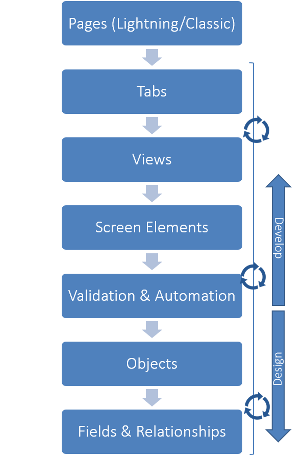

When dealing with Salesforce UI, you will often hear Lightning UI framework and talks of Salesforce Classic. We have seen that before - we will try to focus more on Lightning since that is where Salesforce is going in the future. Lightning UI will work on typical form factors (e.g. desktop, tablet or phone), and provides an user experience atypical to a modern app.

## Start configuring Salesforce UI

A common structure followed to configure UI will include following steps -

1. Create Page Layouts
1. Create List / Detail Views
1. Create Quick Actions / Buttons
1. Related Lists
1. Use Lightning App Builder to configure screen

## UI Configuration

While we have configured UI as part of creating fields, we will delve into the UI customisation a bit more in this section.

### Create Page Layouts

Page layouts bring the basic building blocks of fields and other controls together to form cohesive user interfaces for displaying record detail.

- Layouts consist of fields, buttons, related record list, and any other element and are based on a single object
- Layouts are typical 2-column structure to show record details. You have to build custom UI using Lightning framework or Visualforce to create a different structure
- You can have one or more layouts against any object
- You assign layouts to a profile/permission set, which in-turn are tagged to a user. Salesforce devices the layout to be shown to user based on the permissions in runtime

To create a page layout -

1. Navigate to **Setup** > **Object Manager** tab > Drilldown on an object > **Page Layouts**. Click on **New** button
1. Create the new layout from scratch or clone an existing layout (latter is the preferable option)
1. Drag and drop -
   - fields
   - related lists
   - quick actions/ buttons / links
   - reports and Visualforce components (this is not "the way" - use Lightning Page Builder instead)
1. Make fields read-only or edit enable them. Note that you cannot show read-only fields like system fields or calculation fields (e.g. roll-up summary). Similarly "mandatory fields" cannot be removed from "edit" layout
1. Related lists can be customised to show specific fields. The fields available in related lists depend on which fields are available to a list on the related object

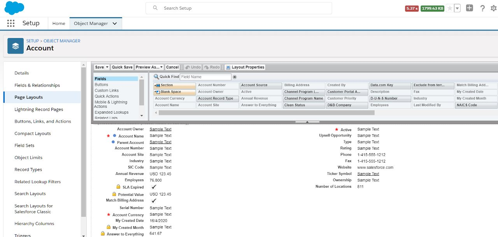

Once created, you can assign page layouts to profiles/permission sets/record types.

You can use layouts in Lightning Page Builder for a record page. Lightning page builders are, of course, assigned to tabs of an app.

### List

You work with lists directly on the app. An administrator can create lists that comprise of -

1. One or more fields
1. Filters

Users can create their own lists with fields that they are permitted to view, and apply filter criteria.

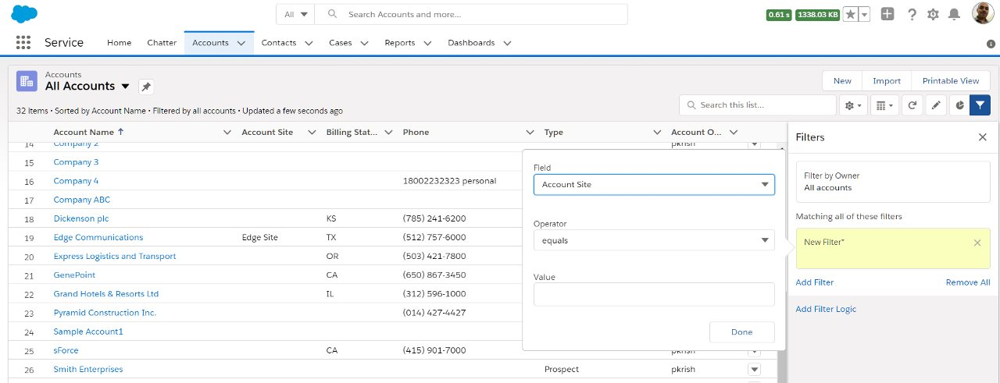

### Other Layouts

When you go to **Setup** > **Object Manager** tab > Drilldown on an object, you will also see layouts other than page layouts.

#### Compact Layout

You can create one or more compact layouts for an object. The compact layouts are used to display record details when viewing in Chatter or in mobile app.

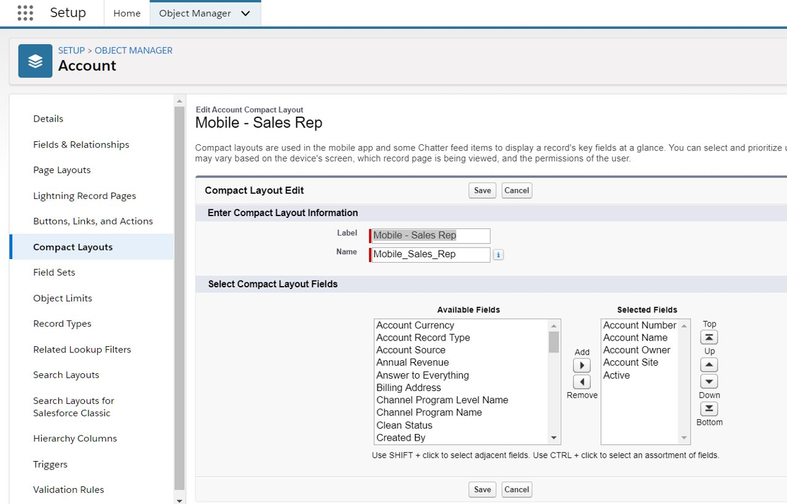

You can select up to 10 fields in compact layout - the fields cannot be of these types - text area
long text area, rich text area and multi-select picklist.

You assign compact layouts against record types to display distinct fields based on different record type values.

#### Search Layout

Search layout specify the fields that are displayed not only while the user searches for a record (search results, search filter fields,), but also for lookup dialogs, and 'recent record' lists on tab home pages in Salesforce Classic.

Search layouts retain the fields specified in default list of object. You may modify the default layout for specific profiles.

### Use Lightning App Builder

Lightning app builder is used to create three different types of pages -

- App page - home page for the app
- Home page - provide a home page for a specific entity
- Record page - provide a detail page. Reuses layouts of the entities

Whenever we say "detail pages", we indeed refer to "record page". App and home pages provide a dashboard in the context of the app or entity type, which can have charts, quick navigation links, etc.

You can invoke the Lightning page builder in more than one context.

#### Setup > Lightning App Builder

Invoke Lightning app builder from **Setup** > **Home** > **User Interface** > **Lightning App Builder**.

Click **New** in the Lightning Pages list and click away to create a new page.

### Show and hide related lists

Salesforce data model is made up of many specific entity types and tens of related entities to the said entity.

We have seen that related lists can show the records that are tagged to the parent record in a 1:M or M:M fashion. This enables the user to get a quick overview of the parent record (for e.g. account ) and the many related records (for e.g. Account's opportunities, orders, activities, etc.).

There are a couple of ways to control related lists -

#### Layouts

While defining the layout for the parent record, you may view/hide the related lists in the same layout.

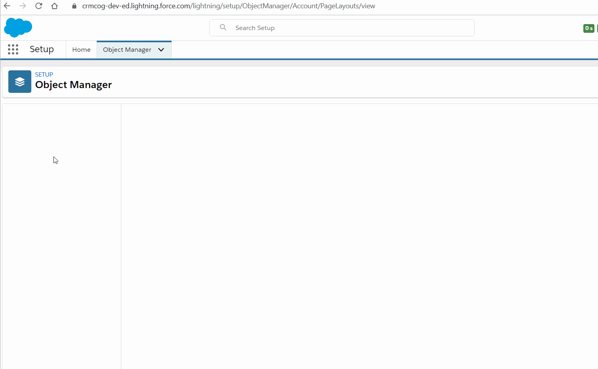

#### Lightning page builder

Using Lightning page builder you can -

- add / remove standard related lists
- include Lightning components that display related entities

You can conditionally display any component in Lightning page builder - the same applies for related lists as well. For e.g. you may display the related list only when the account goes to 'Approved' status.

#### Custom UI

Use Lightning framework or Visualforce to show detail page along with custom related entities.

#### Setup > Object Record Pages

You can create Record pages by navigating to **Setup** > **Object Manager** > Drilldown on an object > Click on **Lightning Record Pages** in the left navbar > Click **New** and go crazy. (technically you can create any page once the page builder wizard starts up)

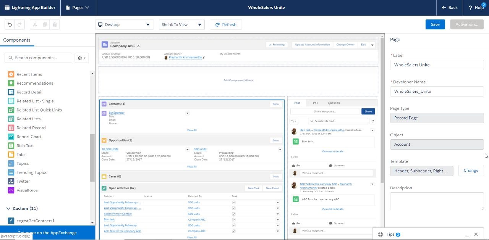

#### Setup > Edit Page

If you are on a page that needs editing here and now -

1. Make sure you are on the right page
1. Click on the `cog` icon on the right, click on **Edit Page** to edit the page in Lightning App Builder

### Data-driven behaviour for UI

There are two fundamental truths for "what data will I see" -

- Profiles/permission sets allow one to streamline which fields and views does a user see in salesforce app.
- Data security rules - role, role hierarchy, sharing rules decide which data a specific role will see in a salesforce tab. This behaviour can be overridden by profile/permission set attributes - View All, Modify All, View All Data and Modify All Data

The elegance of building a complex app does not quite stop here.

Data other than the security information can influence how and what information does a user see in the application.

There are three ways in which UI is influenced by data -

1. Record types: You can define different record types that can show different layouts to different profiles. Record types can also influence which dropdown values are seen in a picklist field. See below sections for more information.
1. You could also use Lightning component conditional display to display or hide Lightning component using Lightning Page Builder. See Lightning Page Builder section for more information
1. You can use customisation using Lightning Framework or Visualforce to enforce dynamic behaviour based on data

#### UI security rules

UI security rules refer to -

1. Profiles and permission sets that decide which UI can a user has access to. See [profiles and permission sets](/admin-guide/trust-security/#profiles)
1. Layouts (as explained in this chapter)
   - Selectively make fields visible or editable on distinct layouts
   - provide different UI (fields and actions) based on profiles/permission sets
1. Record types (as explained in this chapter)

Other than these options, developers can customise UI using Visualforce and Lightning Framework.

#### Record types

Record types have far reaching implications than mere UI - read on to delve into their exciting world.

Record types make it possible to provide super powers to an object and personalise itself based on data.

You can create record types by going to **Setup** > **Object Manager** tab > select an object and drilldown > Select **Record Types** in the left navbar.

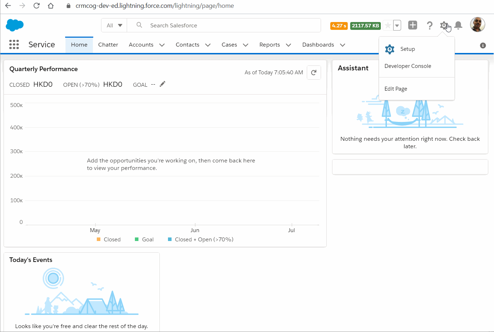

1. Click on **New** to create a new record type
1. Provide a label, description
1. Provide access to the new record type to one or more profiles
1. You can select a default layout for record type for all profiles, or provide distinct layouts
1. Save!

You can now change the record type for any specific record.

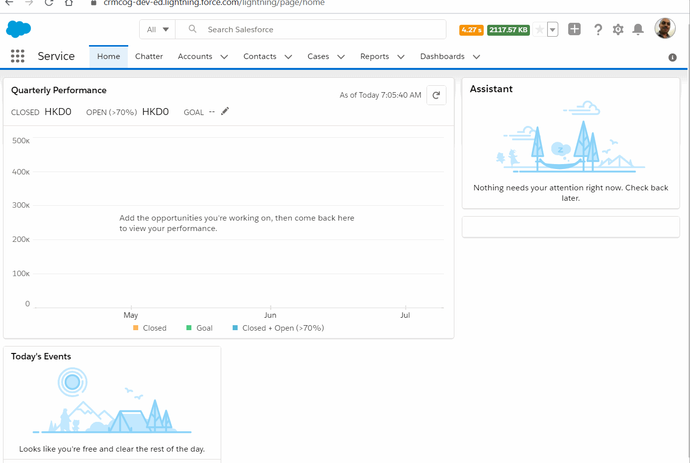

Record types change behaviour in multiple ways-

1. Display distinct UI layouts: You can specify the same or different layouts for profiles when records belong to a specific record type
1. Display distinct picklist values (if selected)
1. Enable different business processes to be applied to a record

Record types provide a powerful way to enable personalised UI for records based on the value. For e.g. -

1. Sales reps may need to focus on different fields when the account record type is 'wholesale' as compared to a more boring 'retail' customer
1. Sales managers and sales reps may need to see different fields for the same 'wholesale' customer
1. Provide different sales processes for retail and wholesale customers in opportunity functionality

## Reports

No UI discussion is complete without reports.

Reports typically provide valuable insights to an organisation -

1. Overview of state of business
1. Trends across time and other factors
1. Visualise co-relation between business and environmental factors

A report can be or contain -

1. list of records - filtered by conditions specified by you (e.g. get opportunities created in the last week)
1. grouped by a field specified by you (e.g. get me month-wise opportunity count for this year)
1. visual representation of data (e.g. a pie chart of revenue by sales rep, a bar chart of sale trends for the entire year)

_/j_
Although reports were super popularised by a small subset known to the world as "TPS Reports", they have been known to exist in some shape and form since humanity existed. It is a lesser known fact that old stone age paintings in Asia also depict an early form of pie chart.

A dashboard is a collection of related or independent reports. It can have -

- a list report showing record list
- a visual display of metrics and trends

You can use dashboards to show an overview of "where we are". Users can drilldown on individual reports to find more details.

Reports and dashboards can be easily configured in Salesforce.

The typical life cycle for creation of reports -

1. Identify report type to use / create report types
1. Create reports
1. Create dashboards
1. Include reports on your own UI (if relevant)

### Create Report Types

Report types refer to "report templates" in Salesforce. They provide the ability to create report from a set of fields included in the type and in pre-defined formats.

Salesforce provides standard report types out of the box and you can create awesome report types of your own.

You can see available report types in -

1. Navigate to **Setup** > **Home** tab
1. Find for **Report Types**. Select **Feature Settings** > **Analytics** > **Reports and Dashboards** > **Report Types**

You would want to select the report type that includes the fields and relationships to other objects that you want to use in your reports.

To create a new report type -

1. Navigate to **Setup** > **Home** tab
1. Find for **Report Types**. Select **Feature Settings** > **Analytics** > **Reports and Dashboards** > **Report Types** (Click on **Continue** on the first info screen if this is the first time you are accessing report types)
1. Click on **New Custom Report Type**
1. Select **Primary Object**, the name of report type, description and a category (you will see these categories in the navbar in reports view). Any custom object that has `Allow Reports` option checked in object detail and is not part of master-detail relationship will be available for report type creation
1. Select related objects and related-related objects in a hierarchy. You can specify whether the relationship can include parent records that may have zero related records or must have at least one record to display in report
1. Once you save, you can go back to the layout and specify different labels for fields (if that is your thing)

Your report type is now fit and ready to save the world.

### Create reports

You can view reports or create/edit them in a distinct **Reports** tab in an app. Search for the tab in additional tabs if you don't see them by default.

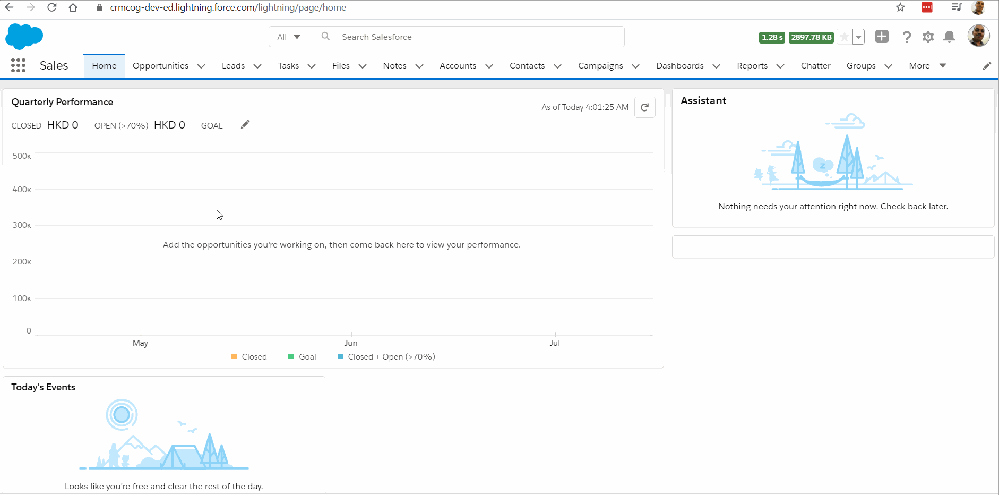

To create the report -

1. Navigate to **Reports** tab
1. Click on **New Report** button
1. Select report type on which this report will be based
1. Add/remove fields or add group fields from the **Outline** tab. Group records by column or by row - also see "bucket fields" below
1. Create formula fields that can derive values from actual fields. For e.g. use a formula to look up state values and show them in an abbreviated form on reports
1. Specify sort order by directly clicking on the fields dragged on to the report layout
1. Specify filters to use (e.g. My accounts, All accounts), etc. in the **Filters** tab
1. Add charts by clicking on **Add Chart** button at the top. This is available only when data is grouped on report
1. Save report - pay attention to the "folder" in which you share reports. The folder drives visibility

Note that -

1. Data security rules in salesforce do not have a play here - users see all fields on reports as long as users have access to reports. You have to control report visibility by creating folders for different groups of personnel and store reports targeted at them
1. While users can drilldown on a record displayed on report, they will get an error if they don't have access to the record
1. Reports show limited records on the screen. You can export to CSV, Excel or any available formats to get up to 20K records in the report
1. You can 'subscribe' to a report to get periodic reports - click on drop-down button at the right in **Report** tab and click **Subscribe**
   - get daily, weekly or monthly reports - same report but refreshed data
   - you can run report for yourself or as another person (your subordinate for e.g.)

The above workflow should be the standard from now on, but there is an older admin experience available with Salesforce Classic.

In Classic, you had to specify the type of report (Tabular, Summary, Matrix or Joined report) - to indicate the type of information displayed on the report. For e.g. tabular contained just a simple data table, summary/matrix reports allow aggregation/groups on fields. The types of reports refer to how information can be displayed on reports and are not to be confused with report types - which are just, templates.

#### Report filters

Report filters allow you to get to specific data of interest. You can use filters on field values in the parent object (on which the report is based), or use a "cross filter" to filter records based on a related entity (for e.g give me all contacts with account type 'Retail').

Users can change the filter criteria while viewing reports.

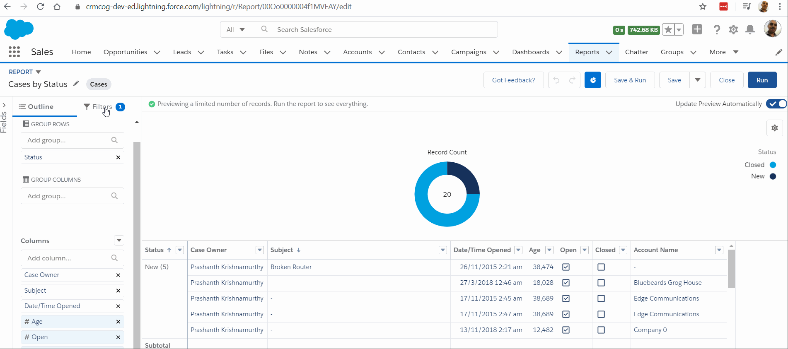

Report filters work on top of relationship filters defined at the report type level - for e.g. if you have specified that Accounts need to have at least one contact at the report type level, you cannot see accounts with zero contacts in report despite removing all other filters.

#### Bucket Fields

While creating the report, you can not only group by field values as they exist in database, but also group by ad-hoc groups that group the actual values. These virtual fields that exist only for a report are called "bucket fields".

For e.g. let's say we have an opportunity report that groups records by stage - Qualification, Prospecting, Value Proposition, Closed Won etc.. This is all good until you want them grouped as closed and open opportunities. Instead of creating a separate field in business layer, you can group by bucketing the stage values on the report.

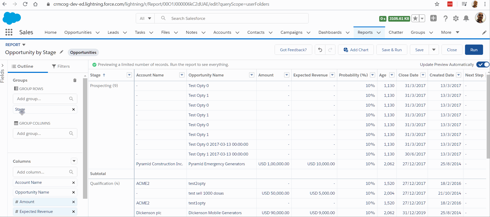

You can create bucket fields for both row or column grouping.

### Dashboard

You can view or edit/create dashboards from **Dashboards** tab.

To create a new dashboard -

1. Navigate to **Dashboards**
1. Click on **New** button
1. Drag and drop reports (or even Visualforce pages) - these are called "dashboard components"

You can also add reports to dashboard from the **Reports** tab.

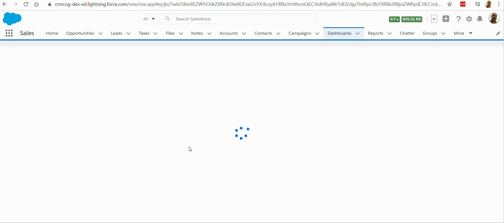

You can specify a filter component for the overall dashboard that applies to all dashboard components.

You can also customise dashboard components to have unique filtering criteria that is relevant to dashboard, display different charts as compared to the original report, etc. All these are configurable by the admin as well as the end-user who is the consumer of the dashboard.

You can share dashboards through folders - similar to reports. You an share folders (if you are the owner/have relevant privileges) to other users or groups - either view, edit or manage access.

Users can click on "Follow" button against dashboards (that they have access to) to get a notification in their Chatter feed when the dashboard is refreshed.

## Customising Salesforce UI

So far, we have seen how you can configure Salesforce UI. As you would have seen, configuring UI is quick, painless, and easy to maintain.

At the same time -

1. UI has defined layouts (a list has to be fields arranged side-by-side, a form has fields arrayed in an x-column layout)
1. Standard layouts may not allow complex operations (for example: interact with a rich text box to show spelling mistakes, or showing activities in a colour-coded calendar)
1. It is not possible to go out of standard UI behaviour - e.g. clicking on fields to edit record, pop-up edit for parent/related records, etc.

The Salesforce-standard behaviour may be changed by customising UI. This customisation is not an administrator function, but all good administrators should be aware of what the system can do. So, here's a sneak-peak at customisation options.

There are two distinct ways to customise Salesforce UI -

1. Lightning UI - will be used as default. You can use Lightning framework to create components by writing in code. These components can be assemble together by developers or administrators to create Lighting pages
1. Visualforce - used to create pages for Salesforce Classic (but can also be useful to create Lightning UI in niche case - we will not go there for now)

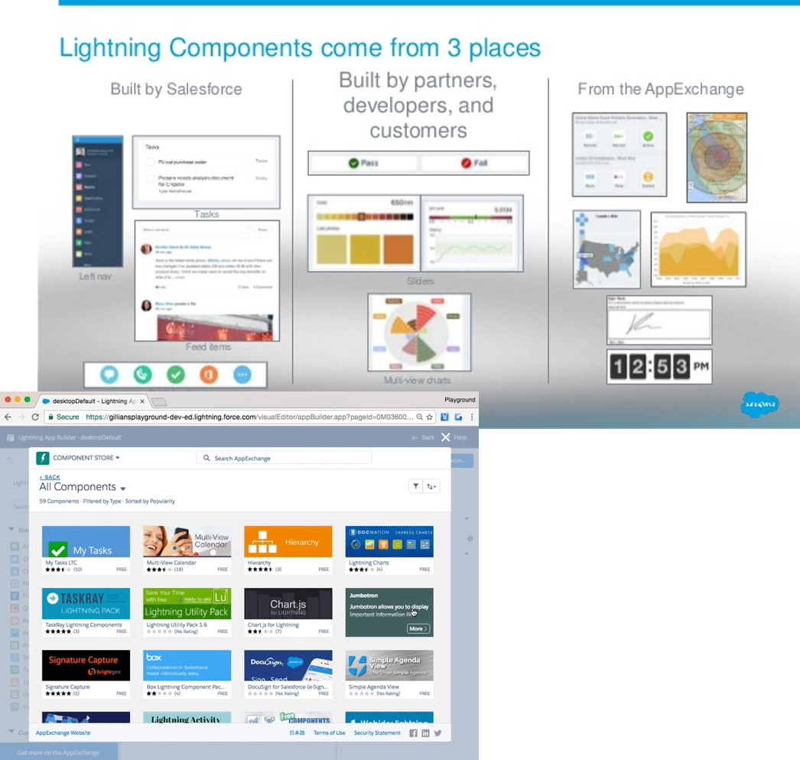

A few points to note about the two options -

- Visualforce is page centric, while Lightning allows entire applications to be assembled
- Ability to reuse Lightning components within org and from AppExchange is very powerful. This allows admin/designers to create advanced apps without developers
- Convert Visualforce pages to Lightning with simple stylesheets (for OOB components)
- It is possible to use Javascript or custom front-end frameworks and work with Salesforce.com APIs for very niche needs

## Workshop

| No. | Type | Description                                | Time (hrs) |
| --- | ---- | ------------------------------------------ | ---------- |
| 1   | Do   | Create / rename app                        | 1          |
| 2   | Do   | Create UI for all related entities         | 1          |
| 3   | Do   | Create quick actions                       | 0.5        |
| 4   | Do   | Reuse Lightning component from AppExchange | 0.5        |
| 5   | Do   | Explore Salesforce UI on mobile app        | 0.5        |
| 6   | Do   | Create reports & dashboards                | 1.5        |
| 7   | Do   | Create lists – private and public          | 0          |
| 8   | Do   | Create and explore record types            | 0.5        |

### Create/revise app

1. Create or rename app - call it “Healer Elite”. Select an icon and publish app
2. Create an app page and expose that to all roles
3. Create three different types of record pages for Visits – doctor, CC, Manager. Use same views for now – this can be changed later
4. Create two different home pages for doctors and CC – retain same views or change them

### Create / revise UI for all related entities

1. Show fees in UI only if there is one or more record
2. Do now show “Contacts” in Patients tab

### Create quick actions

1. Create quick actions to trigger a manual reminder email on user click against scheduled visit
2. Create a quick action to open Paypal home page when clicked against the visit. This will be finally used to accept fees through Credit/Debit Cards

### Reuse Lightning component from AppExchange

1. Use AnyCalendar in your UI (for Visits) - [https://appexchange.salesforce.com/appxListingDetail?listingId=a0N3A00000Ev8qpUAB](https://appexchange.salesforce.com/appxListingDetail?listingId=a0N3A00000Ev8qpUAB)
2. Group related list against Visits – open and closed visits [https://appexchange.salesforce.com/appxListingDetail?listingId=a0N3A00000FYDY4UAP](https://appexchange.salesforce.com/appxListingDetail?listingId=a0N3A00000FYDY4UAP)
3. Use enhanced lightning grid for at least one of your related lists [https://appexchange.salesforce.com/appxListingDetail?listingId=a0N3A00000EVK8iUAH](https://appexchange.salesforce.com/appxListingDetail?listingId=a0N3A00000EVK8iUAH)

### Explore Salesforce UI on mobile app

1. Download Salesforce app from Android Playstore
2. Explore Salesforce app and discuss how UI/quick actions are laid out in the mobile device vs. desktop browser
3. Make change to Doctor list view in the Lightning Experience for compact layout, list and detail views. Make note of changes within Salesforce app

### Create Reports & Dashboards

1. Create reports –

   1. List report to show all visits in a current month and last month.
   1. List of visits, patients grouped by doctors with a chart representation
   1. Total fees against doctors, rolled up to branch, city and overall hospital
   1. Month-wise utilized vs. unutilized beds
   1. Potential vs. accrued fees for doctors – consider availability of 1 hour = Rs. 10,000 fee potential
   1. Total fees for visits by branch, city and overall hospital for the last one year. Apply “Additional State Taxes” of 1% for Bangalore, 1.1% for Chennai, 1.4% for Mumbai to calculate final fee
   1. No. of patients managed by individual CC

2. Create dashboard –
   a. Dashboard to show four of the above reports in one screen

3. Enable reports for `1.4`, `1.5` & `1.6` (as listed above) to be viewed by manager and above

### Create private and public lists

1. Create ‘Scheduled Visits for Day’ public list to show scheduled visits with start date as that day
2. Create a public list that shows only dormant customers
3. Select any five visible contacts, collect ids and create a private list that filters only those records. Name it “My De-hospitalized Patients”

### Create and explore record types

1. Create record types for corporate and household customers.
2. Create at least 4 fields specific to record type. Fields need to be visible only for the specific record types

   - Corporate: TAN, Headquarters Address, Corporate Insurance, HR Contact, Account Owner, Designate for Medical Check-up?
   - Household: No. Sr. Citizens, No. < 5 years, Multi-city?

3. Create a field “Status”. Values must differ as per the customer type

   - Corporate: Proposal, Expired
   - Household: Initiated, In Progress, Active, Dormant

4. Only Account Owner should edit the field “No. of Employees”, “Potential Value” for corporate customers

## Teaching Aids

### Presentation

#### 1. UI Customisation: sf-cog

&nbsp;

  <iframe src="https://docs.google.com/presentation/d/e/2PACX-1vTGmM_bl_ZntVLzPdMe88qUbqEVshiV4hZCD6stAERacDQRgSwk-suvK2lyfEPk8Q/embed?start=false&loop=false&delayms=60000" frameborder="0" width="800" height="600" allowfullscreen="true" mozallowfullscreen="true" webkitallowfullscreen="true"></iframe>

[More info](/misc/pricing#sf-cog)
