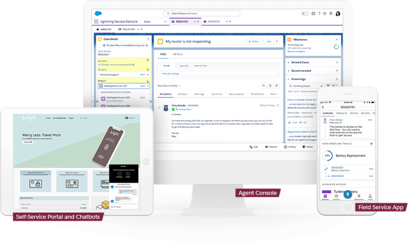
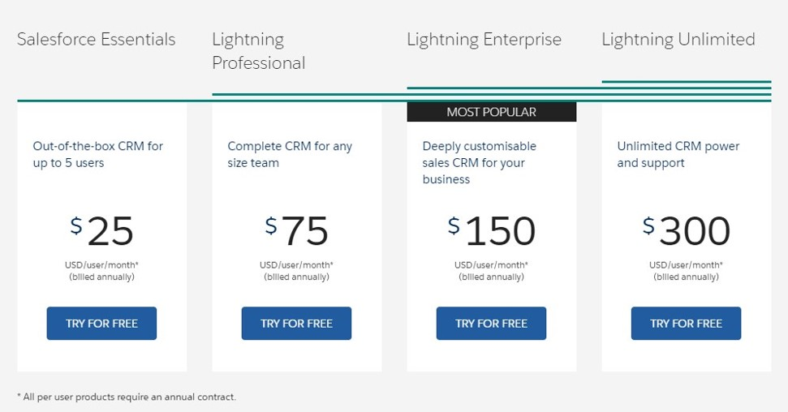
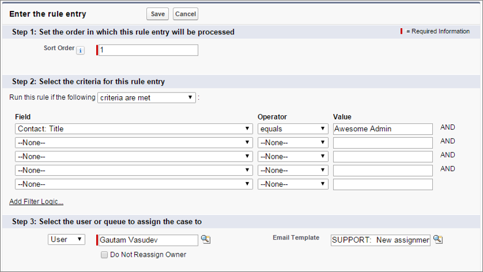
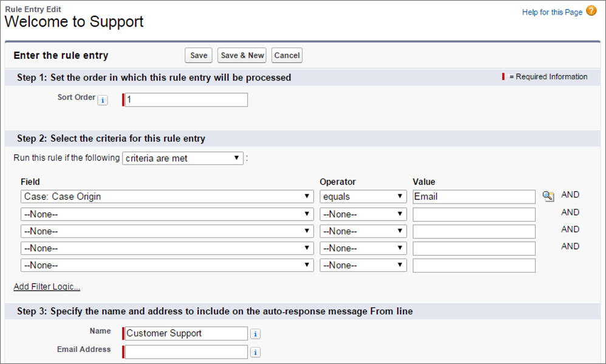
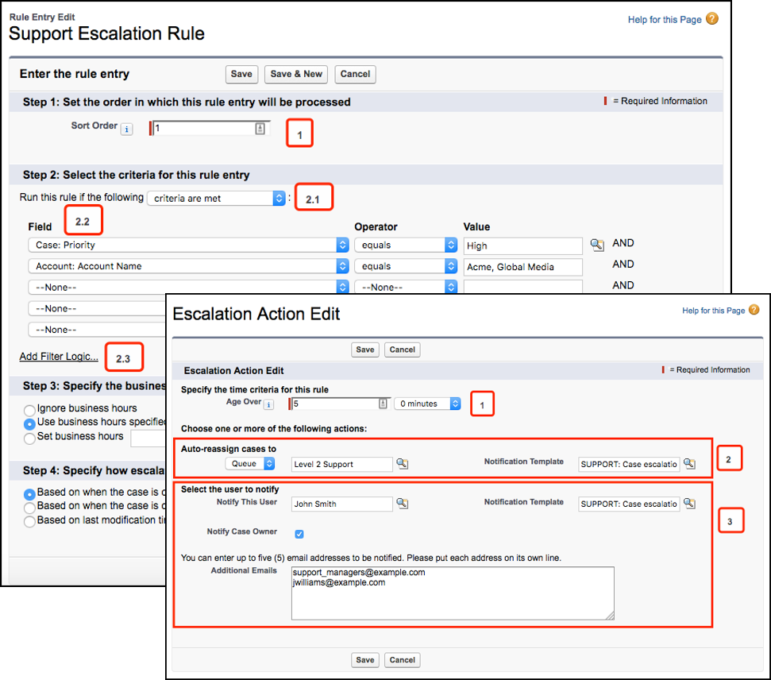
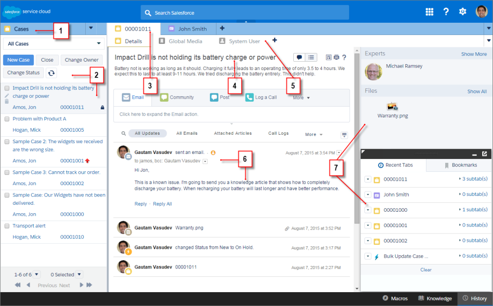

# Service Cloud

Salesforce groups functions related to service organisations in 'service cloud' product. Service cloud consists of apps, objects/rules/automation and more to increase service efficiencies of an organisation -

- Enables reps to manage service business
  - Provides tools to know your customer and issues
  - Faster case resolution
  - Multi-channel platform for org employees, partners and customers
- Pinnacle of transactional service offering
- Service takes over from sales, and works together with other enterprise systems for - fulfilment
- Focused on service management

Similar to Sales Cloud, Service Cloud enables different levels of functionalities in different editions.

  _src: [Service Cloud Pricing](https://www.salesforce.com/in/products/service-cloud/pricing/)_

## Who uses Service Cloud?

Service Cloud is used by organisations that have their core business around some kind of service.

Every business may be seen as providing some kind of service (you have to service what you sell, perhaps). While Service Cloud may help them all, it's true power lies in providing super powers to organisations structured around a service business.

Service cloud is used by -

- Service Professionals
- Capture complaints, feedback and customer conversations
- Process cases for resolution
- Support customers across channels
- Service Operations
  - Align processes to improve productivity and optimise service
  - Improve service rep efficiencies
  - Optimise service times, and part supply chain
  - Service scheduling
- Field service personnel
  - Get assigned to the right service
  - Offer right service onsite

## Processes

The typical processes associated with sales cloud are -

- Case management
- Task management
- Service order management
- Knowledge management

The following terms get used quite a bit in service cloud and service management in general.

**Omni channel support**

Omni channel service refers to providing support and having those conversations with customers in context of a customer request/requirement across multiple channels.

For e.g. -

1. Your customer org may have a manager creating a Case to repair their server hardware
1. The same manager may call you to raise priority
1. A service engineer may write an email with details of the problem
1. The CTO calls you to know the progress

Or.. take another situation -

1. A customer complains on social media
1. Customers regularly call you on your service number, but they may also email you
1. You have a chat support team online and ready 16 hours a day to attend to people seeking direct and immediate help on your website

While you may have service personnel trained for certain actions, you cannot just bear the thought of inefficiencies of multiple teams doing their own thing and trying to create their own moats.

Omni channel support helps you to provide the same seamless support experience across any channel and across customer touch points.

**Personalised Service**

In your daily support, you would want to take customer needs into consideration -

1. Customer personnel availability
1. Communication channel preferences
1. Identify up-sell / cross-sell opportunities based on customer business, the products / services they get from you and industry trends
1. Or.. this is really important - send e-cards on their birthdays

**Compliance**

Adhere to regulatory and organisational compliance requirements while providing service. Your system should have the ability to capture the right data and ensure right action at the right time.

For e.g.:

1. Life science companies have to capture all the right data in case of major injury or death due to their products and send the information to regulatory bodies within specified number of hours or days of the incident
1. Shop lines may strive to maintain transparency in reporting throughput trends, risks and anticipated issues so that the organisation can align supply lines to offset risks

Guided user interfaces, business validations, automated assignment rules, escalation rules and standard communication templates come together quite nicely to address any compliance needs.

**Standardised processes, workflows and approvals**

Best practices get embedded in processes and process templates make implementing the process easier. Salesforce can provide infrastructure to implement standard repeatable templates -

1. Processes aided by business rules and system-guided flows
1. Automated, rule-based approvals and notifications/escalations
1. Ability to automate common tasks using macros
1. Processes split into tasks and assigned to right owners - with pre-defined timelines
1. Templates to standardise communication emails
1. Reuse solutions and practices that have been used effectively before to serve customers and to course-correct processes where necessary
1. Real-time reporting to identify trends and improve process efficiencies

**Customer self-service**

Enable self-help channels for customers and rally everyone around using the organisation's products or services better.

Again, how does Salesforce help?

1. Self-service websites that completely integrate in the larger salesforce ecosystem
1. Enable community portals that get super charged with supporting information, FAQs, solutions, forums/groups etc.

## Entities

Typical entities in service cloud -

| Entity                        | Description                                                                                                                 | Attributes                                    |
| ----------------------------- | --------------------------------------------------------------------------------------------------------------------------- | --------------------------------------------- |
| Case                          | Inquiries, feedback, service request, complaints                                                                            | Number, Type, Priority, Escalation, Status    |
| Contacts & Accounts           | Individuals and businesses who are of interest to the organization                                                          | Name, Phone, Address, Category                |
| Knowledge                     | Collated knowledge articles to resolve issues or respond to customer. Well integrated in the service flow and has analytics | Title, Description, Types, Categories, Voting |
| Solution                      | Documented solutions to address cases                                                                                       | Title, Description, Status                    |
| Community                     | Users and interest group.                                                                                                   |                                               |
| Live Agent / Mobile Messaging | Communication channels to engage customers                                                                                  |                                               |
| Social                        | Engage customers on social media                                                                                            |                                               |

## Cases

Cases are at the heart of service cloud. Requests for service, inquiries, complaints and any other customer requirement for service is captured as a "case".

Cases can and should be created as a starting point to initiate service - regardless of the channel through which service is requested.

Cases may have -

1. Customer information - accounts, contacts, product information
1. Nature of case and details of service - type of case, origin, details of problem or service request, priority, severity
1. Tagged to related lists including tasks, approvals, attachments and case history

## Business Automation for Cases

### Assignment Rules

Assignment rules enable businesses to identify right owner for given case, and route cases without (or with minimal) intervention. Using these rules an administrator can have the system assign cases (new/cases not attended to/anything else) to specific groups (typically to "queues") or individuals depending on a set of rules.

### Auto-response Rules

Use auto-response rules to send acknowledgement, response, update emails without human intervention.

Salesforce enable administrators to -

- create templates for sending notifications by dynamically include relevant data (E.g. case number) in acknowledgement/response
- send emails through specific templates when cases satisfy conditions set forth in rules
- send emails to specific personnel based on their privileges and relevance. Copy support personnel in response emails

### Escalation Rules

Salesforce enables administrators and service leaders to create rules that redirect cases when not attended to (or when they meet select criteria) and provide attention to cases not being actively worked upon.

Using escalation rules you can-

- Define SLA response/resolution times for Cases – order, criteria
- Escalate cases to queue or individuals
- Define specific notification and escalation actions to automate sending emails, creating tasks and more

### Email to Case

Email to case refers to creating case from emails sent by customers.

Salesforce can -

- Recognise customers from emails and create case
- Use assignment rules to assign case to a queue (or even to specific service personnel)

To configure email-to-case -

1. Navigate to **Setup** > **Home** tab
1. Find for **Email-to-Case**. Select **Feature Settings** > **Service** > **Email-to-Case**
1. Select /de-select options to enable HTML emails, insert thread id in email subject/body
1. Create routing address and specify whether emails create a task

## Tasks

Tasks are activities that record every step of the way while resolving a case and also have details that can get under one's skin.

While tasks can be (and probably exist) against most entities, they are especially useful in cases where tracking of history, assignment changes, granular activities may be more significant given the nature of cases and the need to get an answer to customers / resolve customer problems quickly.

A task can be a call, email (received or sent), a quote sent to customer, or anything else that deserves a record.

## Service Console

Service console provides a superior user experience for service personnel - specifically those who are front-lining customer conversations.

Service console provides service representatives and managers super powers -

1. Manage multiple calls/ conversations. Customer conversations may be a drawn out affair with one side or the other waiting for information, waiting for a task to be completed, and so forth. Managing multiple calls improves agent productivity and keeps service costs low.
1. Open multiple tabs/details in context of a case - all without leaving the case in focus. For e.g. search for previous cases, standard solution templates, or FAQs for a given problem. Use multiple tabs that are faster to use than a standard UI experience
1. Run macros to automate most common tasks

  _src: salesforce.com_

1. Select objects and records from the navigation tab.
1. Records display in a list, which you can pin at the left of the top of the screen.
1. Selected records appear as primary tabs, and tabs let you work on several items at once.
1. A highlights panel shows key information related to records.
1. Records related items appear as subtabs, and subtabs let you quickly switch between related information without losing context.
1. View and interact with content in the feed or detail area.
1. Access custom component data in sidebars and footers

## Knowledge Base / Solutions

Salesforce knowledge provides a knowledge repository of knowledge articles, FAQs etc. that agents can reuse. Knowledge base and solutions can be quickly searched for, and templates effectively reused to provide answers to customers' burning questions / clamor for service.

## Communities

Communities provide self-help portals, ability to form private/public groups around topics / products and a way for customers to partner with the organisation in order to put a product to better use.

Salesforce Community Cloud provides a comprehensive solution to -

- host forum-like interactions, allow formation of groups around products or topics of interest
- provide customers ability to track their cases
- enable customers to help themselves by accessing FAQs, product/process help documentation, and search for previously recorded solutions or knowledge base
- identify opportunities to up-sell/cross-sell products or services

Agents, managers and community managers can manage brands, gauge market perception, and manage customer conversations on a platform that is integrated seamlessly with the rest of salesforce ecosystem.

## Live Agent

Provide real-time online help through chat service.

A few key features -

1. Provide pre-chat or post-chat messages / pages. Automated responses
1. Assign incoming chat messages to service agents as in a "normal" salesforce case assignment flow to designated personnel - consider skills, availability, and queue traffic
1. Message templates that an agent can use during conversations
1. Ability for supervisors to listen-into conversations when required and provide suggestions to agents
1. Granular, actionable reports

Live agent can exist independently and assign agents for service , or can work with standard Computer-Telephony Integration (CTI) systems to provide a streamlined experience across channels.

## Orders

Order management in service help in capturing products required for service, provide standard templates to carry out service, provide artefacts that need to be shared with customer, etc.

## Workshop

| No. | Type | Description                       | Time (hrs) |
| --- | ---- | --------------------------------- | ---------- |
| 1   | Do   | Explore cases                     | 0.5        |
| 2   | Do   | Create assignment rules for cases | 0.5        |
| 3   | Do   | Create auto-response rules        | 0.5        |
| 4   | Do   | Create escalation rules           | 0.5        |
| 5   | Do   | Enable email to case              | 0.5        |

### Explore cases

- Explore service console and “normal” UI
- Create solutions/knowledge and associate against case

### Create assignment rules for Cases

1. Create automation –
   - If customer is Corporate, any patient is associated with customer – assign account owner as a ‘Hospital POC’ against visit record
   - Assign any cases created by corporate patients to account owner

### Create auto-response rules

1. Create auto-response rules to trigger when case is created
   - Email details of case to patient
   - Copy email to Account Manager if patient is a corporate customer
2. When case gets resolved, send notification –
   - If query – we hope the query was addressed to satisfaction. Else connect with us to help you better
   - If complaint – complaint stands resolved. Please get in touch with Service manager if not satisfied

### Create escalation rules

1. Escalate to Service Manager if any case is not resolved in 5 days
2. Escalate to Service Manager if cases from corporate customers are not resolved in 2 days

### Enable email to case actions

1. Create email to case function

## Teaching Aids

### Presentation

#### 1. Service Cloud: sf-cog

&nbsp;

<iframe src="https://docs.google.com/presentation/d/e/2PACX-1vRAOEcIF_w24QtGH5NIV1HyejOYw9HqVPtPyb0WKHj-802wc3pguvpDY-TD2AdMUQ/embed?start=false&loop=false&delayms=60000" frameborder="0" width="800" height="600" allowfullscreen="true" mozallowfullscreen="true" webkitallowfullscreen="true"></iframe>

[More info](/misc/pricing#sf-cog)
