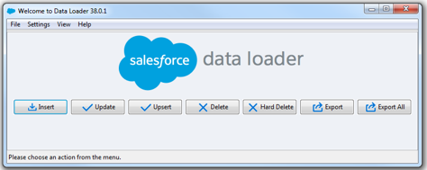
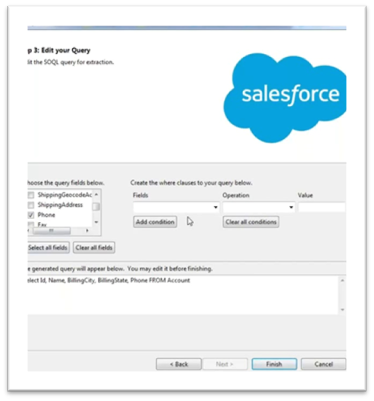
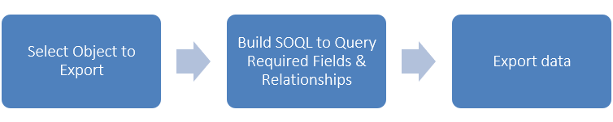
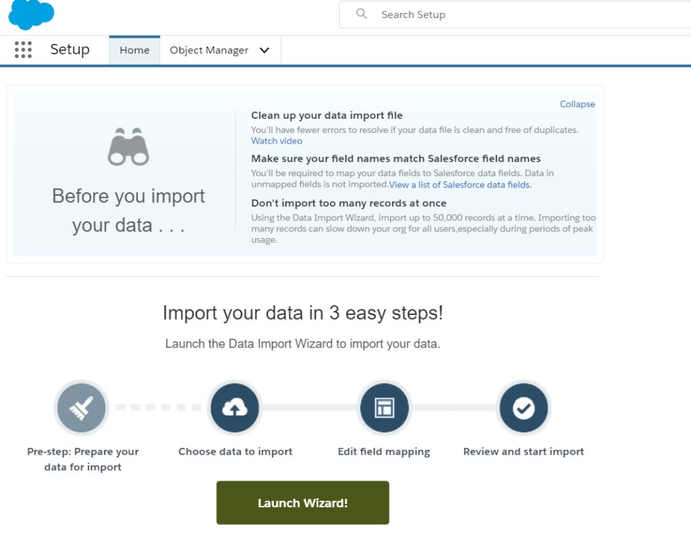
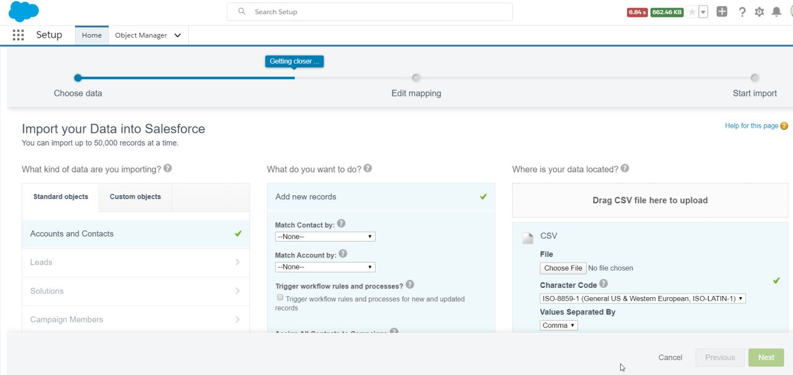

# Data Management

The typical way to get data in your salesforce org is for the users to type them in :).

Unfortunately, that is not always possible -

1. There are other systems in the enterprise which collect data in hundreds or thousands of records
1. You may be setting up Salesforce for the first time and importing data from an existing system
1. Your company may be acquiring another company that has its own data set to be available for them to use the system

In all those cases (and probably hundreds more), you should consider -

1. using the batch data processing utilities.
1. integrating external systems using Salesforce provided APIs to import/export data

As part of admin course, we will explore a bit on the batch data utilities available within Salesforce in this section -

1. Data Loader application (independent program supplied by Salesforce)
1. Data import wizard (available within Salesforce app)
1. Overview of third party batch data processing options

## Data Loader

Data loader is a desktop tool to batch import, update or export data to/from salesforce. You use files to source data when using data loader.

## Considerations for using Data Loader

Here are the typical considerations while doing any export/import of data-

- Identify the need for bulk operations
- Use Data Loader to-
  - Create field mapping
  - Work with fields and attachments
- Use data import wizard (within app) and Windows-based Data Loader tool
- Work with basic SOQL/SOSL
- Effect of Apex rules, workflow, assignment rules on Data Loader

### Installing Data Loader

Data loader is an independent program to batch process data. Refer the [Data Loader installation instructions](https://developer.salesforce.com/docs/atlas.en-us.dataLoader.meta/dataLoader/loader_install_general.htm) to install the program for your operating system. It essentially consists of two steps-

1. [Install OpenJDK](https://www.azul.com/downloads/zulu-community/?architecture=x86-64-bit&package=jdk)
1. Go to **Setup** > **Integration** > **Data Loader**. Download Data Loader and set it up on your device

### Using Data Loader

To use Data Loader, you first create mappings to map columns in your file to the fields in Salesforce.

- Admins (or super users) can create mappings within Salesforce for Data Import
- Data files (including relationships ) need to identify a Salesforce id, or external id for upserts
  - Can be created manually or using data manipulation routines outside Salesforce
- Data Loader tool is typically used by admin / support team – has advantages over the data import wizard

Exporting data will include following steps -

Import data process will look like this -

The development life cycle consists of -

1. Design backing up routines for data that will get impacted
1. Design data transformations external to data loader
   - Change values or structure of data in the file
   - Third party utilities like Informatica ETL/Cloud help streamline these processes for larger enterprises
1. Design data map - map fields to columns
1. Design test cases - automated checks and manual tests. Include process testing as part of data testing (e.g. check whether order management goes through just fine for the products being imported)
1. Import in sandbox. Conduct system tests for data loads and for backup routines
1. Import in production

Data Loader can process records in bulk and you should set a good enough number for you.

Note that data loader by itself cannot be scheduled to run at a specific time or to repeat job executions, but you can use the Command Line arguments to run the data loader and schedule the program using external schedulers available for your operating system. (typically this is done on a server machine.)

## Data Import Wizard

Data import wizard is available through the Salesforce app and should be your go-to tool for simple batch processing routines.

Access data import wizard by going to **Setup** > **Integrations** > **Data Import Wizard**.

Click on **Launch Wizard** for a guided screens to get started.

- Choose entities
- Choose your operation - insert, update, insert & update
- Choose your file
- Create/edit mappings between the input file and Salesforce fields
- Start import!

As you see, this is simpler than using data loader.

- No need to install anything, and the tool is available within Salesforce app
- You can schedule export
- You can get alerted on data duplicates and choose to ignore duplicate records while importing data

On the other hand -

1. It supports only record sets up to 50,000 records
1. Although data import wizard supports all custom objects, only a few Salesforce default objects are supported (e.g. Accounts, Contacts, Leads). Data Loader supports all custom and Salesforce provided objects (excluding users)
1. You cannot delete records
1. No export facility available (Data Loader supports exports)

## Third Party Data Utilities

Data loader provides an easy solution to import data, but is not always effective for all use cases. For example -

1. You need complex data transformation before loading data to Salesforce
1. You need custom roll-back logic for treating data exceptions
1. Establish entity relationships for inbound data using custom keys or using complex logic
1. You need custom error handling for sensitive data

Large enterprises with complex data needs often consider external tools to data integration.

The third party data processing utilities also call Salesforce batch data API to load data (similar to Data loader), but provide additional functions to make your life easier (at a cost of course). Common functions provided by external programs -

- Manipulate data before feeding into salesforce (or even generating files for data loader)
- Provide better ways to create relationships with less manual intervention
- Custom error handling and better control on rollback

Your org-wide API limits apply for any data processing operations using these third party utilities.

Examples -

- Jitterbit Data Loader for Salesforce
- Apsona app
- Mulesoft (part of Salesforce in Q2 '18, but is additional cost)
- Informatica Cloud / On Premise solution with Salesforce Connector
- Salesforce Connector in Heroku
- Talend & other solutions that manipulate data structure and values before files are processed by Salesforce Data Loader

## Workshop

| No. | Type | Description                 | Time (hrs) |
| --- | ---- | --------------------------- | ---------- |
| 1   | Do   | Explore data wizard         | 0.5        |
| 2   | Do   | Explore data loader         | 0.5        |
| 3   | Do   | Explore mass data changes   | 0.5        |
| 4   | Do   | Explore dataloader.io/other | 0.5        |

### Explore data wizard

1. Export contacts
2. Import new contacts using the contact template

### Explore data loader

1. Export visits
2. Create new patients if necessary
3. Import visits using the visit template, associate visits with Doctors, patients
4. Import bed assignment data for patients

### Explore mass data changes

1. Change status of ‘Dormant’ customers to active if there is a visit in the last one week

### Explore Dataloader.io / Other

1. Explore third party tools to export/import data

## Teaching Aids

### Presentation

#### 1. Data Management: sf-cog

&nbsp;

<iframe src="https://docs.google.com/presentation/d/e/2PACX-1vSR-CZEpX0gKI9mCV7Y3DuM2YNdpjM-SGJ4bv-d72PLCqHKKHa_o7bekji74omchA/embed?start=false&loop=false&delayms=60000" frameborder="0" width="800" height="600" allowfullscreen="true" mozallowfullscreen="true" webkitallowfullscreen="true"></iframe>

[More info](/misc/pricing#sf-cog)
