# TRUST / Security

We have seen details about application and data security rules in an earlier chapter. Let us build on that knowledge to understand how different aspects of Salesforce system protect your data.

## Application and Data Security

This section is a recap, but an important one.

We have seen that security is controlled by -

1. Roles
1. Permission sets
1. Profiles
1. Org-wide defaults

Profiles and permission sets control which views you see in the application. Roles and org-wide defaults ("OWD") control the data that you see in those views.

Roles and OWD enforce security rules to users reading or manipulating data through APIs.

You control data access at three levels as depicted below.

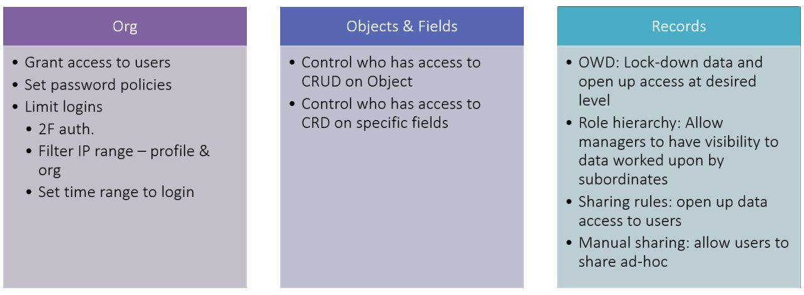

You would also remember that you restrict data to the max extent possible using OWD and open up data as required.

-Org wide defaults (OWD): default access for user to access record created/owned by other users
-Role hierarchies: data access granted automatically to managers of record owners
-Sharing rules: provide access to users for others’ data
-Manual sharing: provide access to data to anyone with system access

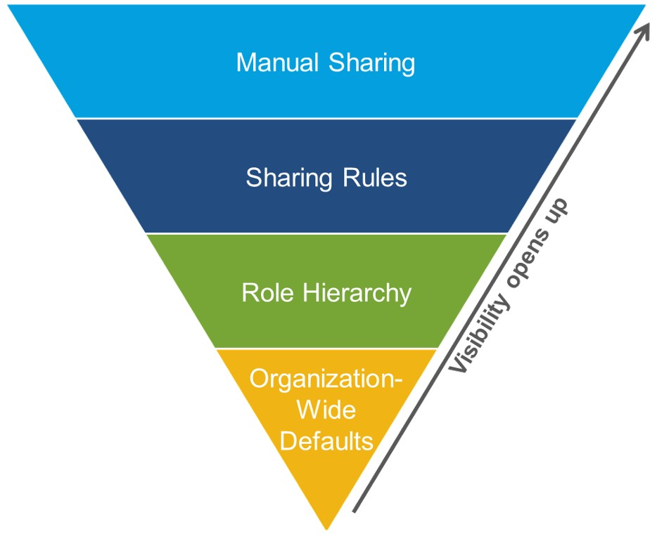 _src: salesforce.com_

You design and implement sharing rules to allow or deny users to data depending on data sensitivity - either automatically or through manual sharing. Below are the levels at which data security is applied in Salesforce.

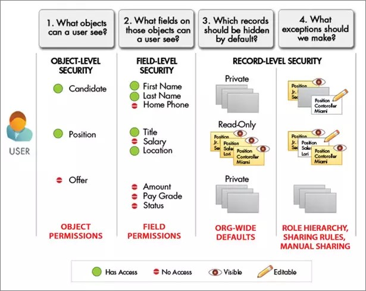  _src: salesforce.com_

### Profiles

As we have seen earlier - each user in salesforce has one and exactly one profile.

There are two parts to profile -

- Profile settings = access to app, tab, field or record type
- Profile permissions = read, create or edit records, run reports, customize app

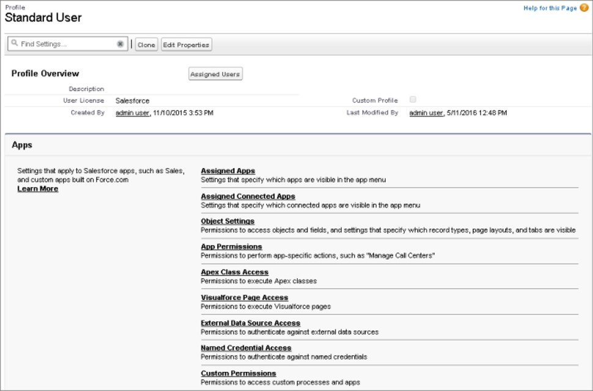

We refer to profiles supplied by Salesforce as 'Standard profiles'. These are -

- Read-only
- For e.g. System administrator, Standard user

You cannot modify standard profiles, but can create other profiles by cloning them. You can also create profiles from scratch. The profiles you create are known as 'Custom profiles'.

App license has its role to play in profiles. The license specifies the views/functionality that the user will have access to. The licenses you see in Salesforce are licenses you have paid for - this acts as the control layer based on the Salesforce plan you are on.

You can specify two powerful properties against profiles -

- View All Data
- Modify All Data

As the names suggest, these properties override all sharing settings. Users tagged to the profile will get access to read or manipulate data regardless of their role.

In essence, you can assign following privileges using profiles -

- Read: permission to view
- Create
- Edit
- Delete
- View All
- Modify All

Except for the last two privileges, rest of them respect the data access rules enabled against role + sharing rules.

You would have already created profiles while going through previous chapters -

1. Navigate to **Setup** > **Home** tab
1. Find for **Profiles**. Select **Users** > **Profiles**
1. Click on **New**. Select a profile that will be cloned to create this new profile. Select the profile that is "near" to the permissions you want to enable with the new profile. Assign a license
1. Provide app permissions for new profile
   - object settings - provide read/edit/delete access to objects and fields, assign page layouts
   - apps, connected apps
   - Visualforce page
   - execute Apex classes
   - access external data source
1. Provide system permissions for new profile
   - system-wide permissions like 'Modify All Data'
   - specify login hours
   - define password policies
   - specify default Community
1. Assign one or more users to the profile by clicking on the button at the top

### Permission Sets

Use permission sets to grant permissions to users or groups.

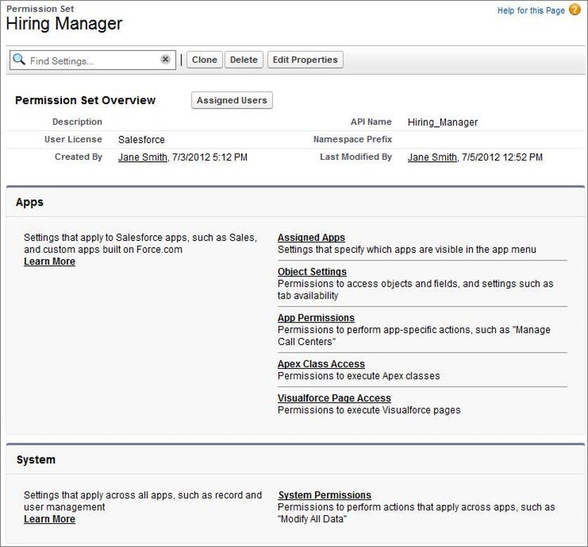

Permission sets have same function as profiles, but different. They provide privileges to users without changing their profiles.

- Users can have zero or more permission sets while they can have only one profile at any time
- Permission sets can only provide additional permissions - not remove them. To remove permissions from user, you have to remove the permission set from user (and also change profile if required)
- Due to their nature of adding permissions and the ease of managing permission sets, they are also extensively used to grant permissions on demand for a limited time-period

Permission sets are our preferred way of granting permissions. They can be thought of as "modern version of profiles" and also are invaluable in packages due to their flexible nature.

To create new permission sets -

1. Navigate to **Setup** > **Home** tab
1. Find for **Permission Sets**. Select **Users** > **Permission Sets**
1. Click on **New**. Select a license
1. Provide app permissions for the new permission set (similar to profiles)
1. Provide system permissions for the new permission set (similar to profiles)

Permission sets provide granular access to opening up access and can be stacked up to combine rules. It is so much more easy and manageable to -

1. Create baseline profile with minimum required permissions
1. Incrementally add permissions using permission sets based on granted privileges

For e.g.

- all personnel in sales organisation can be provided read-only access to Accounts, Contacts, Opportunities
- and then.. assign edit privileges, and access to Orders, Cases, and Quotes depending on their job role

As you have seen - permission sets also have licenses set against them, and the license cannot be modified once set.

In addition to the permissions that can be set through profiles, permission sets can also control who has access to run Apex classes – web services & Visualforce controllers. You cannot control who has access to triggers though.

Note that permission set licenses are different from permission sets. They extend license granted through permission set or profiles

### OWDs

Organisation-wide or organization-wide or org-wide defaults provide the default restrictions that are applied against a given object in the org.

Objects are tagged to an OWD in the Salesforce out of the box application, but that can be modified to suit your company needs.

You can set OWD in **Setup** > **Security** > **Sharing Settings**.

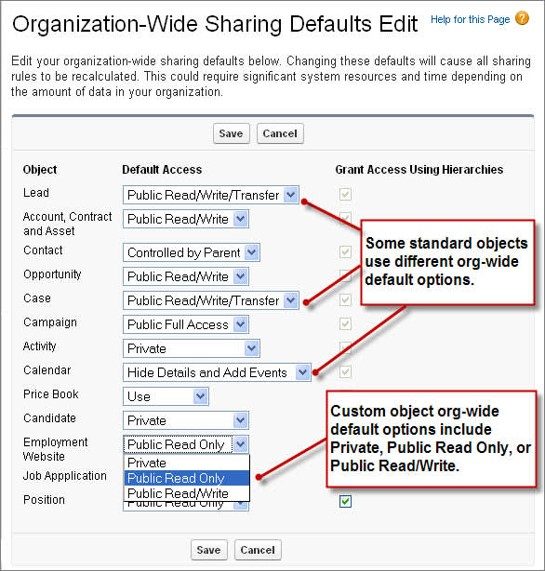 _src: salesforce.com_

There are four types of restrictions that you can place using OWD -

- Private: Record owner and manager can see
- Public read-only: All users can see; owner & manager can edit
- Public read/write: free for all – read, edit, reports
- Controlled by parent

You can decide OWDs quite methodically as depicted below -

 _src: salesforce.com_

The data protection decision for an object goes like this -

1. Decide which OWD to provide baseline security for any object - read-only or edit
1. Access for 'private' object data are decided by roles & role hierarchies
1. Access to records are also decided by sharing rules
1. Access to fields and views are decided by profiles and permission sets

Typically you end up using 'private' or 'controlled by parent' for new custom objects.

Note that even when access is restricted through OWD, 'View All', 'Modify All', 'View All Data', 'Modify All Data' permissions can override those restrictions and view/edit all records.

## Other Data Access Considerations

### Roles & Role Hierarchy

Role hierarchy is represented in Salesforce by providing how roles stack up and report to each other in the salesforce org. Role hierarchy plays along with sharing rules to determine the access of data to users.

Role hierarchy may not reflect the actual org hierarchy but also depends on other factors. For e.g. -

1. Data access needs - for e.g. back-end service personnel in call center may need access to all territory data
1. Data administration needs - administrators need access to data across regions

A user can have zero or one role. Any role may or may not be part of the role-hierarchy.

| Roles                                                                                                                                                                                                    | Role Hierarchy                                                                                                                                                                                          |
| -------------------------------------------------------------------------------------------------------------------------------------------------------------------------------------------------------- | ------------------------------------------------------------------------------------------------------------------------------------------------------------------------------------------------------- |
| Always have access  <ul><li> Group Member</li><li> Queue Member</li><li> Role Member</li><li> Member of Subordinate Role</li><li> Territory Member</li><li> Member of Subordinate Territory</li></ul> | Access through hierarchy  <ul><li> Manager of Group Member</li><li> Manager of Queue Member</li><li> Manager of Role</li><li> Manager of Territory</li><li> User Role Manager of Territory</li></ul> |

A manager has same privileges to data as the direct subordinate. However, you can override this default behaviour using 'Grant Access using Hierarchy' flag and disable data access to managers in custom objects. There are limitations to this behaviour - see [security sharing considerations](https://help.salesforce.com/articleView?id=security_sharing_considerations.htm&type=5) and [manager role help page](https://help.salesforce.com/articleView?id=users_managers_only.htm&type=5) for details.

If a user is have more than 10K records assigned, it is advisable to keep user out of the role hierarchy for performance reasons

### Sharing Rules

Sharing rules provide a way to automatically or manually share data across individuals and groups.

Sharing rules signify -

- What to share: criteria based sharing rules are defined on field values
- With who: share with groups or roles. A group may contain users, roles, roles & - subordinates, or other public groups
- What access: read and read/write Access using Hierarchy flag can disable data - access to managers in custom objects

Internally, Salesforce maintains record access by mapping the record with users having access to the record. This access may depend on one or more of -

1. Roles and default manager access (and any flags preventing such access)
1. Sharing rules triggered automatically depending on record data
1. Manual sharing of record

Sharing rules can be against the following attributes.

| Category                                | Description                                                                                                                                                                                                                                                                                                                                                                                                                                                                                                                             |
| --------------------------------------- | --------------------------------------------------------------------------------------------------------------------------------------------------------------------------------------------------------------------------------------------------------------------------------------------------------------------------------------------------------------------------------------------------------------------------------------------------------------------------------------------------------------------------------------- |
| Managers Groups                         | All direct and indirect managers of a user.                                                                                                                                                                                                                                                                                                                                                                                                                                                                                             |
| Manager Subordinates Groups             | A manager and all direct and indirect reports who he or she manages.                                                                                                                                                                                                                                                                                                                                                                                                                                                                    |
| Queues                                  | All records owned by the queue, excluding records owned by individual members of the queue. Available only in the owned by members of list.                                                                                                                                                                                                                                                                                                                                                                                             |
| Public Groups                           | All public groups defined by your administrator.   If a partner portal or Customer Portal is enabled for your organization, the All Partner Users or All Customer Portal Users group displays. These groups includes all users allowed to access your partner portal or Customer Portal, except for high-volume portal users.                                                                                                                                                                                                        |
| Roles                                   | All roles defined for your organization. This includes all of the users in the specified role.                                                                                                                                                                                                                                                                                                                                                                                                                                          |
| Portal Roles                            | All roles defined for your organization’s partner portal or Customer Portal. This includes all users in the specified portal role, except high-volume portal users. A portal role name includes the name of the account that it’s associated with, except for person accounts, which include the user alias                                                                                                                                                                                                                             |
| Roles and Subordinates                  | All roles defined for your organization. This includes all of the users in the specified role plus all of the users in roles below that role, including partner portal and Customer Portal roles that contain users with a portal license type. Portal roles are only included in this category if a partner portal or Customer Portal is enabled for your organization. The Roles, Internal and Portal Subordinates data set category is only available in your organization after you create at least one role in the role hierarchy. |
| Portal Roles and Subordinates           | All roles defined for your organization’s partner portal or Customer Portal. This includes all of the users in the specified portal role plus all of the users below that role in the portal role hierarchy, except for high-volume portal users. A portal role name includes the name of the account that it’s associated with, except for person accounts, which include the user Alias.                                                                                                                                              |
| Roles and Internal Subordinates         | All roles defined for your organization. This includes all of the users in the specified role plus all of the users in roles below that role, excluding partner portal and Customer Portal roles. This category only displays if a partner portal or Salesforce Customer Portal is enabled for your organization. The Roles and Internal Subordinates data set category is only available in your organization after you create at least one role in the role hierarchy and enable a portal.                                            |
| Roles, Internal and Portal Subordinates | All roles defined for your organization. This includes all of the users in the specified role plus all of the users in roles below that role, including partner portal and Customer Portal roles. This category only displays if a partner portal or Salesforce Customer Portal is enabled for your organization. The Roles and Internal Subordinates data set category is only available in your organization after you create at least one role in the role hierarchy and enable a portal.                                            |
| Territories                             | All territories defined for your organization.                                                                                                                                                                                                                                                                                                                                                                                                                                                                                          |
| Territories and Subordinates            | All territories defined for your organization. This includes the specified territory plus all territories below it.                                                                                                                                                                                                                                                                                                                                                                                                                     |

_Table src: salesforce.com_

Any changes in position, roles or role hierarchy will trigger recalculation and recreation of access details. Rules recalculation times vary depending on complexity of rule, and number of impacted records.

## Audits

Audit trails ensure a fail-safe system to track access (read or write) to a system of record. Organisations require audit trails in application to -

1. Track how records are manipulated or read by users
1. Ensure regulatory compliance to capture full tracking of details on application or information access

Salesforce enables audit trails on multiple levels -

- Field value update history is tracked using history tracking
- Track login history
- Modifications are tracked in Modified by and Modified Date
- Setup audit trail to track administration changes (for e.g. who enabled or disabled field audit trail and at what time)

We will see more details to enable these audit trails here and in other sections in this chapter.

### Field History Tracking

Field history tracking provides the audit trail for field value changes. This audit trail tracks users who changed values, date/time of the transaction and old /new values.

Field history tracking is used in many organisations to comply to regulatory or organisational compliance requirements.

Enable field history -

1. Go to **Setup** > **Object Manager** tab
1. Drilldown on an object
1. Select **Fields and Relationships**. Click **Set History Tracking**. If you are unable to see this button, just ensure you have "Track Field History" enabled against object in **Object Manager** > Drilldown on object > **Details** tab
1. Enable object for history tracking and select fields of interest. Note that for long fields, you can only track changes (know that change has occurred) and not the old/new values

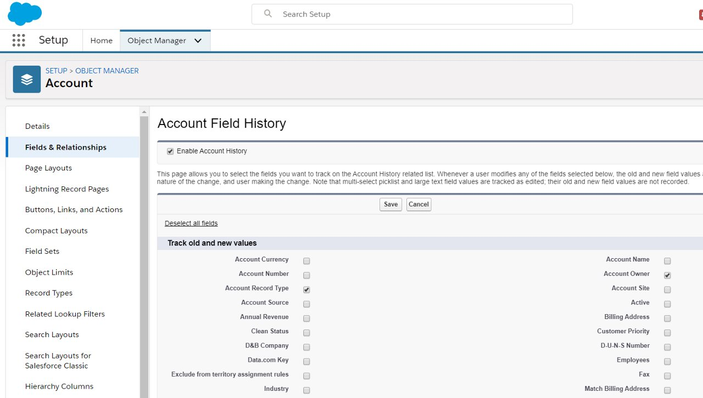

You see the trail of changes through a related list against the record.

1. Go to the page layout of the object that needs to reflect history tracking
1. Add the _Object_ Field History related list to the related list section
1. .. and voila you can now see any recorded changes from field history tracking

Alternatively, you can add the related list through Lightning Page Builder.

## Transaction Security

Salesforce enables you to define real-time security rules to provide enhanced protection to your data.

Using transaction security rules you can -

- Intercept Salesforce events in real-time to apply security rules
- Define real-time actions for policy: e.g. notify, block, 2f auth, freeze user, or end session

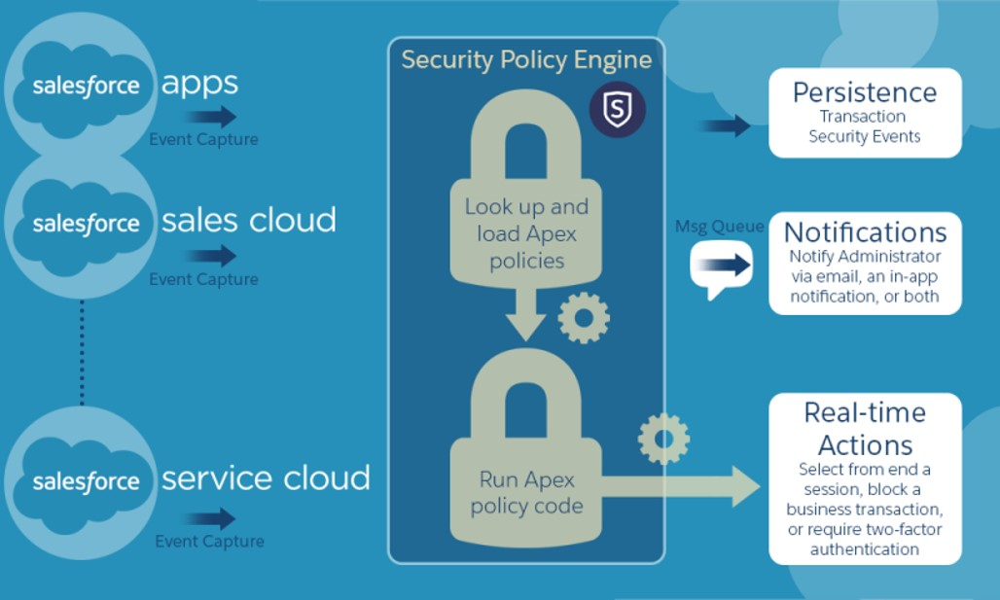

## Application Access Security

While users are the critical part of how Salesforce applications are used, user access is a large surface area for security issues.

Salesforce provides multiple levels of access controls to secure your application and data-

- Login and access restrictions
- Password restrictions
- Session management
- Certificates
- Remote settings

### Login policies & restrictions

You provide additional security measures by restricting access to the application -

- specify login hours against profiles and permission sets
- specify IP ranges from which users can login

These are highly effective in protecting your application from malignant attacks - even if user authentication details fall into wrong hands.

You have already seen how you can setup system permissions against profile or permission sets. Consider revisiting the functionality if that has turned hazy :p

You could also specify trusted IP range for the entire application -

1. Go to **Setup** > **Home** tab
1. Find for **Network Access**. Select **Security** > **Network Access**
1. Click on **New** and specify IP range

You can monitor login history of users through -

1. Go to **Setup** > **Home** tab
1. Find for **Login History** > Select **Identity** > **Login History**
1. View or download data

Login history shows -

1. Login user
1. Login time, IP from which user logged in
1. Environment details like platform OS and browser

### Password policies & changes

You specify password policies against profiles/permission sets -

1. Password length
1. Password complexity
1. Mandate passwords to be changed periodically

### Session management

### Certificates

### Remote settings

## Application Monitoring

### Setup Audit Trail

As seen earlier in this section, Salesforce enables you to track changes to its configuration setup. This assumes significance to ensure full accountability and traceability of changes carried out to audit trail setup (amongst other things) for all administrators and power users.

You can imagine setup audit trail as "history tracking for administrative actions".

Key setup functions traceable through setup audit trail are below -

| Setup             | Changes                                                                                                                          |
| ----------------- | -------------------------------------------------------------------------------------------------------------------------------- |
| Admin             | - Company info, currency, user email   - Certificates   - Users, portal users, roles, permission sets, and profiles        |
| Customization     | - UI settings   - Page layout, tab names etc.  - Critical updates  - Enable, disable Chatter emails                     |
| Security          | - Password policies and resets  - Session timeout parameters  - Named credentials  - Shield platform settings           |
| Data Management   | Data export, Mass delete / transfer, Report snapshots, Data import wizard                                                        |
| Application usage | - Mobile configuration settings  - Enable/disable partner/customer portal accounts  - Enable partner/customer portal users |

See the full list of trackable options in [Security Guide](Full list at https://developer.salesforce.com/docs/atlas.en-us.securityImplGuide.meta/securityImplGuide/admin_monitorsetup.htm).

Setup audit trail enables you to -

- Track up to 20 recent changes to setup listed in UI
- Audit trail data for 180 days available for export in CSV format (data deleted post 180 days)

To access setup audit trail -

1. Go to **Setup** > **Home** tab
1. Find for **Setup Audit Trail**. Select **Security** > **Setup Audit Trail**
1. View entries / download file

## Debug Logs

Debug logs are used to track salesforce-generated and custom events. Using these logs Salesforce application developers and maintainers can collate valuable information about application usage and track errors in any environment.

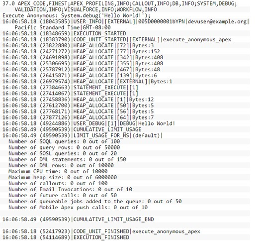

Debug logs can record database operations, system processes, and errors that occur when executing a transaction or running unit tests. They can contain -

- Database changes
- HTTP callouts
- Apex errors, Resources used by Apex
- Automated workflow processes, such as: Workflow rules, Assignment rules, approval processes, Validation rules

Debug logs do not include info. from actions triggered from time-based workflows.

Debug logs consist of the following components -

| Section       | Description                                                                                                                                                            |
| ------------- | ---------------------------------------------------------------------------------------------------------------------------------------------------------------------- |
| Header        | API version; Log category and level   e.g. 44.0 APEX_CODE,DEBUG;APEX_PROFILING,INFO;CALLOUT,INFO;DB,INFO;SYSTEM,DEBUG;VALIDATION,INFO;VISUALFORCE,INFO;WORKFLOW,INF |
| Code units    | Discrete unit of work within transaction. E.g. trigger, web service, validation (NOT Apex class)                                                                       |
| Log Lines     | Time stamp, event identifier   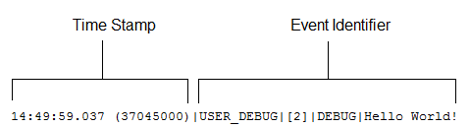                                                            |
| More Log Data | Cumulative resource usage at end of many code units, cumulative profiling info.                                                                                        |

Any application can generate a ton of logs. This can result in important information being buried and hard to locate in the logs. The problem of "too little" or "too much" logging is more pronounced for a large system like salesforce. Salesforce provides easy-to-control debugging filters to control logging levels at various levels -

- Control verbosity for triggers/classes
- Log order of precedence
  - Trace flags within a specific class override all other logic (set in Developer console or using API calls)
  - Else, default logging levels are used
- Default logging levels in Apex are below   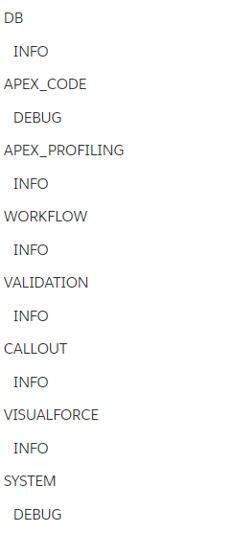 _src: salesforce.com_

See the below illustration to understand how logging levels work.

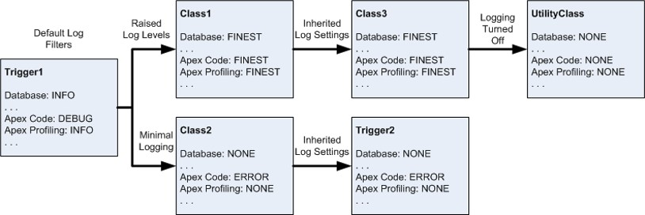 _src: salesforce.com_

Debug logs can be enabled quite easily against an entity or user -

1. Go to **Setup** > **Home** tab
1. Find for **Debug Logs**. Select **Environments** > **Logs** > **Debug Logs**
1. Click on **New**
1. Select **Traced Entity Type** as `Apex Class`, `Apex Trigger`, `Process` or `User`. Specify the **Traced Entity Name** as the specific entity - class, trigger, process or user
1. Specify start/end times to trace activity for creating the log, and also specify the log level

You can view the log entries through salesforce app or download the log file.

### Email logs

Email logs provide details on emails sent from salesforce and their delivery status.

You can download log files in CSV format to view the target email addresses, date/time email was sent (automated/manual) and the status.

You get email logs from -

1. Go to **Setup** > **Home** tab
1. Find for **Email Log Files**. Select **Environments** > **Logs** > **Email Log Files**
1. Specify start/end times between which you need logs (allows a max difference of one week)
1. Specify who will receive the log and submit request

Email logs are available for the past 30 days.

## Job Scheduling and Monitoring

You can schedule "jobs" or routines that run periodically to perform a set of tasks within salesforce.

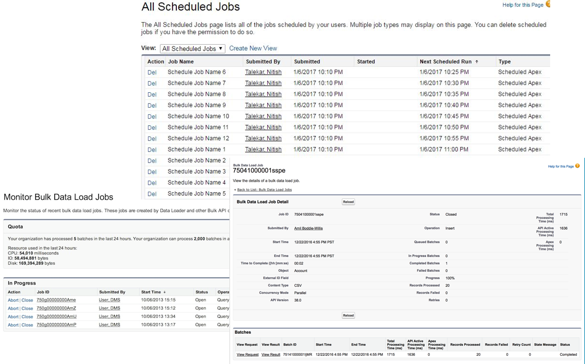

Using this scheduler and job monitor, you can -

- View scheduled jobs: Navigate to Scheduled Jobs in Apex to view jobs: View job details, or delete job instance
- Navigate to Monitor background jobs from Setup : View details of background job (e.g. sharing recalc. for >20k records)
- Navigate to Bulk Data Load Jobs: View in progress and completed jobs. See more details [here](https://help.salesforce.com/articleView?id=monitoring_async_api_jobs_details.htm&type=5) and [here](https://help.salesforce.com/articleView?id=monitoring_async_api_jobs.htm&type=5)

## Other Admin Privileges and Tasks

Administrators are responsible for a number of periodic maintenance tasks in a Salesforce org. A few key tasks are described below.

### Delegation

### Desktop and mobile admin: Mobile app, Outlook

### Deployment

Previously we have seen that a typical development process in Salesforce involves -

1. Design changes
1. Develop changes in non-production environment
1. Test changes
1. Deploy changes to production environment

Deployment not only happens from non-production to production environments, but also across testing environments (e.g. development to test).

Deployment of changes can be done in two major ways -

1. Using change sets (also known as 'the old way'). This uses change sets generated in source environment and uploaded to target environment - all using the salesforce app
1. Automated deployments using configuration files and data routines - typically done using external version control systems and Salesforce command line interface (CLI)

While (1) is typically done by development teams and is fully or partially automated deployments, the second option is more involved and manual.

Administrators often take up the responsibility of deploying change sets in controlled environments.

Deployment with change sets is a 2-step process -

- Create change sets in source and upload
- Validate and deploy in target environment

While change sets are still being actively used in many salesforce implementations, take note that -

- Change set deployments are not version controlled (without manual or external applications).
- It is not the preferred way for deployment anymore

Salesforce automated deployments are setup using version control systems and using Salesforce-provided CLI utility. A typical process is illustrated below.

### Introduction to Developer Tools and Ecosystem

Salesforce developers use many more tools to modify salesforce application and customise it for an organisation's unique needs.

Some of the terms you need to be familiar are below.

| Terms                                                                          | Description                                                                                                                                                                                                                                                |
| ------------------------------------------------------------------------------ | ---------------------------------------------------------------------------------------------------------------------------------------------------------------------------------------------------------------------------------------------------------- |
| Scratch orgs                                                                   |                                                                                                                                                                                                                                                            |
| VS Code / Salesforce extensions for VS Code                                    |                                                                                                                                                                                                                                                            |
| Salesforce DX / CLI                                                            |                                                                                                                                                                                                                                                            |
| Developer Console                                                              |                                                                                                                                                                                                                                                            |
| ANT Migration Tool                                                             |                                                                                                                                                                                                                                                            |
| Workbench                                                                      |                                                                                                                                                                                                                                                            |
| Debugging: Salesforce Lightning Inspector                                      |                                                                                                                                                                                                                                                            |
| Data: Data Loader, Excel Connector, Reports for Excel, Toolkit for Google APIs |                                                                                                                                                                                                                                                            |
| Other Tools                                                                    | - Other Tools - Wilkin Suite IDE for force.com - force.com IDE (no future plans) - Data tools like dataloader.io, Informatica, & Mulesoft - Aside.io (possible future if there is an acquisition) - Maven’s Mate (gone, not buried yet)  |

## Workshop

- Explore UI Security - Layout assignment
- Explore Data Security – Roles, Permissions, Permission Sets
- Explore Audit Trail – field & setup audit trail. Enable audit trail for different type of fields
- Explore and create sharing rules for -
  - Objects & fields
  - Files
  - Reports & Dashboards
  - Apex
  - Visualforce

Follow instructions in sf-cog presentation provided against the teaching materials below.

## Teaching Aids

### Presentation

#### 1. TRUST - Security Revisited: sf-cog

&nbsp;

<iframe src="https://docs.google.com/presentation/d/e/2PACX-1vSV_qSdch3j6i3EqrEURQnvftykUZ7uGWJSdkzN28_AXCpAGk-RnUMCfeRx-CVC4g/embed?start=false&loop=false&delayms=60000" frameborder="0" width="800" height="600" allowfullscreen="true" mozallowfullscreen="true" webkitallowfullscreen="true"></iframe>

[More info](/misc/pricing#sf-cog)
