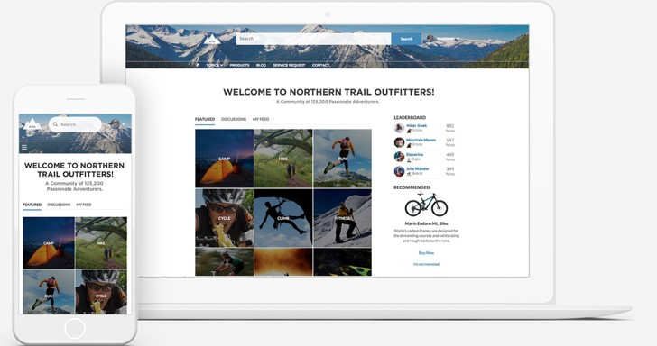
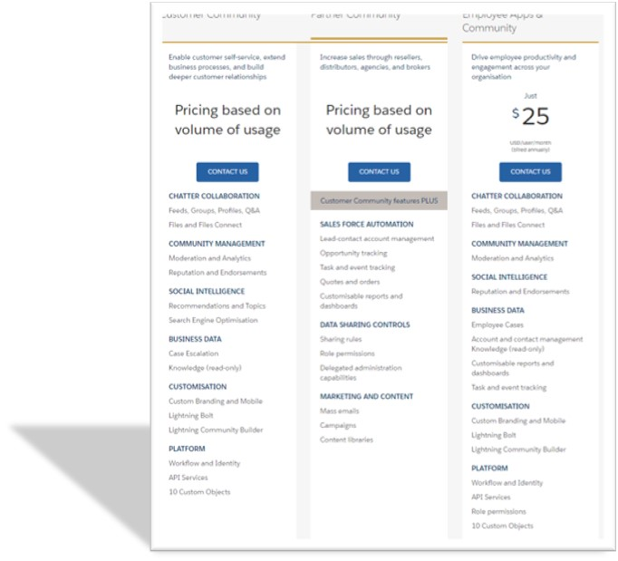
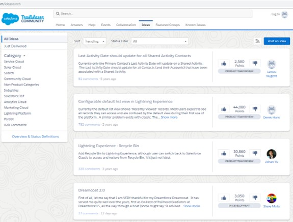
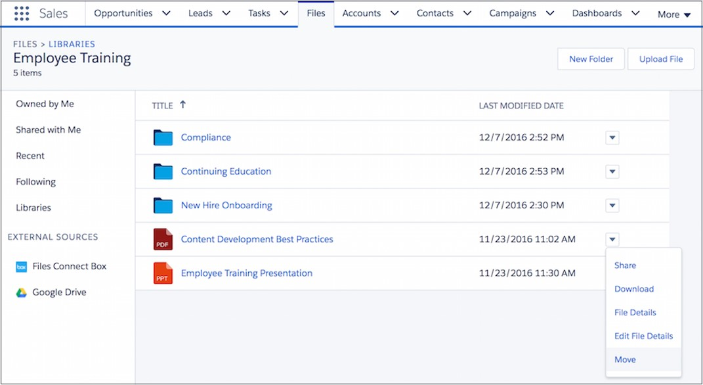

# Collaboration

Salesforce helps orgs manage customer information and internal-facing process information. Establishing better customer relationships and selling more or servicing efficiently requires collaboration amongst multiple individuals and groups within an organization (and even outside organisation - partners, co-development with clients etc.).

This section deals with collaboration tools available within Salesforce.

## Chatter

Chatter is chat tool, forum and resource management tool built in one cohesive interface.

Organisations use Chatter to -

- Enhance collaboration within organization – opportunities, cases, campaigns, track records
- Share knowledge and files – collect answers
- Share and rate ideas – polls, group discussions
- Collaborate with customers and partners
- Embed actions in feed: provide approvals, create tasks, close cases

Chatter enables tracking feeds of records significant to any individual user -

Chatter does not only promote collaboration between individuals and groups, but enables that with data access rules established by the core Salesforce product.

### Enabling Chatter

### Setup feeds

### Chatter groups & members

### Share data on Chatter (with visibility rules)

### Chatter emails

### Publisher actions

## Community Cloud

Community Cloud enables you to create external-facing client or partner websites that are easy to manage, and fully integrated within the Salesforce ecosystem.

- Enable customer/account portal
  - Provides capabilities to brand, personalize
  - Integrate data from multiple sources
  - Enable eCommerce & self-service
- Collaborate with partners
  - Includes reports & dashboards, actions, data sharing
  - Deal & lead registration and distribution
- Collaboration within org and with data context
  - Enable Chatter for groups and knowledge management
- Setup audits to monitor usage –
  - Login history
  - Modifications are tracked in Modified by and Modified Date
  - Field audit trail. Track history of updates
  - Setup audit trail. Track administration changes

  _src: salesforce.com_

Pricing for Community Cloud depends on volume of usage and the collaboration tools required.

### Enable Community Cloud

You can enable Community Cloud and configure UI using Lightning Community Builder. It is a 'no code' solution to customize communities with 'what you see is what you get' (WYSIWYG) functions.

A few salient features of Community Cloud are below -

- Themes to tailor UI - use pre-built themes, or develop your own
- Connect to Enterprise Content Management Systems (CMS)
- Use Lightning Community Templates to fast track development
  - Pre-packed solution frameworks incl. page layouts, components & processes
  - Also built with Lightning Community Builder
- Lightning Bolt solutions
  - Partner Built solutions with apps + process + community cloud templates
  - E.g. patient engagement, supplier management

Community Cloud also provides the standard features expected from a typical website and adds even more awesome features from the salesforce world -

- Built-in SEO
- Custom domain for the community cloud
- CDN caching
- Dynamic branding (branding sets) and theming
- Moderation tools & dashboards
- Personalization
- Built-in groups and Chatter
- Gamification
- Knowledge & Answers
- CPQ
- Advanced Analytics + Google Analytics integration

### Create and manage communities

### Community cloud features

### Branding & personalization

### User management

### Topic management

### Collaboration with customers and partners

## Ideas

Salesforce has a beautiful ideas app to leverage org knowledge and foster innovation.

Administrators can enable ideas in org to collaborate on ideas. Using Ideas you can -

- Tag ideas to one or more categories
  - One or more categories can be tagged to ideas
- Gamify idea generation through Reputations
- Organize into zones (logical groups) having their own distinct focus
- Improve focus on topics / categorise ideas with with idea themes
- Selectively provide voting power

## Content Library

Use content library in salesforce to -

- Store, share and manage files
- Permissions are given at the library level
  - User-driven and ad-hoc
  - Add users, or groups
- Org can have max 2000 libraries

## Workshop

| No. | Type | Description             | Time (hrs) |
| --- | ---- | ----------------------- | ---------- |
| 1   | Do   | Enable Chatter feed     | 0          |
| 2   | Do   | Create Community        | 1          |
| 3   | Do   | Explore Ideas           | 0          |
| 4   | Do   | Explore content library | 0          |

### Enable Chatter

1. Enable Chatter for all create entities if not already done
2. Create publisher actions to notify account manager from any chatter feedback from corporate patient

### Create Community

1. Create a Healer community for patients using Napili template
2. Explore community – topics, conversations, groups

### Explore Ideas

- Explore reputation score, ideas and voting

### Explore content library

- Compare permissions for content library vs. attachments

## Teaching Aids

### Presentation

#### 1. Collaboration: sf-cog

&nbsp;

 <iframe src="https://docs.google.com/presentation/d/e/2PACX-1vTf-e620yy3Kn0VYgIHK49MtYcDGRpid8IDHGiuZhJgPmESXUDP8AJOHsgVQpAtwg/embed?start=false&loop=false&delayms=60000" frameborder="0" width="800" height="600" allowfullscreen="true" mozallowfullscreen="true" webkitallowfullscreen="true"></iframe>

[More info](/misc/pricing#sf-cog)
