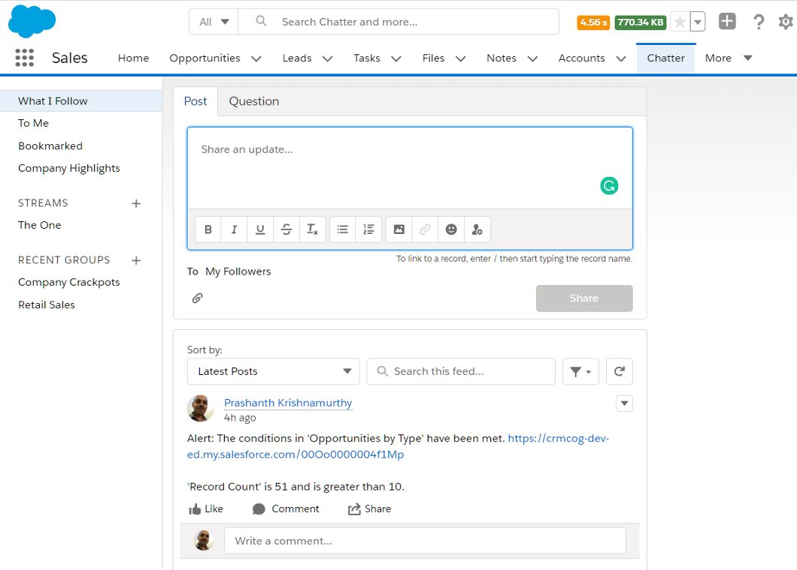
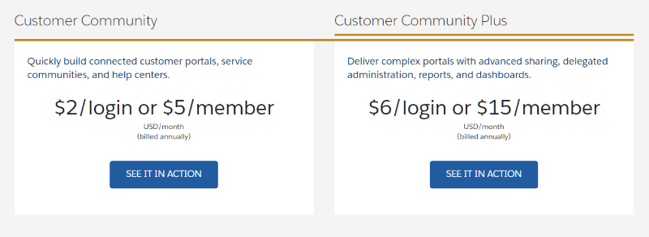

# Collaboration

Salesforce helps orgs manage customer information and internal-facing process information. Establishing better customer relationships and selling more or servicing efficiently requires collaboration amongst multiple individuals and groups within an organization (and even outside organisation - partners, co-development with clients etc.).

This section deals with collaboration tools available within Salesforce.

## Chatter

Chatter is chat tool, forum and resource management tool built in one cohesive interface.

Organisations use Chatter to -

- Enhance collaboration within organization – opportunities, cases, campaigns, track records
- Share knowledge and files – collect answers
- Share and rate ideas – polls, group discussions
- Collaborate with customers and partners
- Embed actions in feed: provide approvals, create tasks, close cases

Chatter enables tracking feeds of records significant to any individual user -

Chatter does not only promote collaboration between individuals and groups, but also enables that with data access rules established by the core Salesforce product.

### Enabling Chatter

To enable chatter -

1. Go to **Setup** > **Home** tab
1. Find for **Chatter**. Select **Feature Settings** > **Chatter** > **Chatter Settings**
1. You can click on **Edit** button to edit settings and disable/enable chatter. In addition -
   - you can enable approvals through Chatter
   - enable publisher actions. Tick the box **Enable Publisher Actions**
   - allow users to collaborate with customers and invite them to groups
   - provide mods super powers to edit posts / comments
1. While you are at this..
   - setup which fields show up in Chatter when users "follow" an object to get updates in their Chatter feed - change fields against objects in **Feed Tracking**
   - change groups UI - because, why not. **Groups** > **Group Layout**
   - setup Chatter emails so that users can get updates on email

Users can now -

- start collaborating with internal employees or customers/partners (the latter has to be allowed by admin)
- start "following" records and those updates show up in their feeds
- approval requests start showing up in chatter and those can be approved at the click (or two) of a button
- make announcements, ask questions and upload attachments
- form groups and discuss their cat photos
- mute every feed item so that there can be peace

### Publisher Actions

You can reduce user clicks for getting things done by using publisher actions. Actions in Chatter refer to the "shortcuts" to a function that can be achieved easily enough by clicking on an option against a Chatter conversation (yes, that rhymes. Some of us are failed rappers here).

Standard actions supplied by Salesforce includes Post, File, Link and Poll.

You can see actions by clicking on the action bar at the top of the Chatter page, and on top of a conversation.

## Community Cloud

Community Cloud enables you to create external-facing client or partner websites that are easy to manage, and fully integrated within the Salesforce ecosystem.

- Enable customer/account portal
  - Provides capabilities to brand, personalize
  - Integrate data from multiple sources
  - Enable eCommerce & self-service
- Collaborate with partners
  - Includes reports & dashboards, actions, data sharing
  - Deal & lead registration and distribution
- Collaboration within org and with data context
  - Enable Chatter for groups and knowledge management
- Setup audits to monitor usage –
  - Login history
  - Modifications are tracked in Modified by and Modified Date
  - Field audit trail. Track history of updates
  - Setup audit trail. Track administration changes

  _src: salesforce.com_

Pricing for Community Cloud depends on various editions (which provide different functionalities), volume of usage and the collaboration tools required.

You can see the [Community pricing page](https://www.salesforce.com/in/editions-pricing/community-cloud/) for details and comparison of functions available in each flavour/edition.

### Enable Community Cloud

You can enable Community Cloud and configure UI using Lightning Community Builder. It is a 'no code' solution to customize communities with 'what you see is what you get' (WYSIWYG) functions.

A few salient features of Community Cloud are below -

- Themes to tailor UI - use pre-built themes, or develop your own
- Connect to Enterprise Content Management Systems (CMS)
- Use Lightning Community Templates to fast track development
  - Pre-packed solution frameworks incl. page layouts, components & processes
  - Also built with Lightning Community Builder
- Lightning Bolt solutions
  - Partner Built solutions with apps + process + community cloud templates
  - E.g. patient engagement, supplier management

Community Cloud also provides the standard features expected from a typical website and adds even more awesome features from the salesforce world -

- Built-in SEO
- Custom domain for the community cloud
- CDN caching
- Dynamic branding (branding sets) and theming
- Moderation tools & dashboards
- Personalization
- Built-in groups and Chatter
- Gamification
- Knowledge & Answers
- CPQ
- Advanced Analytics + Google Analytics integration

### Create and manage communities

To create a new community -

1. Go to **Setup** > **Home** tab
1. Find for **Communities**. Select **Feature Settings** > **Communities** > **All Communities**
1. Click on **New Community**
1. Select a template, provide a name and select an URL to create your beautiful community

Once the community is created, you can start customising it. Click on the top left icon to get started.

1. Change the theme
1. Change/add sections to the page - content, sidebar, buttons, etc.
1. Add Lightning components to show record lists/details

When you are satisfied with your community, click on 'Publish' to make the community site live and rejoice.

You can see all the analytics you need in the **Workspaces** link that you see when you click on the site icon on the toolbar. You can install additional AppExchange packages for better reporting. You can moderate conversations by heading to the **Moderation** link.

Customers or partners who are the target audience for your community may now self-register, start asking questions, and get all the right solutions.

## Ideas

Salesforce has a beautiful ideas app to leverage org knowledge and foster innovation.

Administrators can enable ideas in org to collaborate on ideas. Using Ideas you can -

- Tag ideas to one or more categories
  - One or more categories can be tagged to ideas
- Gamify idea generation through Reputations
- Organize into zones (logical groups) having their own distinct focus
- Improve focus on topics / categorise ideas with with idea themes
- Selectively provide voting power

## Content Library

Use content library in salesforce to -

- Store, share and manage files
- Permissions are given at the library level
  - User-driven and ad-hoc
  - Add users, or groups
- Org can have max 2000 libraries

## Workshop

| No. | Type | Description             | Time (hrs) |
| --- | ---- | ----------------------- | ---------- |
| 1   | Do   | Enable Chatter feed     | 0          |
| 2   | Do   | Create Community        | 1          |
| 3   | Do   | Explore Ideas           | 0          |
| 4   | Do   | Explore content library | 0          |

### Enable Chatter

1. Enable Chatter for all create entities if not already done
2. Create publisher actions to notify account manager from any chatter feedback from corporate patient

### Create Community

1. Create a Healer community for patients using Napili template
2. Explore community – topics, conversations, groups

### Explore Ideas

- Explore reputation score, ideas and voting

### Explore content library

- Compare permissions for content library vs. attachments

## Teaching Aids

### Presentation

#### 1. Collaboration: sf-cog

&nbsp;

 <iframe src="https://docs.google.com/presentation/d/e/2PACX-1vTf-e620yy3Kn0VYgIHK49MtYcDGRpid8IDHGiuZhJgPmESXUDP8AJOHsgVQpAtwg/embed?start=false&loop=false&delayms=60000" frameborder="0" width="800" height="600" allowfullscreen="true" mozallowfullscreen="true" webkitallowfullscreen="true"></iframe>

[More info](/misc/pricing#sf-cog)
