# Rest of Salesforce Ecosystem

So far we have seen different components of salesforce and how they can be configured. But, this is not the entire salesforce - we refer primarily to sales cloud, service cloud and community cloud, and not much beyond that.

In this chapter we will see a bit more about supporting salesforce components and additional products that play nice with the core salesforce product. The information here will not be part of any exam, but is geared towards providing an overview of additional products and how they can help.

## Salesforce Help and Support

It is highly likely that you have referred back the 'Help' pages / support forums for your questions or issues at one time or the other.

You just click on the help icon from any screen to open a popup screen to see relevant content and navigate to that content on the salesforce site.

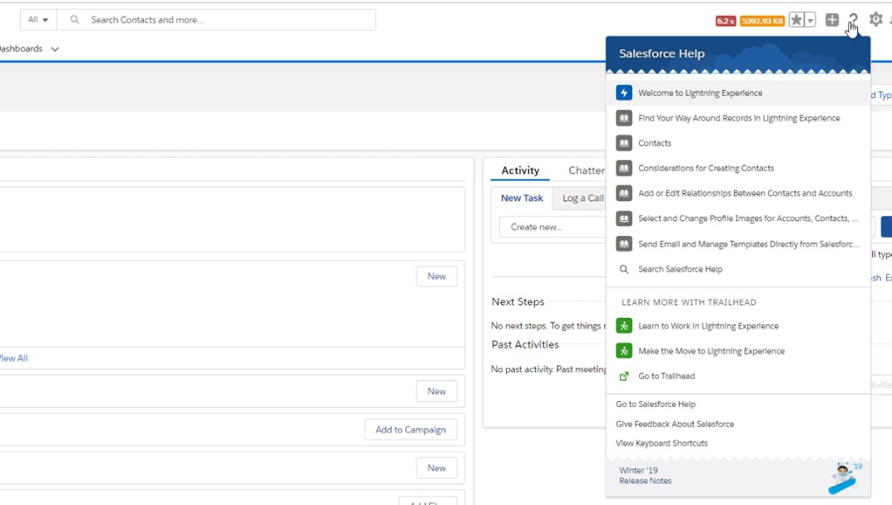

Help can be sought in many forms -

- Application Help

  - Get help from help pages, documentation and training (Trailhead)
  - Seek official support from Salesforce - https://help.salesforce.com/support
  - Users, SME and Support teams can also look at TRUST site to know severe / major issues

- Community Help: [Seek answers / help / advise from Community](https://success.salesforce.com/answers), or from external forums
- Other
  - Partner Help: Get help from within app / partner provided model

Here are a few links of interest -

| Ask                                                                                      | Solution                                                                                                                          |
| ---------------------------------------------------------------------------------------- | --------------------------------------------------------------------------------------------------------------------------------- |
| Get answers to your issues                                                               | [https://success.salesforce.com/answers](https://success.salesforce.com/answers)                                                  |
| Collaborate                                                                              | [https://success.salesforce.com/\_ui/core/chatter/ui/ChatterPage](https://success.salesforce.com/_ui/core/chatter/ui/ChatterPage) |
| Keep track of Salesforce events                                                          | [https://success.salesforce.com/events](https://success.salesforce.com/events)                                                    |
| Create or upvote ideas                                                                   | [https://success.salesforce.com/ideaSearch](https://success.salesforce.com/ideaSearch)                                            |
| Join interest groups and collaborate within a focused community                          | [https://success.salesforce.com/featuredgroups](https://success.salesforce.com/featuredgroups)                                    |
| Keep track of known issues (you can interact with support – cannot create anything here) | [https://success.salesforce.com/issues](https://success.salesforce.com/issues)                                                    |

### Online Help

Salesforce Help provides dynamic / interactive help from any screen. You can configure custom screens to also have help pages - but you have to write your own help content.

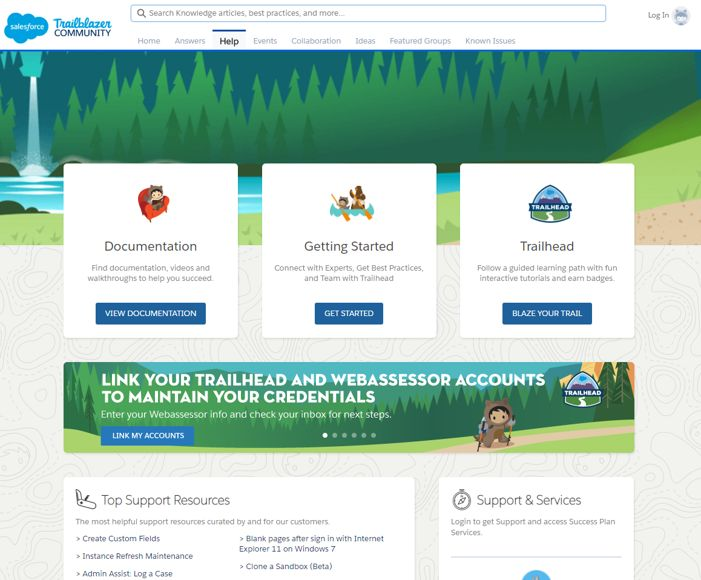 [Salesforce Help](https://help.salesforce.com/)

### Salesforce Support

Salesforce provides support in two flavours:

- Standard: online support + self-service
- Premiere: 24x7 on-call and 1:1 engagements

Depending on how important vendor support is for your organisation (which depends on your salesforce implementation complexity, really) and your IT budget, you can go crazy with support.

### Community Help

Beyond the help links on the popup -

- [StackExchange salesforce community](https://salesforce.stackexchange.com/questions) is quite active and helpful (if you put in the work that is)
- [Reddit salesforce community](https://www.reddit.com/r/salesforce/) is another option

### TRUST site

Go to [Salesforce Trust](http://trust.salesforce.com/) website to know -

- system status
- security information & practices
- salesforce compliance – certifications and attestations

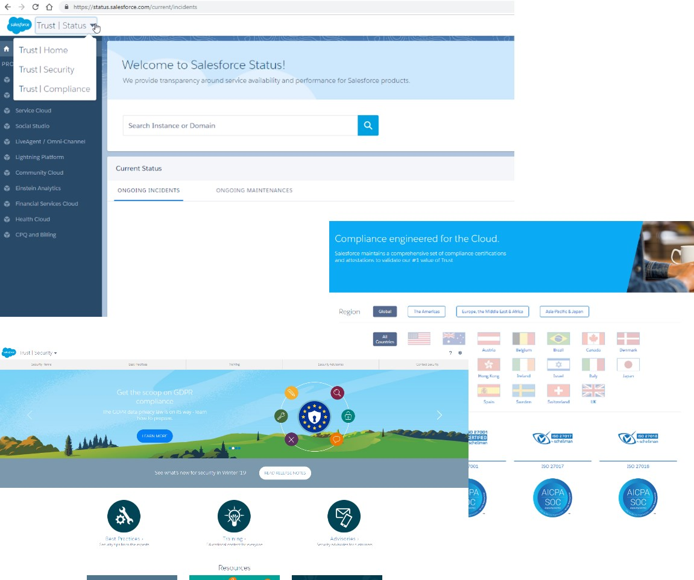

## Einstein Cloud

### What is it?

Einstein Cloud is Salesforce's artificial intelligence platform.

- AI and Predictive capabilities
- Apps on any of the Salesforce clouds can leverage Einstein
- Simple to use, powerful AI which is built to purpose
- Models are determined – not defined by user

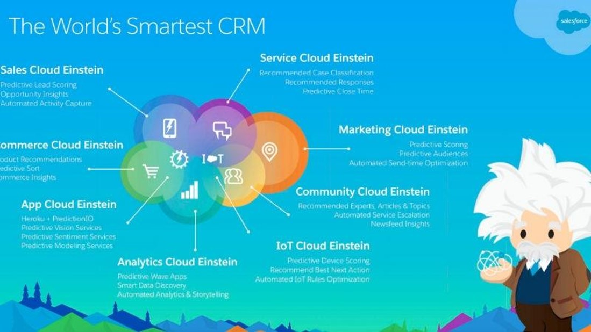 _src: salesforce.com_

### Know more

- Trailhead
  - [Einstein](https://trailhead.salesforce.com/en/content/learn/trails/get_smart_einstein)
  - [Einstein Discovery](https://trailhead.salesforce.com/en/content/learn/trails/wave_analytics_einstein_discovery)
- Attempt the many projects – cat rescue app, bot, voice recognition

## IoT Cloud

Make Salesforce part of your Internet of Things.

- Design, store and process IoT data
- Take massive data from devices, apps, sensors, etc. and process events in real-time
- Integrates with Salesforce clouds (or third party services)

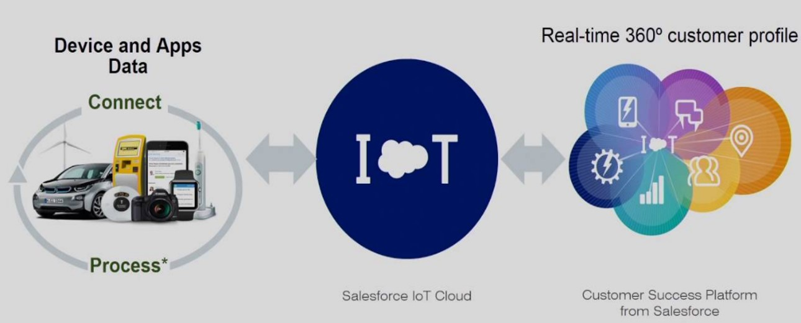
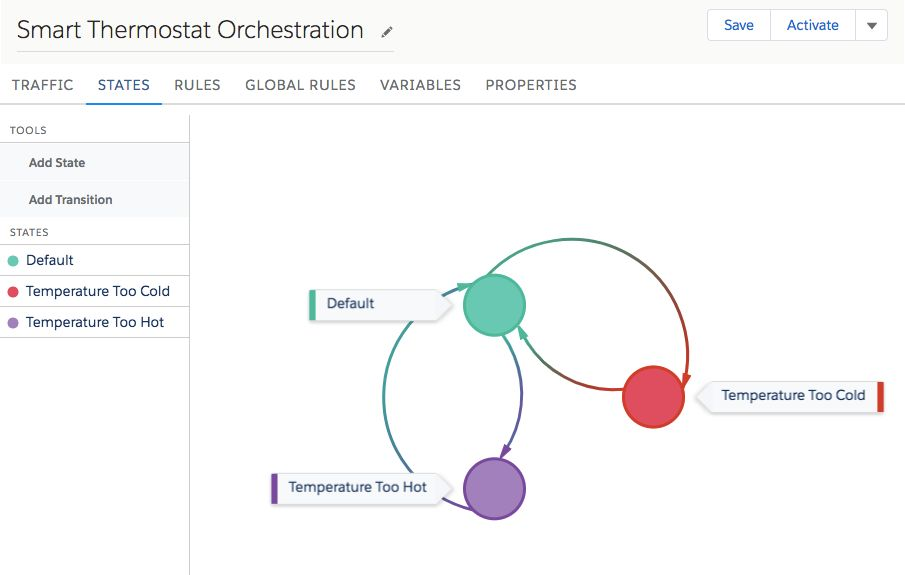

### Know More

- Trailhead
  - [IoT Cloud Trail](https://trailhead.salesforce.com/content/learn/trails/iot_cloud)
- Attempt projects
  - [Electric Imp integration](https://github.com/shadit/electric-imp-salesforce-iot) (if you can get the hardware!)
  - [Sample project using virtual IoT device on Trailhead](https://trailhead.salesforce.com/en/content/learn/projects/quick-start-iot-explorer)

## Marketing Cloud

Marketing is a high-touch function for customers that play a crucial role in any org's business.

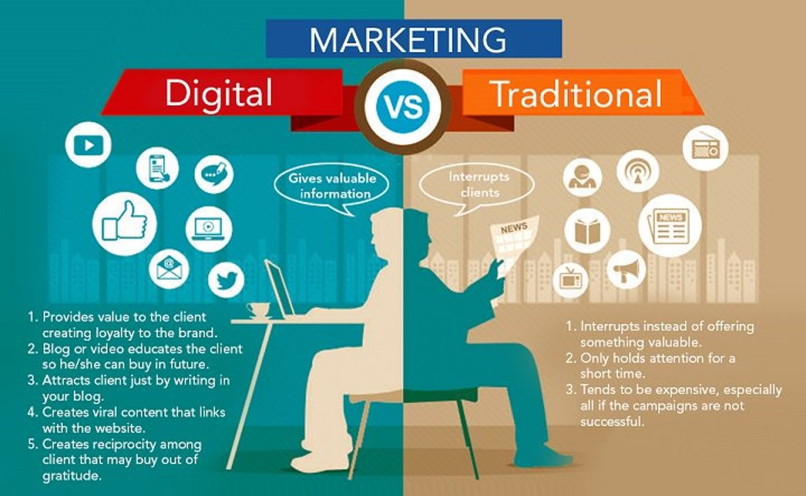

Salesforce Marketing Cloud (SFMC) platform is a combination of a couple of Marketing product acquisitions. We typically talk about two such major marketing solutions –

- SFMC: The default marketing solution sold to customers today. It derives its root from ExactTarget product, is widely used, and better integrated in Salesforce platform
- Pardot: Is still on a different platform – not seamless. Will increasingly find its capabilities merged into the core marketing platform

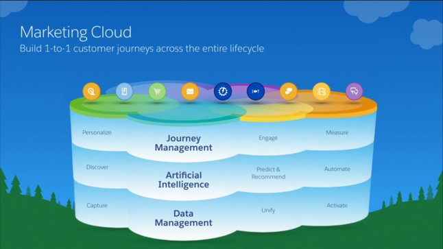

Using marketing cloud you can -

- Enable lead identification, capture at various events
- "Nurture" leads
- Hold conversations with current & future customers
- Supply high-quality leads to sales
- Enable marketing on multiple channels
- Measure marketing efficiency and effectiveness

Terms that you often come across in marketing cloud -

- Journey Builder: create how customer journeys happen in org (lead to deals)
- Capture interactions and make sense out of them
- Social studio, Email studio, Mobile studio: Enable notifications incl. social channels, push notifications on apps, emails
- Data studio: Second party data. Find existing and new potential customers &partnerships
- DMP: Capture and unify data, provide marketing analytics (DSaaS)
- Advertising Studio: B2C advertising

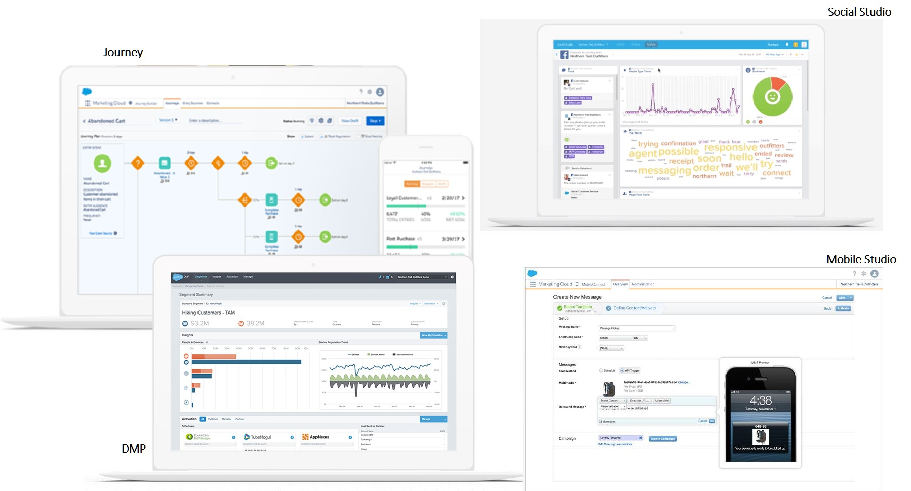

### Know More

- [Overview of SFMC](https://www.salesforce.com/in/products/marketing-cloud/overview/)
- [Demo of marketing cloud](https://www.youtube.com/watch?v=AJnYlN17hOE)

## Pardot

Pardot is another marketing product from salesforce, which continues to have active customers. It is now treated as a part of Marketing Cloud (but is not core part of SFMC license) - it is targeted at B2B marketing.

Using Pardot you can -

- Automate common tasks using configurable workflows
- Manage organic/paid search
- Powerful tools for email marketing
- Manage events (webinars, etc)

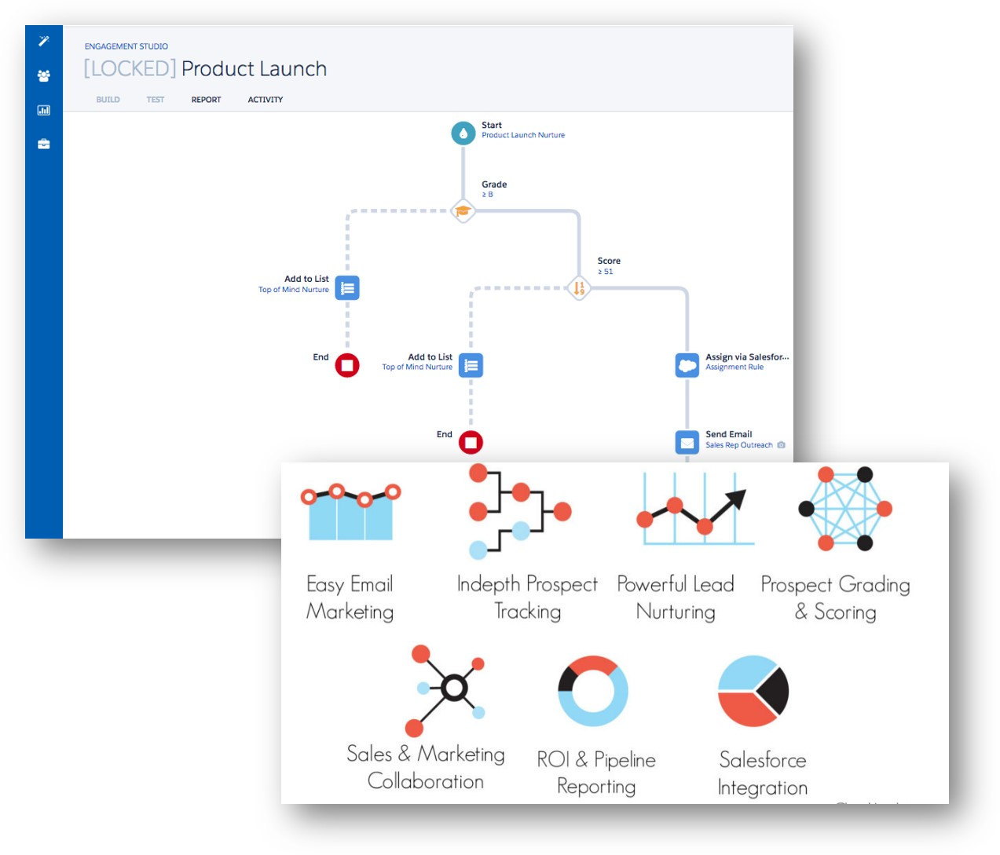 _src: salesforce.com_

## Heroku

Heroku is a platform as a service ("PaaS") platform that allows you to build, run and scale any custom apps.

You can create custom apps and deploy them easily to Heroku, which takes care of scaling the program horizontally without your intervention.

- Developer / App / Production centric – all-in-one
- Use Heroku for development and/or production environments
- Can be an integral part of the build-deploy phase. Has support for modern toolset for many popular languages

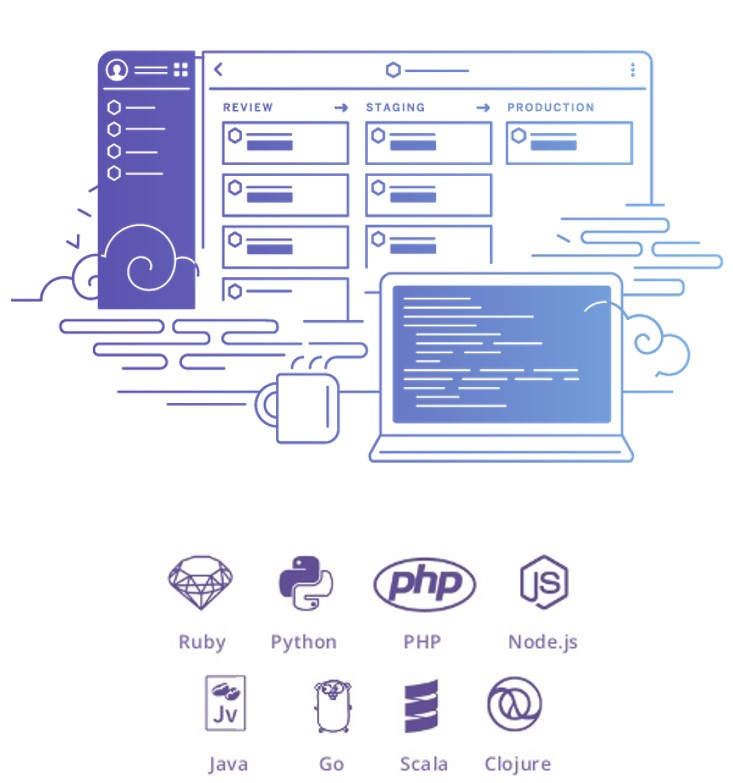 _src: salesforce.com_

Heroku has this concept called 'Dyno' that is a computing instance spun up for your program. Dyno is responsible to run programs coded in supported languages and can scale quickly to address variable loads.

Heroku also provides database as a service (DBaaS). The service is based on PostGRE SQL.

Heroku also has its own market place which features many ready-to-use instances.

### Heroku Connect

Heroku Connect is an integration platform that uses the best of Heroku to integrate with Salesforce. Heroku has increasingly sophisticated integration with salesforce.com core platform, which is expected to only get better with time.

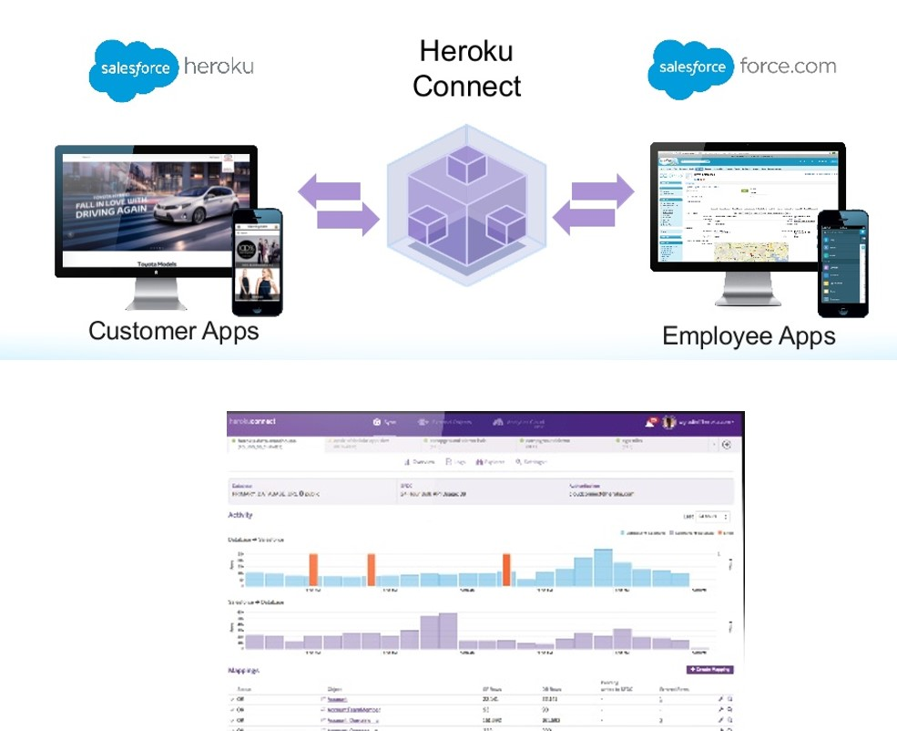 _src: salesforce.com_

Salient features -

- Bidirectional Salesforce-Heroku Synchronization
  - Simple to build – point & click
  - Non-developers can build too
  - Near real-time data sync from salesforce to/from your external app
- Automatic
  - Changes synchronized automatically – quick and effective
  - Low development and maintenance complexity
- Scalable & performant
  - Easily handle millions of records
  - Data sits in Postgres on Heroku end
  - Offers better performance for custom apps from Heroku end
- Supported by salesforce (no limits!)

### How Heroku Connect works?

Heroku Connect integrates salesforce app with your external app in near real-time (yes,we chose that phrase rather carefully).

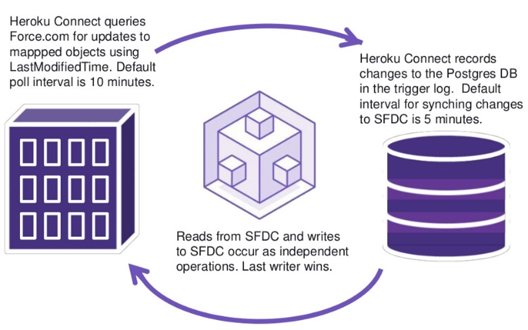 _src: salesforce.com_

Where can you use Heroku Connect:

- Create apps that federate data from Salesforce and other non SFDC systems
  - Enterprise systems
  - Other SaaS, other vendors/partners
- Bring better performance and responsiveness to custom apps as compared to traditional integration using SFDC APIs
- IoT data – connected devices, wearables, etc
- Integrate proprietary / legacy data that may not transactional sense in Salesforce. For e.g. data from Point of Sale systems

## Quip

Quip is a collaborative productivity software suite for mobile and the Web that enables individuals and groups to create/edit documents, spreadsheets and slides (as a group).

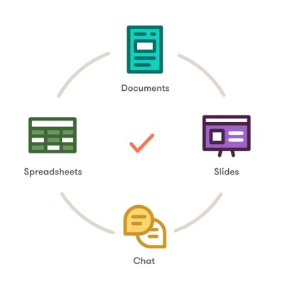

Few key features of Quip -

- Enable teams to work on documents in real-time
- Better collaboration
- Minimize meetings and emails
- Integration is integral part
- Integrates with Salesforce, Slack, Atlassian apps
- Spreadsheets bring live Salesforce data
- Built-in Chat for documents, spreadsheets and slides

## Mulesoft

Mulesoft is an integration platform that can be used to connect different applications in your enterprise or with external services.

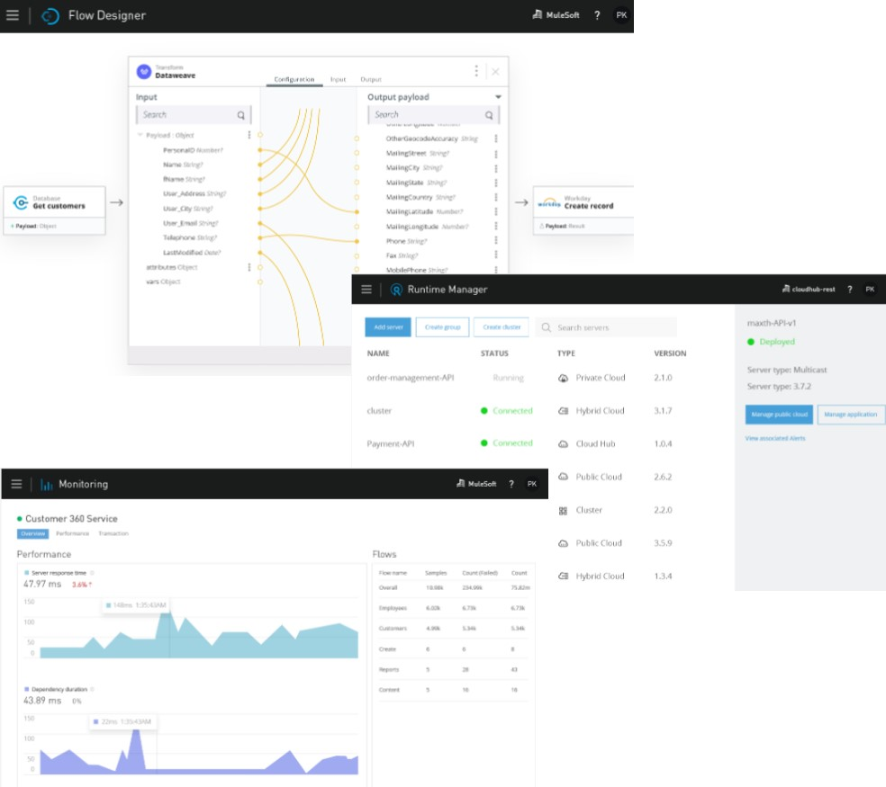

Using Mulesoft you can -

- Design, build and manage integrations and APIs
  - Ready templates
  - Design-first approach with built in mocking services
  - Pre-built components
- Supports multiple cloud architectures
  - On-premise, public or private cloud
  - Mulesoft also offers solution on cloud (iPaaS)
- Monitor integration
  - Provide access
  - Monitor SLAs and transactions
  - Scale – allocate resources
  - Reports & dashboards

## Other Clouds that we did not talk about

- Commerce Cloud
- Vertical clouds – Health Cloud, Financial Services and a number of products from Vlocity
- Field Service Lightning
- Salesforce CPQ
- Tableau

### Know More

- [Google](https://google.com)
- [Trailhead](https://trailhead.salesforce.com)

## Project Life Cycle

Let us switch gears here and focus on how typical Salesforce implementation projects are executed.

A project in our context is defined as a planned piece of work that has a specific purpose. It will have defined start and end dates, and is finite by nature. You can execute projects to -

1. Implement a new instance of salesforce from scratch
1. Implement a new "cloud" - for e.g. enable salesforce to service organisation on top of existing sales cloud
1. Enhance salesforce functions on existing salesforce application

While traditional Information Technology ("IT") projects used a long lifecycle and methodologies like "waterfall" that had a long turn-around time, today's IT projects are focused on quicker turn-around times and involve business teams in the day-to-day tasks to a far greater extent.

- A Salesforce project is like any IT implementation project – only quicker. We leverage the powerful tools of salesforce to enable new functions quickly and with reduced risk
- Characterised by terms like 'agile', 'quick return on investment (ROI)'
- Many projects focus on getting to a 'MVP' or 'MSP' product rather than focusing on a fully polished product

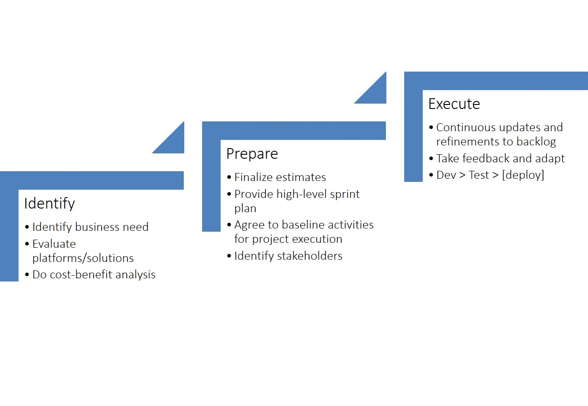

While the previously mentioned waterfall methodologies take a long time to get to anything worthwhile, Agile frameworks focus on getting something useful at the end of each "iteration" (which can be anywhere between 1-8 weeks).

### Scrum

Scrum is a popular methodology to implement projects in an "agile way".

In Scrum, you -

- Develop user stories. Collate stories, changes and bugs in a ‘backlog’
- Dev team works on one integrated backlog in a ‘sprint’ of one to four weeks
- ‘Potentially shippable’ product at the end of every sprint
- Daily updates on progress
- Work items and stories can change between sprints – but seldom within sprint

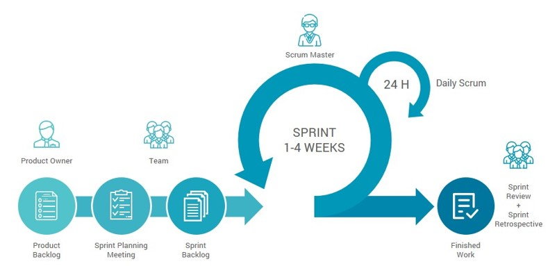

### Kanban

Kanban is another popular methodology to execute Agile projects.

- Industrial practice applied to IT / software development
- Visualise work on a board that depicts work stages and flow
- Focus on 'Work In Progress (WIP) limits' = limit work and increase focus on flow
- Quality, lead time, throughput etc. get measured
- Often used when there are inter-dependencies for development (e.g. integration), many stakeholders and different priorities, situations where timeboxing may not work, or work that requires minimal entry barriers

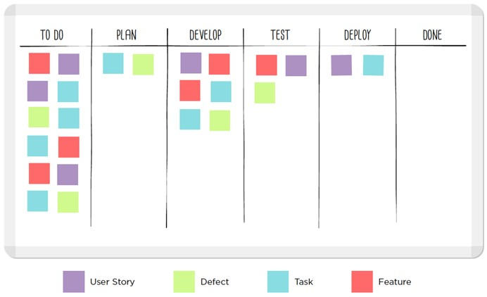

## Teaching Aids

### Presentation

#### 1. Rest of Salesforce: sf-cog

&nbsp;

<iframe src="https://docs.google.com/presentation/d/e/2PACX-1vQuRsUgn3T8zv2f1hOE0L_ztioNOam1Xjkt4foZ_sxbQVRniP3-5DiS-LOBOUNx4Q/embed?start=false&loop=false&delayms=60000" frameborder="0" width="800" height="600" allowfullscreen="true" mozallowfullscreen="true" webkitallowfullscreen="true"></iframe>

[More info](/misc/pricing#sf-cog)
