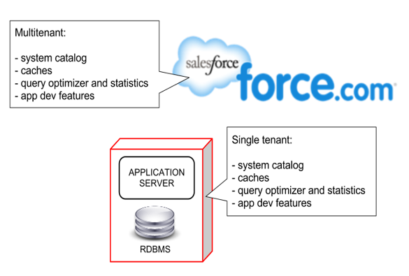

# Introduction

Welcome to the Platform Developer I certification self-study guide!

Have you gone through the [structure of a PD1 guide](/dev-guide/structure/)? Are you already familiar with salesforce configuration and rearing to go to brave new worlds? Ok then, get started on your Salesforce developer journey from here!

# What this course / guide is about?

We are big fans of practical learning. We are also bigger fans of having an objective in sight. Hence.. this course.

With this guide / course structure, you get -

- Rapid learning to prepare for potential Salesforce Platform Developer I (PD1)
- Equip yourself with the knowledge required by salesforce developers. Learn about the tools and the knowledge that need to be on your toolbelt
- Practical guide to understand how to effectively change adapt Salesforce to your business using clicks and code
- Real-world problems in workshops and case studies to apply your knowledge

We tag learning to "certification" since -

- We are more inclined to have a structure for our learning process
- Salesforce world is vast and growing. Preparing for certification will impart adequate knowledge about most of the "headline" topics that developers should know
- With this guide + some experience, you should be confident to attend Salesforce PD1 exam. Certifications provide credibility in any market

To maximise benefits from the guide -

- Go through the guide from the beginning (you are at the starting point - so congratulations)
- Practice tasks from lessons and applied learning workshops
- Make notes from the guide and from your tasks
- Gather knowledge through Trailhead and learn by doing

## About Salesforce and CRM

At this point, we would typically go on a long rant about salesforce, CRM, and the market today - but, we spare you the trouble.

We just refer you to [What is CRM?](/admin-guide/introduction/#what-is-crm) section of Admin guide.

## Architecture

Salesforce is cloud-native - this means that everything that the user needs is hosted in and delivered over "the cloud".

Here are a few key features often associated with salesforce architecture -

1. Multi-tenancy
1. Meta-data driven
1. Layered
1. Infinitely (a more apt term may be "reasonably") scalable

The layers refer to the different platform functions that stack-up to provide everything from an innovative UI on any device to powerful workflows and capabilities like AI, IoT etc..

Salesforce provides a superior user experience that can be tailored for your organisation's unique needs. It can be deployed to different types of users - partners, employees or customers, and to multiple functions - sales, service, marketing etc. The application (as is the case with any complex system) is built using a layered approach and these layers may correspond to

- business functions - sales, service et. al.
- technology functions - IoT, AI
- different parts of an app - UI layer, business layer and so forth

### Multi-tenancy

Salesforce is shared by multiple "tenants" or "organisations" or "orgs". Each of these tenants may have their own functions and data - all without impacting any other orgs sharing the same infrastructure.

Multi-tenancy drives down the application costs for all, and enables continuous improvements to baseline functionality that can be shared and deployed for all. While delivering all this goodness, Salesforce also ensures that security is enforced as a practice across the board, and at the same time securing individual orgs from impacting each other.

Salesforce platform's multi-tenant kernel is built ground-up and not a simple virtualisation. The data and application is secured and abstracted through a custom-designed relational-db like layer that abstracts the underlying data storage layer.

### Meta-data driven

While Salesforce provides you an application that can super-charge your business from day one, each business (or specifically an "org") can customise its own version. The orgs achieve not only data segregation but also functionality segregation. The functionality within an org is driven by meta-data - data about data.

Upgrades to the application in functionality, bug fixes or new features are delivered with no/minimal impact to this meta-data driven behaviour and customisations continue to be supported through patch releases and updates.

### MVC Inspiration

Salesforce's model-view-controller architecture is a way to isolate and segregate design and dependencies of technology layers, which seamlessly integrate to form a whole.

The MVC layers in both Lightning UI or Classic provide clear separation of concerns –

- separate logic from UI
- define data structure and rules in model
- data is distinct from metadata
- independently define components in the user interface layer
- interactions b/w view and model in controller

Each of these layers can independently do their function in any org without hard-dependency on other layers, but are useful when combined together.

### Scalable

Salesforce can scale to different functions (customer touch-points like sales or marketing, to backend functions like order processing) and to numerous groups/individuals.

### Strong app ecosystem

You can create your own apps or install apps from Salesforce AppExchange (or third parties for that matter). Multiple apps can co-exist without issues and come together to form a cohesive application for your users.

## Apps, Apps and Apps

This is the right time as any to bring your attention back to AppExchange. We saw [details on AppExchange in the admin guide](/admin-guide/platform-fundamentals/#salesforce-appexchange).

AppExchange is the marketplace for all things Salesforce – consultants, apps, lightning components, which can be leveraged to get a head-start for your business.

AppExchange apps should be part of your application customisation strategy -

- Identify type of solution that can help – full-blown app vs individual component
- Identify functionality available through apps vs. what you can build – complete set of functions for a vertical or horizontal function (e.g. Veeva for Pharma CRM), incremental (e.g., Conga composer for document generation), or apps that enable further customization (e.g. Skyvisualeditor)
- Evaluate technical needs and boundaries – does the app support your edition and licenses? How you can deploy and maintain a managed app vs unmanaged app vs AppExchange component
- Last factor here, but first on anyone's mind - pricing. Apps can deliver nirvana to you, but at what cost?

### Trying Apps

There are different types of trials possible for apps. There are three distinct (major?) ways to test and know the app -

- Test drive: test on a vendor provided environment with functionality and data (read-only)
- Trial: Install trial version in your own instance
- Trialforce: Enable a trial org with vendor provided data & functionality. Distinct to you; read-write

Enable apps for admins alone or for all users during testing and even in initial production runs.

## Workshop

Workshop section in each chapter provides a set of activities that the students need to do after the theory and practice classes for individual lessons in the Salesforce Platform Developer I course.

The intent is to provide -

1. practical, real-world problems: Outline business scenarios and specific problem statements that require students to apply their salesforce.com learning (well, to 'some' extent)
2. solution details: Provide high level design elements to solve afore-said problems.

**Instructions**

1. Discuss problems/solutions with your instructor(s) in case of any queries
2. Complete the activities before bringing in your unique perspectives and/or solutions to the problem

**Outcome**

The problems provided are expected to incrementally build the complexity of your application as you progress. You will be a better admin, IT analyst or developer who can analyse a problem, think through possible solutions, and identify & implement changes on salesforce.com platform.

Let's dive into our very first workshop.

Complete the following activities.

| No. | Type    | Description                     | Time (hrs) |
| --- | ------- | ------------------------------- | ---------- |
| 1   | Present | Multi-tenancy                   | 0.5        |
| 2   | Learn   | Soft-skills: Trailhead          | 3          |
| 3   | Learn   | Skills: Trailhead               | 2          |
| 4   | Read    | Case Study Overview             | 0.5        |
| 5   | Do      | Prep Salesforce Org for project | 2          |

### Multi-tenancy

1. Think through how multi-tenancy helps? How is segregation of data / logic done?
2. How have you seen it implemented in SaaS you know – e.g. Gmail, Google docs,
3. What are the challenges?
4. Present to an audience

### Soft-skills: Trailhead

Complete the following

- [Manage SFDC story telling](https://trailhead.salesforce.com/en/content/learn/modules/manage_the_sfdc_storytelling)
- [Transform business Salesforce expeditions](https://trailhead.salesforce.com/content/learn/trails/transform-business-sf-expeditions)

### Skills: Trailhead

Complete the following

- https://trailhead.salesforce.com/content/learn/trails/salesforce_advantage

### Workshop Case Study Overview

GA Automobiles is a small car manufacturer with operations in India, Sri Lanka, and Bangladesh. GA has decided to use Salesforce for its sales and service operations, and has asked you to implement a customized Salesforce application for their needs.

GA has four models in market:

- Model A
- Model B
- Model C
- Model M: Sold only in India

GA sells cars to retail customers and corporates directly and through its dealer network. Dealers must have access to same service records that GA uses and to opportunities that are assigned to partners. GA also routes services to partners in respective regions if customers contact through the central call centre.

#### Corporate Structure

GA’s sales business is divided into North, East, South, West, North-East in India, with a regional sales manager in all regions. Bangladesh has North and South regions, and Sri Lanka has one region. Following key positions are part of the sales organization.

| Position               | Reports to             |
| ---------------------- | ---------------------- |
| Country Sales Manager  | CEO                    |
| Regional Sales Manager | Country Sales Manager  |
| Sales Manager          | Regional Sales Manager |
| Sales Rep (Corporate)  | Sales Manager          |
| Sales Rep (Retail)     | Sales Manager          |

GA’s dealer network sells its cars at city/district/state level, and they are managed through Regional Partner Managers, who report into Country Sales Manager.
GA provides services through a Service network, but also runs a centralized call centres per country to provide sales and service assistance to all customers.

Service organization comprises of ..

| Position                 | Reports to              |
| ------------------------ | ----------------------- |
| COO                      | CEO                     |
| Country Service Manager  | COO                     |
| Regional Service Manager | Country Service Manager |

Regional partners connect with regional service manager for management assistance.

The call centres are staffed with one or more of ..

| Position         | Reports to       |
| ---------------- | ---------------- |
| Call Centre Head | COO              |
| CC Manager       | Call Centre Head |
| CC Lead          | Service Manager  |
| CC Rep (Sales)   | CC Lead          |
| CC Rep (Partner) | CC Lead          |
| CC Rep (Service) | CC Lead          |

- CC Leads and CC Reps specialise in either sales or service
- CC Rep (Partner) takes only calls from partners – dealers or service network

The Marketing department comprises of Marketing Country Manager and one or more of Marketing Lead and Marketing Reps.

#### Customer Management

GA has two types of customers –

- Corporate: Any business that buys cars
- Retail: Retail customers who buy through GA show rooms

All customers who buy through dealership also get registered as customers – either as Corporate or retail

#### Marketing Operations

Marketing is responsible to run campaigns in various media sources.

#### Sales Operations

Sales reps receive leads through

- call centre (inquiry)
- walk-in at showroom

The team follows up to convert leads and the process culminates in –

1. Sale through company owned showroom
2. Referrals to partners in the region
3. A lost deal

The process for corporate & retail customers is distinct.

| Category      | Corporate                                                                | Retail                                                            |
| ------------- | ------------------------------------------------------------------------ | ----------------------------------------------------------------- |
| Attributes    | Company Type (SIC), Annual Revenue, # Employees, Countries of Operations | Annual Income, # Cars in Household, # Other Vehicles in Household |
| Sales process | Interest > Opportunity > Quote > Negotiation > Won or Lost               | Interest > Opportunity > Won or Lost                              |

#### Service Operations

All service requests are assigned to service networks based on customer preference and availability of service slots. Customers can request for service through self-service too.

Service orders and vehicle service history are tracked centrally and viewable by all service partners. The pricing of the parts/service can be viewed only by partners owning the service and by employees of GA.

Service personnel also follow up with customers for feedback, measure service efficiencies from partners, and organize service trainings for partners.

#### Partners

Partners can be one of –

1. Sales
2. Service
3. Suppliers

Partners can have their branches and company/parent company relationship defined in Salesforce. Parent companies may have one or more of partnership types defined against them.

#### Sales partner

- Has own sales show room – identified by name, city and a unique code
- Has sales targets provided by GA and agreed by partner
- Requests for new cars from company

#### Service partner

- Has service workshop – identified by name, city and a unique code
- Can request for parts
- Can see service request history for a given vehicle

#### Customers

- Can be corporate or retail customers.
- Existing customers are viewable by all partners
- New leads are viewable only to assigned partners

### Prep Salesforce Org

1. Sign up for Developer edition / trial edition.
2. Discuss entities that need to be used for GA
3. Discuss user groups required to use Salesforce
4. Create basic structure in Salesforce

## Teaching Aids

Each chapter is accompanied by teaching materials that (hopefully) help you present the course material to students in a structured way. There may not be a 100% match between the lessons/chapters and the presentation materials considering the distinct sources of the teaching aids, but do conform to the underlying structure.

### Presentation

#### 1. Introduction to PD1 Certification Course: sf-cog

&nbsp;

<iframe src="https://docs.google.com/presentation/d/e/2PACX-1vQECwkCtXtlifG4eZL5gG3ZRqgVEs2mXvw3jRLmU5DHWl6xZQkFVNYMBYRNsEXf7Q/embed?start=false&loop=false&delayms=60000" frameborder="0" width="800" height="600" allowfullscreen="true" mozallowfullscreen="true" webkitallowfullscreen="true"></iframe>

[More info](/misc/pricing#sf-cog)
