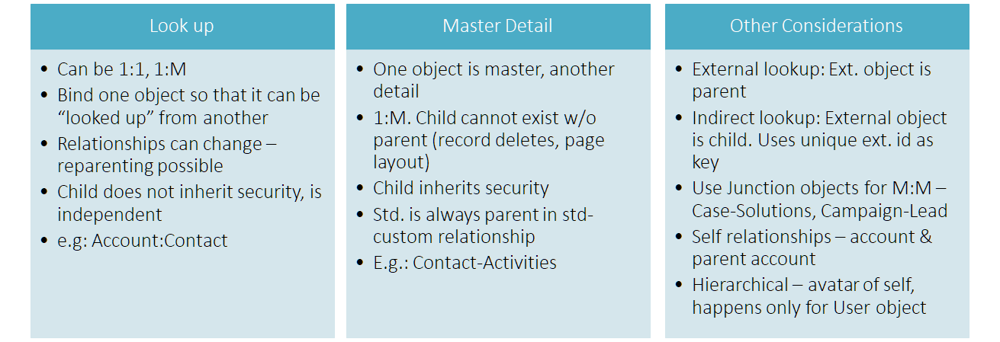
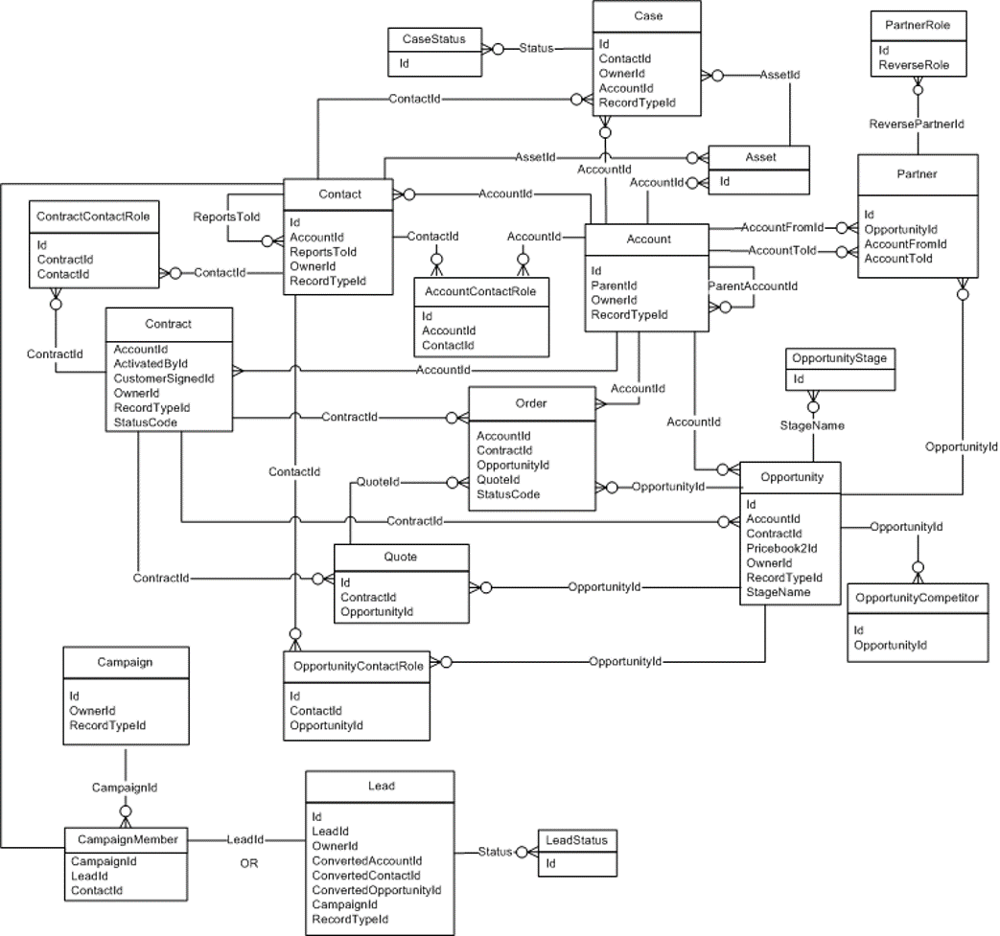
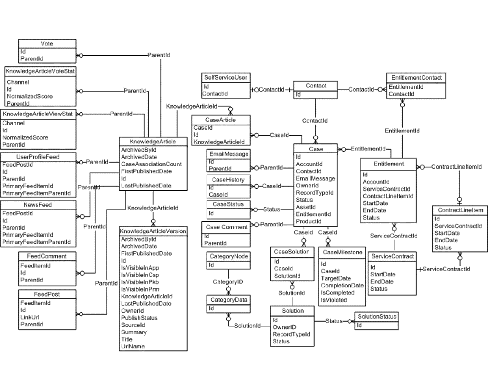
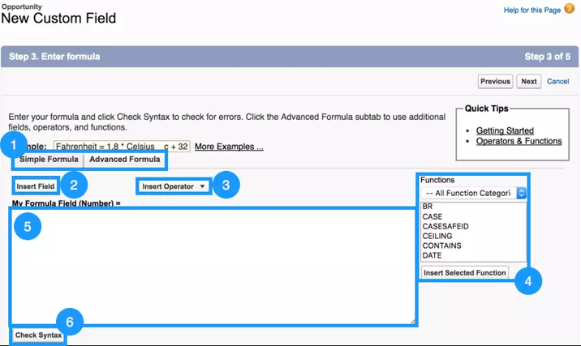
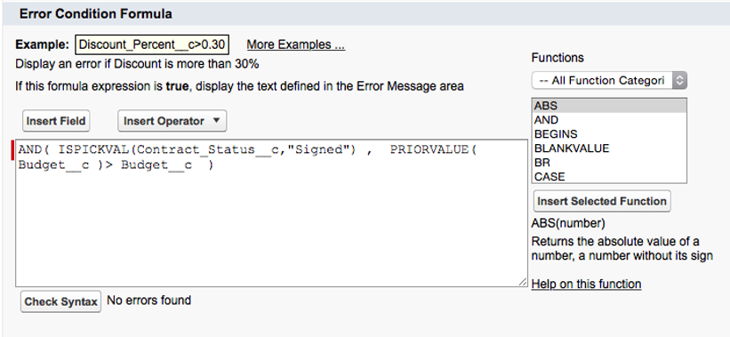
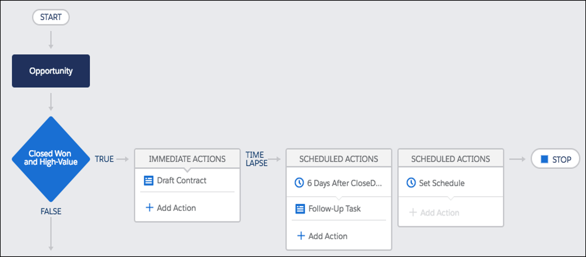
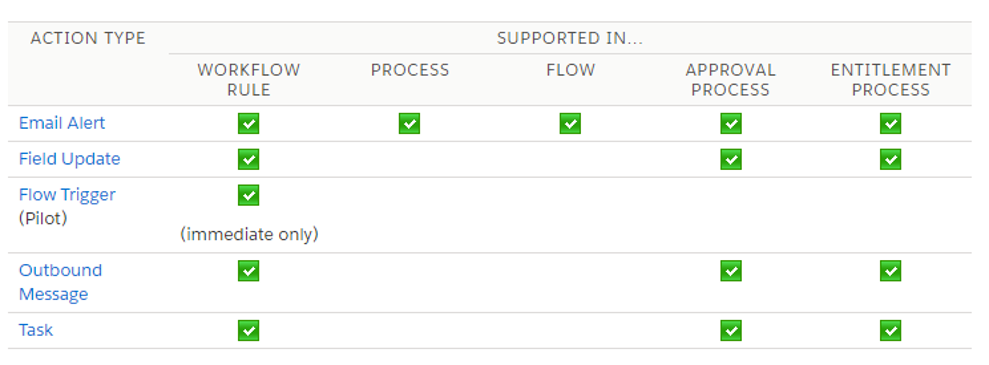
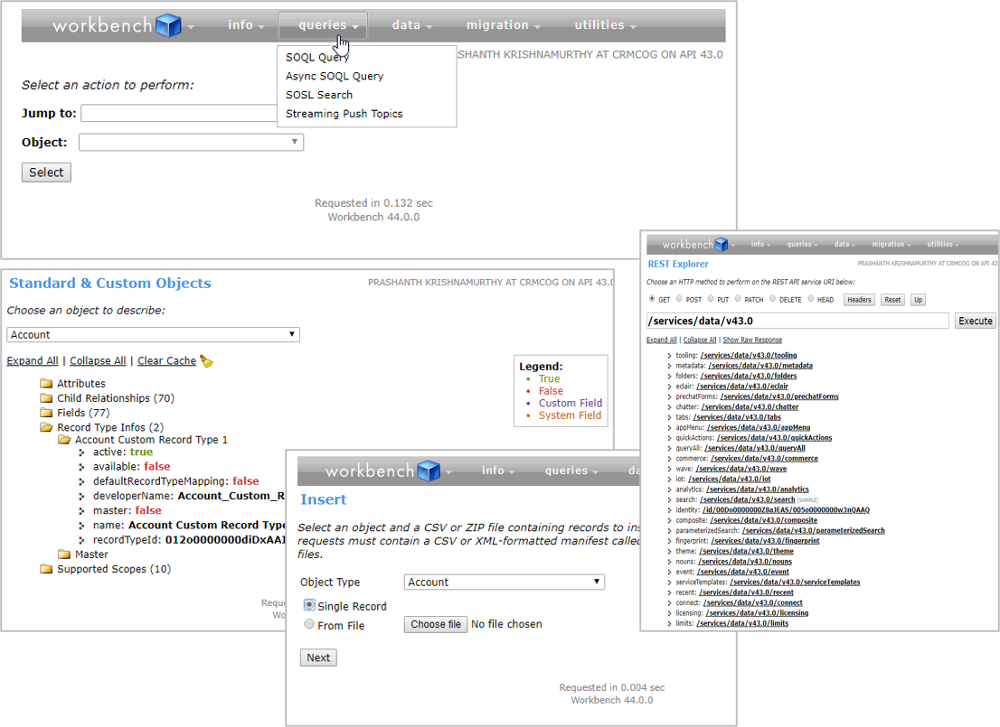

# Configuration Deep-dive

I am pretty sure you have been a good kid and went through all the [configuration](/admin-guide/configure-custom-functionality/) [things](/admin-guide/deep-dive-business-layer/) [there](/admin-guide/ui-customisation/) are.

But, here we go with some more just to fill in more hollow content on pages and fuel our self-confidence. Treat this as quick rejoinder and a bridge that you cross quickly - not the
valley of flowers where you camp out for the evening.

## Objects

Model your data using objects. Objects are at the heart of business layer in salesforce and represent entities in the real-world.

Objects can also be thought of as being synonymous with tables (but not the same). Salesforce provides dozens of objects along with key CRM entities to super-charge your application.

One of the very first things you will learn is to treat these salesforce objects with deference. Quickly learn when & where to use standard objects because extending existing objects is preferred to creating new objects when the new function can be represented by something that exists already.

For e.g. store partner information in Account object and do not create a separate Partner object.

Reusing standard objects has its limitations. You can change only a few properties and upgrades may move away from your intended functionality. So, keep scalability in mind and carefully consider their advantages & limitations.

Custom objects are those created by customers and partners - they may be specific to your implementation, objects that you import from somewhere, or objects created by an AppExchange app.

Follow best practices in creating new objects -

- Identify need for an object
- Give descriptive names
- Provide help text!
- and.. know thy limits. There are limits to number of objects, fields, and so on.

## Object Relationships

Head over to the chapter on customising business layer for a [detailed introduction on relationships](/admin-guide/deep-dive-business-layer/#entity-relationships).

Here's a high-level reference table -

Salesforce objects have a well-defined structure & relationship types. Relationships b/w standard objects cannot change (there are documented exceptions). While there are constraints on how relationships can exist between standard and custom objects (for e.g. standard objects cannot exist on the detail side of master-detail relationship).

For e.g. consider the scenario below -

- Universal containers need to track job positions, job postings on sites and job sites where those positions are posted
- Universal Containers has a Project Manager position posted on Monster.com, while Sr. Developer position is posted on both Monster.com and Dice

In Salesforce, we define relationships such that -

1. Job sites and job postings have a 1:M relationship
1. Job postings have a M:1 relationship with positions

So -

- Every time a position is posted, a job posting record tracks the post.
- One position can be posted many times, and both positions can be posted to the same or different

  _src: salesforce.com_

Objects and relationships are independent of apps - they define business layer and enforce uniformity across apps and any UI layer components.

The different functions and apps provide a window and context to the relationships. Consider examples below..

### Object relationships in Sales

Includes functionality for -

- Sales functions across industries
- Omni-channel lead management & selling
- Lead to cash processes incl. opportunity, quote & order management

  _src: salesforce.com. More diagrams in [SOAP API Developer Guide](https://developer.salesforce.com/docs/atlas.en-us.api.meta/api/data_model.htm)_

### Object relationships in Service

Includes key functionality to -

- Enable service delivery across channels
- supported by knowledge-base and solutions
- Measure SLAs as per contractual commitments
- Collaborative features to improve service efficiency

 _src: salesforce.com. More diagrams in [SOAP API Developer Guide](https://developer.salesforce.com/docs/atlas.en-us.api.meta/api/data_model.htm)_

## Revisiting Business Layer

Head over to admin guide for a [walkthrough of Salesforce business layer](/admin-guide/configure-custom-functionality/) and [deep-dive on possible configurations](/admin-guide/deep-dive-business-layer/).

### Fields and Types

Fields are attributes of an object that are used to store a particular type of value.

For e.g. Accounts may have name, address, total revenue as fields.

Note that -

- Standard fields cannot be changed. Add custom fields to std. or custom objects
- Get your fields right
  - Salesforce opens up rich field typing – thanks to abstraction of DB layer
  - Design before you develop. Establish relationships and FKs/external ids
- Pick right type for your fields
  - Field types may not be subject to change to any other types - see [changing custom field type](https://help.salesforce.com/apex/HTViewHelpDoc?id=customize_fieldtype.htm)
  - Be aware of filtering & sorting needs
  - Be aware of limits – rich text, number of fields etc.
- Encryption is supported on specific field types

| Type                  | Can Contain                     | Description                                                  |
| --------------------- | ------------------------------- | ------------------------------------------------------------ |
| Text                  | Letters, numbers, symbols       | Max 255 char.                                                |
| Number                | Integers and decimals           | Significant digits specified in definition.                  |
|                       |                                 | Rounds off to higher number in case of “tie”                 |
| Date, Date-time, Time | Valid date or time              | Enables easier date calculations                             |
| Currency              | Valid currency                  | Uses even number tie breaking rule                           |
| Checkbox              | Boolean                         |                                                              |
| Formula               | Calculations                    | Math functions, System references, lookup field values, etc. |
| Master-detail, Lookup | Relationships to other entities | Field specified during configuration                         |
| Picklist              | Drop-down list                  | Use hard-coded values or global picklist                     |

### Most Important Point & Click Automation: Formula Fields

Perform runtime or data-driven calculations in Salesforce fields.

- Some calculated functions like TODAY or NOW are in real-time runtime :|
- Few others like counting the detail records in master-detail are updated when records are added/deleted, but function differently - they are stored as calculated values and are not quite "counting records" each time parent record is retrieved
  - Create formula on child to reference parent
  - Can reference merge fields from master if an object is on detail side of a master-detail relationship.
  - Extensively used in lookup relationships (Roll-up summary fields are also calculated fields, but we don't call them 'formula fields')

Create formula fields using easy-to-use configuration tools. Go wild with simple/complex formulae using Salesforce objects, string operations, arithmetic operations etc.

Formula fields are typed and provide complete control over output format – can be Checkbox, Currency, Date, Date/Time, Number, Percent, Text, Time. Like any other fields, they exist against a single record but can refer to other objects or records (e.g. cross-formula fields).

Formula fields are subject to same security rules as other fields, but their formula do not.

- You can display formula fields to a profile even though the formula within the fields have references to fields not visible to that profile
- You decide whether to comply or override org security rules

Once created, formula fields can be used universally – on UI, reports, and custom scripts.

- Different places can enable distinct capabilities but underlying areas are the same
- Formula fields can also cross-reference each other
- No differences b/w Classic and Lightning

| Formula Used In       | Use Case                                                                                                      |
| --------------------- | ------------------------------------------------------------------------------------------------------------- |
| Custom formula fields | Calculate values based on other fields. Cannot be edited on UI                                                |
| Default values        | Default values for the fields when creating new records                                                       |
| Reports               | Calculate values based on other fields.                                                                       |
| Workflows             | Workflow rules and field updates that automate updates or user-defined flows based on specific entry criteria |
| Approval flows        | Criteria for approval                                                                                         |
| Assignment rules      | Assign cases and leads based on defined criteria                                                              |
| Escalation rules      | Escalate and provide alerts based on defined criteria                                                         |
| Visualforce Pages     | Content to be displayed on UI                                                                                 |

Do more -

- refer to the awesome [formula field cheat sheet](https://resources.docs.salesforce.com/216/latest/en-us/sfdc/pdf/salesforce_formulas_cheatsheet.pdf)
- [examples of formula fields](https://help.salesforce.com/articleView?id=useful_advanced_formulas.htm&type=5)

### Equally Important Point & Click Automation: Roll-up Summary Fields

Drive calculations on the master from set of related detailed records. The values are asynchronously calculated and stored (not strictly real-time). As in the case of formula fields, roll-up summary fields can show values even even if the values they summarise are not visible to users' profile.

To use a roll-up summary -

- Create roll-up summary on the master object
- Operations include: sum, count, min/max values
- Automatic roll-up is optional; no recalculation when child records are deleted
- Cannot do roll-up on certain types - long text area, multi-select picklist, system fields like Last Activity, cross-object formula fields, auto-number, lookup fields

Be careful about when and how roll-up summary triggers workflows (see [this](https://help.salesforce.com/articleView?id=fields_about_roll_up_summary_fields.htm&type=5)). Also, do not reference roll-up summary fields in child context - that can show up stale data.

## More Point & Click Automation: Validation Rules

Validation rules enable you to define what is considered "healthy" data and allow on that to find its way in the application.

- Validation runs on data entry – so it makes sense that it only shows up in edit mode, not detail mode
- Aligns data to org rules at the time of record creation or updates

When we say "validation rules" we often refer to rules defined at fields but validations also happen at workflows, flows, approvals etc. These are distinct from the validation rules defined against an object.

This is how validation rules work -

- Validation rule returns a true/false value after evaluating the expression/formula defined against the rule, and shows defined error message if validation does not pass
- All rules are processed before showing errors. Messages can be shown at field level or at the page level

The different rules and automation logic against the object are processed in order when a record is saved -

1. Validation rules
1. Assignment rules
1. Auto-response rules
1. Workflow rules (with immediate actions)
1. Escalation rules

Further reading -

- [Field validation on Salesforce help](https://help.salesforce.com/articleView?id=fields_about_field_validation.htm&type=5)
- [Examples of validation rules](https://help.salesforce.com/articleView?id=fields_useful_field_validation_formulas.htm&type=5)

## (even more) Point & Click Automation: Record Types

Record types help us distinguish b/w similar but different records in same object. You use record types to help users capture different data sets and apply different rules.

- Selectively hide/show fields based on record type -
  - create distinct layouts and assign to different record types
  - allow different profiles access to distinct record types
  - show different layouts depending on record types and select profiles
- Show different picklist values
- Apply different business logic on different set of records on same object

For e.g. both partners and customer accounts, retail and wholesale accounts can be your accounts but need different treatment.

Once record types are defined against an object, you can specify the default record type for the object at the org level. Users can also set preferences to default record types to suit their way of working.

Further reading -

- see [record type documentation](https://help.salesforce.com/articleView?id=customize_recordtype.htm&type=5).

## (gave up prefixes) Point & Click Automation: Workflows

Workflows allow you to automate ‘actions’ within Salesforce. Workflows can be associated with standard or custom objects.

Workflows can -

- be executed when record is saved immediately (in real-time when record is saved) or be time dependent

  - every time record is created or edited
  - every time record is created & anytime edited so that it meets rule criteria
  - trigger specified hours or days after/before given criteria - these timed workflows run under a ‘default’ workflow user (that is configurable)

* consist of `if/then` statements to define conditions
* consist of one or more actions, which are reusable across workflow rules -
  - Email alert
  - Field update on same object
  - Create task
  - Send outbound message (SOAP)

Further reading -

- [Defining workflow rules](https://help.salesforce.com/articleView?id=workflow_rules_define.htm&type=5)

## Point & Click Automation: Process Builder

Process builder are super-powered workflows and are the future of business automation.

- Use a slick interface to create entry criteria and sequence of actions
- Consists of –
  - Trigger
  - One or more criteria to qualify record for action
  - One or more action

By using a process builder you can easily control order of execution of actions. Order of execution of workflows is not guaranteed by salesforce and may not be same every time.

As compared to workflows -

- Process triggers can be when a record is `created`, or when a record `created or updated`
- Further criteria can be defined to conditionally execute actions
  - Query/filter criteria
  - Custom formula incl. fields / operations
  - Can also be defaulted so that action always executes

Similar to workflows, you can perform actions immediately or schedule them for later. Actions can –

- Update current record or related records
- Create records
- Submit for approval
- Create tasks, send emails
- Post to chatter, Execute quick actions
- Invoke process / flow / Apex

Again, timed actions run under a ‘default’ workflow user in the future (user is configurable).

Further reading -

- [Documentation reference](https://help.salesforce.com/articleView?id=process_overview.htm&type=5)
- [Advanced process builder options](https://help.salesforce.com/articleView?id=process_advanced.htm&type=5)

## Flows

Flows adds ultra-super-powers (that word totally exists) to automation in salesforce.

Use Flow Builder to create a sequence of steps that outline criteria and actions.

A flow consists of –

- Elements – screen / CRUD operations
- One or more criteria to execute actions
- One or more actions

Like process builder, you totally control the order of execution of actions and can trigger actions immediately or schedule them for later.

Unlike process builder and workflows, flows can be interactive and provide guided navigation depending on user actions and data rules.

Flows are triggered by -

- Manual action – button click, navigate to UI
- Records updated/created
- Invoked by other flows
- User actions (like clicking on a button)

Flow actions can be sequence of steps and criteria can be defined at connectors. Flows support complex branching logic.

Flow actions -

- Create, Read, Update, Delete records
- Submit for approval
- Create tasks, send emails
- Call Apex
- Invoke process / flow / Apex

Further reading -

- [Flow documentation](https://help.salesforce.com/articleView?id=flow_builder.htm)

## Which process automation to use?

See [workflows vs. process builder vs. flows](/admin-guide/deep-dive-business-layer/#flows-vs-workflows-vs-lightning-flows) in admin guide.

 _src: salesforce.com_

### Evaluation Criteria

Criteria for using a best-fit tool -

- Different declarative techniques overlap, but provide specific features to distinguish themselves
- Actions span single or multiple objects
- Approval records that need to be routed to manager or specific profiles
- User actions required in the automation –
- Button click to initiate flow or to choose decisions
- Filling in values in an interview
- Complexity of branching (if/else)

A quick feature comparison is provided in the below table.

| Criteria          | Workflow                                                          | Process                                                                                                                                      | Flow                                                     | Approval Flow                                        |
| ----------------- | ----------------------------------------------------------------- | -------------------------------------------------------------------------------------------------------------------------------------------- | -------------------------------------------------------- | ---------------------------------------------------- |
| Intended for      | Perform actions now or later based on select criteria             | Perform actions based on defined criteria                                                                                                    | User interviews & automated actions                      | Approvals                                            |
| Actions           | Email alert, outbound message, current record update, Create task | All actions in Workflow, create/ update on current or other objects, Call Apex, Launch process / flow, Post to chatter, Launch quick actions | Create / update / delete records, Call Apex, Launch flow | Send approval request – email, Chatter, Create task  |
| Trigger           | Record created /updated                                           | Record created/updated, Button click, Process                                                                                                | UI navigation, button click, utility bar, process, Apex  | Button click, Approval invoked in flow/process, Apex |
| Time triggered    | Yes                                                               | Yes                                                                                                                                          | Yes                                                      |                                                      |
| User can interact |                                                                   |                                                                                                                                              | Yes                                                      |                                                      |

### Use Cases

Use case evaluation for the process automation tools -

- Choose tool based on complexity of development and maintenance
- Consider actions that need to span single or multiple objects
- Importance of the order of execution of actions
- User actions required in the automation –
- Button click to initiate flow or to choose decisions
- Filling in values in an interview
- Complexity of branching (if/else)

Examples in the below table -

| Workflow                                                                                     | Process                                                                                                                                    | Flow                                                                                                                                                                                                                  | Approval Flow                                                                    |
| -------------------------------------------------------------------------------------------- | ------------------------------------------------------------------------------------------------------------------------------------------ | --------------------------------------------------------------------------------------------------------------------------------------------------------------------------------------------------------------------- | -------------------------------------------------------------------------------- |
| Create task for account owner when opportunity gets closed                                   | Create task for the territory owner when opportunity is closed and the corresponding account has other open opportunities                  | Create task for account owner when opportunity is closed and the corresponding account has open optys and contacts in account are associated with at least one other accounts. Apply won opty discount to other optys | Send approval requests for opportunities with value > \$10,000                   |
| Send standard SOAP message to a specified end point when account status is updated to active | Update case to closed when the feedback is submitted by customer with a satisfaction rating of > 7 overall and “problem resolved” is ‘yes’ | Prompt user to collect GDPR approval when customer calls up the call centre for support                                                                                                                               | Initiate approval requests for opportunities > \$100K through multiple roles     |
| Send email to contact and contact owner when lead is converted                               |                                                                                                                                            | Wizard-like behaviour to enable interviews and data collection through complex process                                                                                                                                | Support complex approval criteria (one can approve), multiple levels of approval |

## UI Configuration

While we are on the topic of configuration, it is only natural for us to discuss user interfaces in the same breath as business layer.

Salesforce.com has two major UIs

- Lightning: Modern, responsive
- Classic

You can configure UI in either of the options, or write completely custom UI using Visualforce pages (Classic) or Lightning components /framework (Lightning UI).

Head over to [Salesforce UI configuration](/admin-guide/ui-customisation/) chapter in admin guide and come back enlightened.

### Lightning UI

Salesforce comes with Lightning experience / Lightning UI by default. All objects and almost all functionality is supported on a modern, responsive Lightning framework.

You can quickly configure pages and build your own Lightning UI using App Builder

- Drag & drop page creation
- Build once, use everywhere
- Use different layouts
- Create different type of pages
  - App page: Home page for an app. Quick navigation and access
  - Home page: Build tailored experiences for profiles
  - Record Page: Customize record pages to show core & related information

You can use components supplied by Salesforce or third parties (available through AppExchange), or your own Lightning components in page builder.

### Page Layouts and Business Logic

Page layouts are the basic building blocks that contain fields, controls and related record lists for an object. You create more than once page layout and assign it to profiles/permission sets (and record types) to enable different UI experiences for users.

You can -

1. Drag and drop fields onto a layout or make fields read-only

- While field level security enables business layer security rules, UI provides a way to display relevant fields in any context
- Object/field level settings override UI settings (e.g. field hidden in Object for a profile will remain hidden even if a layout displays the field)
- Removing fields on UI (or making fields read-only) does not remove access through APIs

1. Use Buttons and Quick Actions enable users to manually trigger functionality like validation rules/automation
1. Add/remove fields from related lists
1. Control which fields you use to query (search layouts)

## Data Management

Head over to data management chapter in admin guide for an introduction and walk-through on data management tools in salesforce.

## Developer Tools for Back-end Access

### Salesforce Workbench

[Workbench](https://workbench.developerforce.com/) is used to access metadata for the org. It is a widely used, open-source tool by salesforce that provides numerous functions -

- Provide info on business and data layer
  - Describe objects
  - Explore metadata types & components
- Execute queries
  - Create & execute SOQL/SOSL queries
- Data operations
  - Perform CRUD operations for single record or process file
- Deploy/retrieve metadata
- Utilities
  - Explore REST end points
  - Execute Apex
  - Monitor job status

You can use workbench to connect to any org that you have access to - all you need is a browser.You can use either SOQL or SOSL to access data

#### SOQL vs SOSL

Structured Object Query Language (SOQL) is similar to SQL in DBMS. It is used to perform CRUD operations on single / related objects -

- Query data in supported tools and through APIs
- Use to query data within Apex
- Query data in VF controller

Example –

- `Select id, name from Account where name like ‘A%’ LIMIT 10`
- `SELECT Account.Name, (SELECT Contact.LastName FROM Account.Contacts)FROM Account order by Account.Name`

Use Async SOQL (which is implemented as RESTful API) for –

- Queries against millions of records
- Query should not time-out but must complete
- Group/where will be on indexed fields

Salesforce Object Search Language (SOSL) is a programmatic way of performing text based search. It enables us to search for specific terms across fields and is generally faster to retrieve such results than a comparable SOQL query.

Use SOSL to -

- Retrieve multiple objects/fields even when not being related
- Retrieve more accurate data for east-Asian languages

Similar to SOQL you can use SOSL -

- to perform queries in supported tools and through APIs
- queries within Apex
- queries within Visualforce Controller

SOSL does not support big objects - a type of object that is used to contain high volume of data.

Examples of SOSL –

- `FIND {"Joe Smith" OR "Joe Smythe"}IN Name FieldsRETURNING lead(name, phone), contact(name, phone)`
- `FIND {test} RETURNING Account(id LIMIT 20), Contact LIMIT 100`

### Dev Console

Developer console enables you to edit and execute SOQL and SOSL through Query Editor and access data in your org.

Developer console for your org can be accessed from **Setup** > **Developer Console**.

Or, going to the URL -

`https://__yourorg__.my.salesforce.com/_ui/common/apex/debug/ApexCSIPage`

Use Developer Console to –

- Create/edit/view Apex code
- Create/edit/view Lightning components and VF page / components
- View logs & set breakpoints
- Run Apex tests
- Provide info on data layer
  - Describe objects
  - Explore metadata types & components

## Other Declarative Data Access Options

### Heroku

Heroku is a fully managed PaaS that supports hosting applications developed in many programming languages. You can use Heroku to build and deploy applications in Java, Ruby, Python, PHP, JavaScript, and Go.

Heroku Enterprise is part of Salesforce platform and makes it easier to build and manage applications at scale.

You can use Heroku in Salesforce context to -

- Integrate with your Salesforce data
- Use Salesforce Connect that enables automatic synching of an external PostGRE SQL database with SFDC
- Integrate external systems using standard REST APIs

Use cases for using Heroku can be -

- Create external websites using any of the open source languages and integrate with Salesforce data
- Backend for custom mobile applications
- APIs to drive IoT
- Build external tools to process, warehouse and archive data

## Workshop

Complete following tasks.

| No. | Type    | Description                                   | Time (hrs) |
| --- | ------- | --------------------------------------------- | ---------- |
| 1   | Present | Present roles & profiles                      | 1          |
| 2   | Do      | Create roles, profiles & permission sets      | 0.5        |
| 3   | Do      | Create objects, basic attributes and basic UI | 2          |
| 4   | Do      | Enable Chatter                                | 0          |
| 5   | Do      | Create validation rules                       | 1          |
| 6   | Do      | Create calculations                           | 1          |
| 7   | Do      | Create automation                             | 2          |
| 8   | Do      | Create approval rules                         | 0.5        |
| 9   | Do      | Create record types                           | 0.5        |
| 10  | Do      | Create and import data                        | 2          |
| 11  | Do      | Use SOQL / SOSL                               | 0.5        |
| 12  | Do      | Create test cases (basic) and test            | 4          |

### Present roles & profiles

- Discuss profiles and permission sets required
- Discuss role hierarchy

### Create roles, profiles & permission sets

Create all identified roles.

- New customers cannot be created by sales reps, partners
- Opportunities are read-only for service personnel within GA and not visible to
- Leads are visible to sales personnel who have access to associated campaigns
- Leads who are not associated to any campaigns are visible to all managers and above, and only to regional sales reps
- Service history is read-only to sales personnel
- Any pricing is visible to GA employees and to owner partners
- Partners can be created by Partner manager alone

### Create objects, basic attributes and basic UI

Create objects, attributes and basic UI.

- Create vehicles
- Create parts
- Create orders for sales
- Create way to track services and service history
- Create way to track inquiries, feedback (through call centre)
- Create pricing: recommended price lists are per country
- Partners can have their own price lists but need to request partner manager for the change

### Enable Chatter

- Enable Chatter feed in your org and newly created top-level objects

### Create validation rules

- Existing customers cannot be part of more than 2 campaigns at any given time
- New or existing customers cannot be part of more than 4 campaigns at any given time
- Duplicate customer creation cannot be allowed – uniqueness factors are customer name and location
- Corporate opportunities that have been assigned to GA should not be routed to partners
- Opportunity close date cannot be in the future, and cannot be more than a month in the past
- Each Won opportunity must have an associated winning quote (corporate), vehicle (through order or asset). Else don’t allow opportunity closure

### Create calculations

- Last contact date should be visible at customer level and can be the last date contacts for marketing, sales or service
- Last service date should reflect the last service done through authorized centres
- Current customer lifetime value sales & service should be individually calculated
- Flag customer as VIP if total lifetime customer value > 50 Cr.

### Create automation

- Send email to partner manager for every closed opportunity from partner
- Partner discounts `>5%` for sales or `>15%` for service should be notified to partner manager
- Assign loyalty points for customers
  - 10 points per sale
  - 1 point per service. 2 points if service value in a month has crossed Rs. 1 lakh
- Enable reps to send birthday wishes to customers through email with a template specifically created for the purpose. Send emails only for active customers (status is active)
- Create a service schedule for a vehicle based on the vehicle recommended service template and the sale date
- Send service due reminders as per the service schedule tagged against vehicle

### Create approval rules

- Manual flagging as VIP should be approved by Country Sales Manager. Automatic VIP flagging is not subject to approval
- Campaign end date can be changed only by Marketing manager after approval from Regional
- Opportunity > Rs.10 Cr should be approved by Regional Sales Manager (for all types of opportunities)
- Opportunity > 50 Cr should be approved by two levels incl. Country Sales Manager

### Create record types

- Corporate and retail customer types

### Create and import data

**Customer data**

- Create data templates for leads, accounts and contacts
- Create sample data using a data generator (e.g. Free Data Generator)
- Import data

**Sample data**

- Create sample data for opportunities, cases and all other entities with relationships. Test importing the data
  Lead form
- Create lead forms that can be used by partners to directly associate leads through partner websites

**Partner form**

- Create custom form that can be embedded in multiple websites for requesting partner access
- Partner creation will go through partner request process

### Use SOQL / SOSL

- Get service history grouped by partner in the past 6 months
- Get last 10 sales or service transactions for given customer ids
- Get last 5 won opportunities for the partner along with last date on which opportunity was won
- Get total no. of customers per region and per country
- Get total no. of customers with life time value more than 1 Cr. Group by sales and service partner

### Create test cases (basic) and test

- Explore test case creation best practices
- Create test cases for high level transactions
- Test and document test results

## Teaching Aids

### Presentation

#### 1. Configuration Deep-dive: sf-cog

&nbsp;

<iframe src="https://docs.google.com/presentation/d/e/2PACX-1vRfu_vhfHjlreucmXkA4eCpNIKSAwU0MCya6jytaYnyAWvdIdXUEc8wbDTHEEMwEg/embed?start=false&loop=false&delayms=60000" frameborder="0" width="800" height="600" allowfullscreen="true" mozallowfullscreen="true" webkitallowfullscreen="true"></iframe>

[More info](/misc/pricing#sf-cog)
