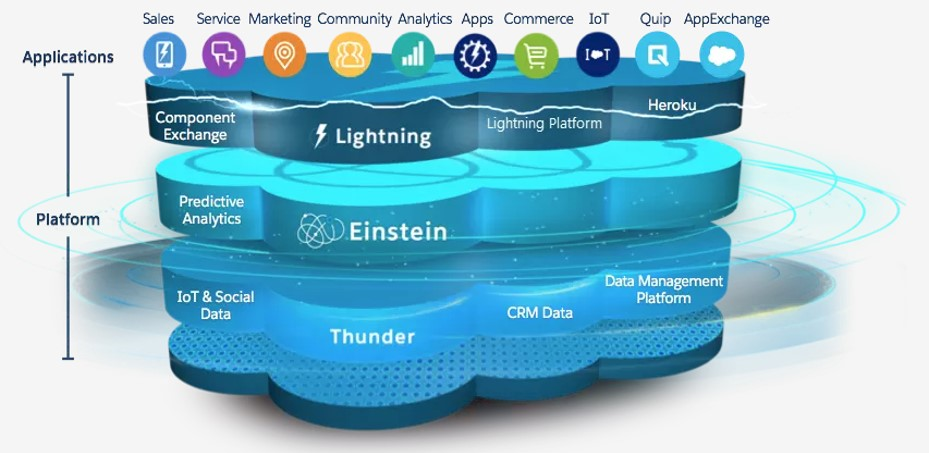
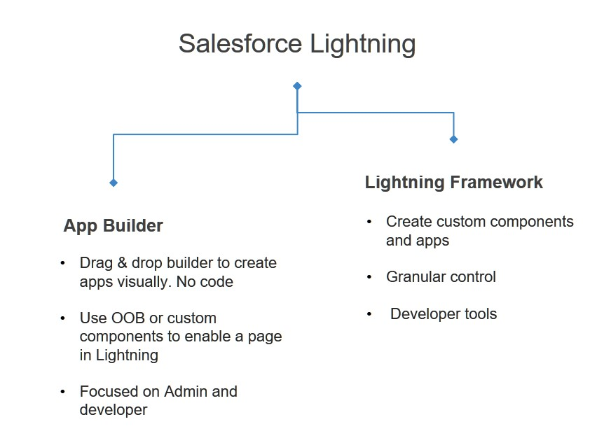
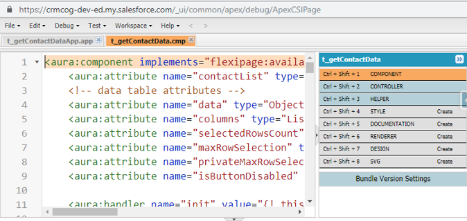
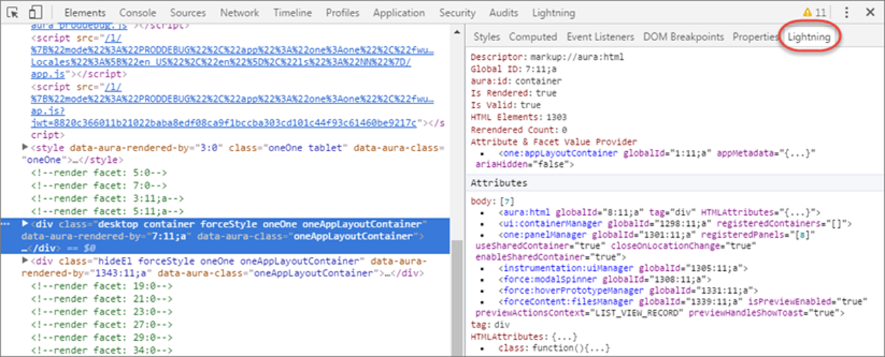

# Lightning UI and Framework

Lightning UI is the modern user interface for Salesforce applications. The UI is created using Lightning framework, which is a client-server framework that enables you to build performant applications quickly.

- Great experience on all devices
- Usability feature galore – intuitive use, embedded reports, customize & filter lists, utility bar
- Many prominent features tailored to user workflows- e.g. custom guided screen/process flows, inline reports, Kanban views
- Easier navigation
- Personalizable tabs, layouts, lists and more
- Improved productivity

Lightning framework incorporates best practices of today’s web architecture -

- Build once and the UI is usable on any (supported) devices
- Is comparable to powerful Javascript frameworks available today, but specifically built for salesforce applications
- Enables front-end validations and sophisticated interactivity
- App-centric as compared to page-centric Visualforce
- Rich ecosystem - build yourself or source ready-to-eat components
- Fast development using markup, encapsulation
- Event-driven - streamlined component architecture and communication
- Performance - reliance on client-side processing to power the most complex applications

## Lightning Architecture

Lightning is the UI part of Salesforce application architecture.



There are three key layers to Lightning -

<br>_src: salesforce.com_

- The view layer in Lightning is based on aura/LWC ("Lightning Web Component") markup + HTML + Javascript.
- Controllers are on client (Javascript) . Client-side validations and business logic
- Controllers (Apex) on server

<br>_src: salesforce.com_

Lightning ties back into the same configurable Salesforce data layer that we all love.

## Start using Lightning

All new orgs get Lighting experience automatically and Lightning is the default UI. Classic UI is supported through style sheets or by providing the classic experience within Lightning.

For older orgs -

- Comprehensive wizard/ guidelines to switch over to Lightning from Classic
- Option to roll out Lightning in stages using profiles / permission sets
- Decision to switch should consider functions not available in Lightning today – similar opportunities, solutions, conditional formatting in reports , customizable forecasting
  Updated information in documentation (things change fast and these may be made part of Lightning in future releases)

## Development

You can build Lightning UI at two "levels" -

- Use Lightning page builder to quickly create pages using OOB or pre-built components using App Builder
  - Drag & drop components to create Lightning pages
  - Assign pages to profile or make them default similar to layout assignments
- Create your own components using Lightning component framework
  - Create fully customizable, secure components using Lightning technology built on open source aura framework
  - Use a combination of element mark-up, HTML and Javascript
  - You then use these components in a page/tab/use it within other components or within page builder, and display it as part of your app



### Lightning App Builder

Use AppBuilder to create responsive pages that contains Salesforce out-of-the-box components, or custom components developed by you or components installed from AppExchange.

You can build three types of pages using AppBuilder -

- App page
  - Home page for custom app viewable by clicking the tab
  - Access important aspects of custom app
  - Add in salesforce mobile app
- Home page: Personalized page for specific user groups
- Record page: Tailored record detail page for an object


### Lightning Framework and Components

Lightning framework is built on top of open-source aura and Lightning web component framework.

- Client-server framework that accelerates development
- Stateful client and stateless server architecture, event-driven
- Device aware
- Leverage rich OOB components for most common tasks

You use Lightning framework to build Lightning component.

Lightning components are reusable user interface components that are well-integrated with Salesforce ecosystem. Lightning components can also be installed from AppExchange.

## Creating Lighting Components

You can use IDEs or Developer Console to create Lightning components.

To create a new component in Developer Console -

1. Navigate to **Setup** > **Developer Console**
1. Click on **File** > **New** > **Lightning Component**
1. Start coding



Note -

- Component markup is required at a minimum for any component - the markup makes up the UI layout
- Client-side controllers can help in validation and implement business logic, and also call server-side controller. Server-controllers fetch data and do validations/automations in the back-end
- Use app to "group" components – create app in Developer console or using App Builder

Steps to create UI –

- Create component markup
- Create controller code and stich controller functions with component events
- Group common or reusable functions in `Helper` (reusable within the component scope)
- Introduce custom styling in `Style` sections
- Write server side controller or use Lightning Data service
- Create new app / use existing app to display component

## Component Markup

Markup makes the UI.

The components of a markup are below -

| Name                   | Description                                                                               | Example                                                             |
| ---------------------- | ----------------------------------------------------------------------------------------- | ------------------------------------------------------------------- |
| Attributes             | Store value. Can be -                                                                     | <aura:attribute name="message" type="String"/>                      |
|                        | oPrimitive data type (Boolean, Date, DateTime, Decimal, Double, Integer, Long, or String) | <aura:attribute name="lstAcc" type="List" default="['a','b','c']"/> |
|                        | osObject                                                                                  |                                                                     |
|                        | oCollection – list, map, set                                                              |                                                                     |
|                        | oCustom Apex classes                                                                      |                                                                     |
|                        | oAura specific types (e.g. Aura.Component)                                                |                                                                     |
| Expressions            | Formula. Denoted by '{!' and '}'                                                          | Hello! {!v.message}                                                 |
| Value providers        | Way to access data & group related data.                                                  | {!v.account.Id}                                                     |
|                        | Global value provides –                                                                   | <lightning:button label="Hello" onclick="{!c.handleClick}"/>        |
|                        | o$Browser, $Resource                                                                      |                                                                     |
|                        | o$Label, $Locale, globalID                                                                |                                                                     |
| Conditional statements | Conditionally render stuff.                                                               | <aura:if isTrue="{!\$accExists}">                                   |
|                        |                                                                                           | <c:getAcc/>                                                         |
|                        |                                                                                           | </aura:if>                                                          |
| Iteration loops        | Iterate through a list.                                                                   | <aura:iteration items="{!v.lstAcc}" var="acc">                      |
|                        |                                                                                           | {!acc.Name}<br/>                                                    |
|                        |                                                                                           | </aura:iteration>                                                   |
| Components             | OOB, Custom or AppExchange components that provide different functions                    | <lightning:layout>                                                  |
|                        |                                                                                           | <lightning:outputField>                                             |

Example Markup -

```js
<aura:component>
  <aura:attribute name="text" type="String" default="Examples string." />
  <lightning:button label="Ok" onclick="{!c.handleClick}" />
  <br />
  {!v.text}
</aura:component>
```

```js
<aura:component>
    <!-- PAGE HEADER -->
    <lightning:layout class="slds-page-header slds-page-header--object-home">
        <lightning:layoutItem>
            <lightning:icon iconName="standard:scan_card" alternativeText="My Expenses"/>
        </lightning:layoutItem>
        <lightning:layoutItem padding="horizontal-small">
            <div class="page-section page-header">
                <h1 class="slds-text-heading--label">Expenses</h1>
                <h2 class="slds-text-heading--medium">My Expenses</h2>
            </div>
        </lightning:layoutItem>
    </lightning:layout>
    <!-- / PAGE HEADER -->
    <!-- NEW EXPENSE FORM -->
    <lightning:layout>
        <lightning:layoutItem padding="around-small" size="6">
        <!-- [[ expense form goes here ]] -->
        </lightning:layoutItem>
    </lightning:layout>
    <!-- / NEW EXPENSE FORM -->
</aura:component>

```

## Client Controller

A client controller defines app behaviour on the client-end–

- what should happen when an event occurs (page load, user click, data change)
- make elements interactive - e.g. display/hide controls/fields based on user actions or data

Client controller is written in Javascript - it is wrapped in JSON format. You can refer/call controller logic within markup by simply calling it by its name prefixed by `c:` ("the `c` value provider") :)


Example component that has a client controller -

```js
({
  handleClick: function(component, event, helper) {
    var btnClicked = event.getSource(); // the button
    var btnMessage = btnClicked.get("v.label"); // the button's label
    component.set("v.message", btnMessage); // update our message
  },
});
```

```js
({
  clickCreate: function(component, event, helper) {
    var validExpense = component
      .find("expenseform")
      .reduce(function(validSoFar, inputCmp) {
        // Displays error messages for invalid fields
        inputCmp.showHelpMessageIfInvalid();
        return validSoFar && inputCmp.get("v.validity").valid;
      }, true);
    // If we pass error checking, do some real work
    if (validExpense) {
      // Create the new expense
      var newExpense = component.get("v.newExpense");
      console.log("Create expense: " + JSON.stringify(newExpense));
      helper.createExpense(component, newExpense);
    }
  },
});
```

## Server Controller

Client-side controller functions are stitched with server-side controller to gain access to server-side functions. Server calls are async (as they should be in any UI interactions), and responses are handled through call back.

All server operations including CRUD, authentication, etc. are through server-side logic.

<br>_img: salesforce.com_

Example component -

```js
@AuraEnabled
    public static List<Expense__c> getExpenses() {

        // Check to make sure all fields are accessible to this user
        String[] fieldsToCheck = new String[] {
            'Id', 'Name', 'Amount__c', 'Client__c', 'Date__c',
            'Reimbursed__c', 'CreatedDate'
        };

        Map<String,Schema.SObjectField> fieldDescribeTokens =
            Schema.SObjectType.Expense__c.fields.getMap();

        for(String field : fieldsToCheck) {
            if( ! fieldDescribeTokens.get(field).getDescribe().isAccessible()) {
                throw new System.NoAccessException();
            }
        }

        // OK, they're cool, let 'em through
        return [SELECT Id, Name, Amount__c, Client__c, Date__c,
                       Reimbursed__c, CreatedDate
                FROM Expense__c];
    }

```

## Lightning Data Service

Lightning data service provides automatic data layer for Lightning (similar to a Visualforce standard controller).

They are quite powerful as you can imagine any good UI framework in existence today -

- Fetch record once and use it multiple times (from cache)!
- Minimal server calls (XMLHttpRequests or XHRs)
- Cache records and reuse cache across components
- Progressive record loading and automatically building up cache as more records get added
- Ensures one instance of record data across components

Example component using lightning data service -

```html
<force:recordData
  aura:id="forceRecordCmp"
  recordId="{!v.recordId}"
  layoutType="{!v.layout}"
  fields="{!v.fieldsToQuery}"
  mode="VIEW"
  targetRecord="{!v.record}"
  targetFields="{!v.simpleRecord}"
  targetError="{!v.error}"
/>
<!-- aura:id is required to reference the component in your Javascript controller -->
```

## Lightning & Visualforce

Lightning is the "new" (the quotes are justified, they have been in existence for 5 years now) defacto UI for Salesforce. Functionality of Classic UI has been ported to Lightning over many releases, and almost all significant functions are available in Lightning.

At the same time a few functions may not ever find their way to Lightning in their current form due to architectural differences. However, Salesforce has made it quite easy for switching to default Lightning by providing ability to make Visualforce work in Lightning experience – with exceptions..!

You can use stylesheets provided by Salesforce to make UI look & feel like Lightning UI and manage risks with Lightning migrations -

- Visualforce pages can display in Lightning with classic look & feel by default, which can be changed to look like Lightning UI
- Javascript in Visualforce will not work as-is in Lightning
- You can also add a Visualforce component to Lightning page in App Builder

Refer to [Lightning Experience and Visualforce trailhead module](https://trailhead.salesforce.com/content/learn/modules/lex_dev_visualforce) to know more.

## Developing Secure Code

Lightning implements "Content Security Policy" (CSP – a W3C standard) to control source of content that can be loaded on page.

Salesforce provides what is called "Locker service" to -

- Isolate lightning components across namespaces
- Provide access to supported APIs (hide other internal functions)

Locker service covers -

- Enabling `strict` mode for Javascript by default
- Component has access to the same namespace in DOM
- Access to trusted Javascript libraries : Use all Javascript frameworks from Salesforce static resources
- HTTPS for all external fonts, images, frames
- Wraps global objects - which need to be accessed by Lightning components
- Restrict access to methods from Javascript API and restrict what can be done with `eval`

See more details on [what is impacted by Locker service](https://developer.salesforce.com/docs/atlas.en-us.lightning.meta/lightning/security_ls_where.htm).

Locker service is supported on all modern browsers - but is disabled on older / unsupported browsers (sorry, IE).

## Testing Lightning

You can automate testing for Lightning components using Lightning Testing Service ("LTS"), which is a suite of tools that plays well with Salesforce DX. LTS can be installed from DX (recommended) or LTS unmanaged package.

LTS consists of –

- Example test suite – Jasmine or Mocha javascript files in static resources
- Example components – components, Apex class
- LTS infrastructure
  - Jasmine framework & wrapper
  - Mocha framework & wrapper
  - LTS test utilities & LTS test app
  - Test runner component


LTS enables you to write tests in a Javascript testing framework - Jasmine or Mocha are supported out of the box. You can also use other test frameworks by creating a wrapper.

Note that LTS is NOT similar to unit testing within SFDC framework. Any DMLs will be committed to DB.

Example code -

```js
/**
 * This is a 'hello world' Jasmine test spec
 */
describe("A simple passing test", function() {
  it("checks that true is always true", function() {
    expect(true).toBe(true);
  });
});
```

Run tests with -

```
sfdx force:lightning:test:install
sfdx force:lightning:test:run -a jasmineTests.app
```

## Debugging Lightning

Lightning framework runs in production mode by default -

- Framework code is minified, optimized
- Custom / managed package code delivered as-is

You can enable debug mode by select any user in 'Debug Mode Users'. This will change a couple of things -

- No minification/optimization
- More warnings and errors

Disable **Session** > **Session settings** > **Enable secure and persistent browser caching to improve performance**.

Install [Salesforce Lightning Inspector](https://developer.salesforce.com/docs/atlas.en-us.lightning.meta/lightning/inspector_install.htm) for Lightning specific debugging & profile component performance.



## Lightning Best Practices

Outlined below are a few best practices -

**Performance**

- Share data/state where possible – evaluate LDS
- Optimize server round-trips
- Limit fields & objects selected for display
- Lazy load as much as possible
- Cache data where possible
- Combine requests to server in a single request
- Optimize images
- Do not load external redundant Javascript libraries
- Minimize no. of event handlers
- Lazy load as much as possible
- If UI is not required to be in sync with model (on server!) consider unbound expressions as compared to bound ones
- Turn on "Enable secure and persistent browser caching to improve performance" in Session > Session settings (on by default)
- Turn on "Enable Content Delivery Network (CDN) for Lightning Component framework" (on by default)

**Scale**

- Always develop to scale – leverage component architecture

**Security**

- Let Lightning use object/FLS
- Use Locker service to secure code
- Exercise caution for external Javascript. Evaluate options within Lightning framework

## References

### Read

1.[Lightning developer guide](https://resources.docs.salesforce.com/sfdc/pdf/lightning.pdf)

2.[Lightning experience guide](https://resources.docs.salesforce.com/216/latest/en-us/sfdc/pdf/lightning_experience_guide.pdf)

### Watch

1.[Lightning experience (end user)](http://salesforce.vidyard.com/watch/LfY-yg0tw_0A2YeLn42lsw)[](https://www.youtube.com/watch?v=KJk56couAIo)

2.[Lightning components introduction](https://www.youtube.com/watch?v=qm_kQFfRIaY)

3.[Lightning experience with Visualforce best practices](https://www.youtube.com/watch?v=82bVlNigOcI)

### Do

- Complete on Trailhead --

  - [Develop for Lightning Experience](https://trailhead.salesforce.com/en/content/learn/trails/lex_dev)
  - [Module: Lightning Experience Rollout](https://trailhead.salesforce.com/module/lex_migration_rollout)
  - [Lightning quick start](https://trailhead.salesforce.com/projects/quickstart-lightning-components)
  - [Lightning components](https://trailhead.salesforce.com/content/learn/modules/lex_dev_lc_basics)
  - [Build a Lightning app](https://trailhead.salesforce.com/projects/slds-lightning-components-workshop)

- Go through

  - [Lightning developer centre](https://developer.salesforce.com/developer-centers/lightning-apps/)
  - [Component library](https://developer.salesforce.com/docs/component-library/overview/components)

- Follow groups/ topics --
  - [Lightning development](https://developer.salesforce.com/forums?communityId=09aF00000004HMGIA2)

## Workshop

Complete following tasks.

| No. | Type    | Description            | Time (hrs) |
| --- | ------- | ---------------------- | ---------- |
| 1   | Do      | Simple UI              | 3          |
| 2   | Do      | Beyond Simple UI       | 6          |
| 3   | Present | Discuss completed work | 1          |

### Simple UI

1. Create simple list view for Top 100 accounts – retail accounts with max life time value and in active status (no styling required)
2. Create a quick action to send select messages & promotions to all using manual action

### Beyond Simple UI

1. Recreate My Accounts page that was created in Visualforce earlier in Lightning
2. Create a Lightning page that shows calendar for a given partner with scheduled services for the time period
3. Create a Google map accessible by partners that can mark customer locations for car pick up on a given day based on scheduled & confirmed services

## Teaching Aids

### Presentation

#### 1. Lightning: sf-cog

&nbsp;

<iframe src="https://docs.google.com/presentation/d/e/2PACX-1vTx8g0tQuPq2t5bU_WWs0WlwND6Jmb5ircRhZpe7YIrJJNjZ-oL4NHOQJDCucrw6A/embed?start=false&loop=false&delayms=3000" frameborder="0" width="800" height="600" allowfullscreen="true" mozallowfullscreen="true" webkitallowfullscreen="true"></iframe>

[More info](/misc/pricing#sf-cog)
