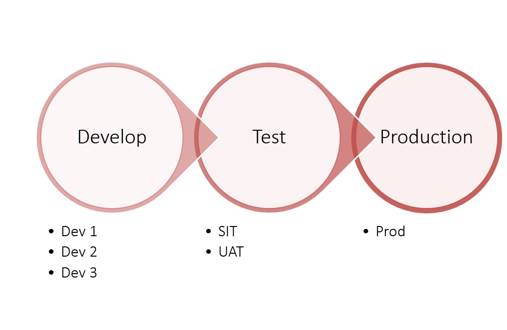
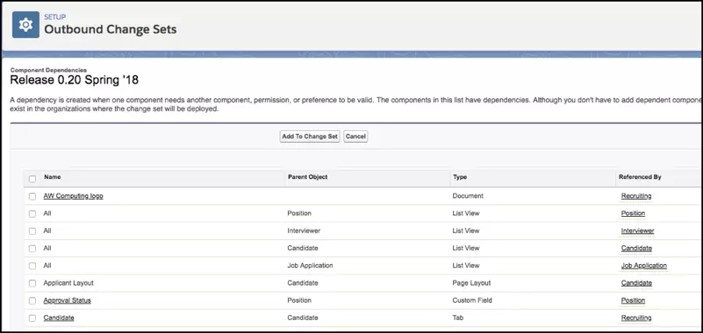
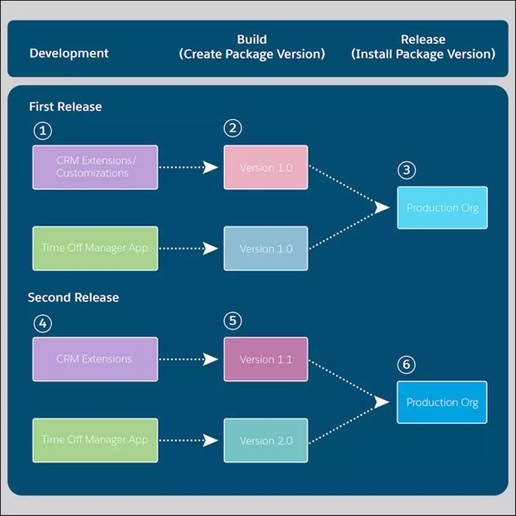

# Deployment

Deployment refers to introducing your changes to the world!

Salesforce supports complex enterprise systems, and the development of such an application may need planning and preparation.

Sequence of events -

1. Development is carried out in one or more dev environments
1. Test (iterative / multiple-rounds until the product is deemed fit to use)
1. Deploy to production where your users will start using the changes

Depending on your edition, you have access to -

1. Development sandboxes: Used for Dev, Integrated Dev, SIT, UAT
1. Other sandboxes: Training, Pre-prod
1. Production



Any customisation is carried out in one or more dev and migrated all the way to production. This is also true for any managed and unmanaged packages - no matter how confident you are with the said package.

Testing is done in the Quality Assurance/Test environments against substantial data - you need a partial copy or a full copy sandbox to do that. More complex enterprises may have pre-production environment where they test the impact of changes, migration times and do a dry-run of migration in pre-production before the actual production migration.

Never change metadata or data in production directly – never ever! Even if you are on an edition that does not support sandbox, it may make a lot of sense to do a quick test in a separate environment (dev?) before introducing changes that change the world.

## Application Lifecycle Management

Larger and complex implementations put in a structured process to manage the application lifecycle - from what business problems the application solves, change management over the course of time, and how technologies give way to newer technologies (sad, but that's the way of the world).

The change management in ALM defines not only how change is introduced to mitigate risks and gain adoption, but also the change cycle within technology systems itself. Below is a depiction of lifecycle management - by salesforce.


## Deployment Methods

Deploy changes to Salesforce environments using one of the following means -

- Change sets
- API
  - Salesforce CLI
  - Used by Workbench
  - Used by third party tools
  - Developer console (uses APIs)
  - Ant migration tool (uses APIs and files)
  - Using IDEs (Salesforce extensions provided in VS Code)
- Packages
  - Less used in enterprise environments, but popular for reusable deployment artefacts in AppExchange and in the wild
  - Create unmanaged, unlocked or managed package from changes
  - Deploy packages in the salesforce environments

## Change Sets

Sequence of events to deploy using change sets -

1. Developer tracks changes made in dev
1. Release manager identifies changed component dependencies & creates change sets (the developer herself may do this task - only differentiating the role, not the person)
1. Upload change sets in target environments (test & repeat). Additionally -
   - Manually migrate metadata that may cannot be included/makes tasks unnecessarily complex
   - Follow up with data migration where relevant
   - Manually track changes at each step




Change sets only contain metadata, they do not have user data. The release manager has a crucial role since changes and dependencies are manually selected in change sets. While this is not a problem in small implementations or while doing simple migrations, this may become too complex too fast in larger implementations or when you have too many changes going on.

Change sets can only be imported completely - no partial business allowed.

Out of all this, you may have already inferred that change sets are scoped to the different environments of the same org (or, different orgs of the same instance). Change sets cannot be used across different Salesforce instances.

### Advantages

- Simple & easy deployments
- Flexibility offered by manual tracking
- Fine-grained control on items to be included in deployment

### Limitations

- Manual work
- No version control
- Difficult to manage large orgs with multiple development tracks

### Best Practices

- Track dependencies and changes carefully. Change sets that do not include all dependencies fail (& waste a lot of time)
- Clone change sets to add incremental components if change set is uploaded and read-only
- Plan and publish maintenance window
- Org setup changes are locked during outbound or inbound change set processing
- Plan extended window for field type changes. Apex test runs may also delay process
- Test deploy using 'Validate' prior to actual deployment
- Anticipate errors and bake that in your production migration schedule since this is a manual task

## API based deployment

Use separate orgs for distinct environments and migrate changes from one environment to the other. This option is sometimes (also?) referred to as "org development".

The most popular sequence of events is below -

1. Create different environments (sandboxes) and use separate dev/test orgs to do development in distinct tracks
1. Integrate branches of development (different tracks/developers etc.) in an "integrated environment" (yet another sandbox)
1. Move source of truth to deployment version control - often this is just a tag on a release
1. Use Salesforce CLI to retrieve & deploy changes - you are therefore "tying version controlled deployments to orgs"
1. Process remains similar to change set based deployment process but with different tools

<br>_src: salesforce.com_

**Advantages**

- Org-based development provides better tracking of changes as compared to change sets
- Version control using files
- Better dependency management
- Perform development without impacting work from other individuals/teams
- Easily roll-out and roll-back changes
- Depending on the option you choose, you can setup a super automated deployment flow including testing and data migration - which needs less manual intervention (= less mistakes)

**Limitations**

- More complex to setup - unless you are using a third-party tool that makes it really easy. Needs an experienced dev team
- Cross-project impact makes dev, testing & deployment tricky (which is equally true for other options in a complex environment)

See the help page for [deploying changes from Sandboxes](https://help.salesforce.com/articleView?id=deploy_sandboxes_parent.htm&type=5) for more details.

## Package based migration

1. Group relevant metadata in packages – metadata can be in one package
1. Use scratch orgs to work on changes independently
1. Source of truth is metadata in packaged project (stored in VCS)
1. Version different packages differently
1. Potentially run different release schedules for different packages
1. Perform development & deployment without impacting other packages
1. Depending on how you are organised, this option can lower the complexity of multiple development tracks with dependencies (this is highly specific and opinionated - I may wake up tomorrow to regret this statement)

_src: salesforce.com_

You use Salesforce CLI to create and migrate packages -

1. Create DX project
   - a local directory-structure of metadata
   - contains configuration files for creating scratch orgs
1. Work on packages locally and using scratch orgs. Keep track of changes – `sfdx force:source:status`.
1. Version control all changes
1. Deploy packages independent of other development tracks
1. Perform development without impacting work from other individuals/teams

A high-level process flow is depicted below -


Creating packages may not be a one-time activity, but can be incremental. You can create packages from existing metadata based on –

- App: Different apps are grouped into package
- Customizations based: Changes in different functions
- Shared library: commonly used objects across application

Don't hurry up into creating a separate namespace - requires a lot more changes and testing.

Note that packages can have inter-dependencies – across managed and unmanaged packages.

**Advantages**

- Better option if you are using same code base across instances
- Atomic packages result in best dependency mgt. Changes are modular
- Improved team collaboration - lesser dependency on the team that "built" the changes
- Manage complex changes across systems
- Incremental versioned changes – development, testing, release process is easier
- Facilitates automated testing

**Limitations**

- Complex to setup
- More laborious to execute (even with automation)

## Salesforce Data Deployment

All of the tools discussed so far deploy metadata - which is configuration and changes in your salesforce org. We did refer to 'data' (as in 'user data' like accounts, contacts etc.) and the process can include data migration across environments - but those tools do not support migrating data with the exception of Salesforce CLI tool.

We have seen a bit of data migration tools in [admin study guide](/admin-guide/). You can choose from your favourite tools to migrate data across environments once the changes are ready in the target environment -

- Export data from lower environments and import using Data loader
- Use third party data migration tools
- Use CLI!

With CLI, you simply export data from one environment to files and import those files in the target environment. Not quite efficient for large data volumes or for controlled migrations - but it works!

For example -

Exporting data [example from salesforce.com] -

```
sfdx force:data:tree:export --query \
      "SELECT Id, Name, Title__c, Phone__c, Mobile_Phone__c, \
              Email__c, Picture__c, \
       (SELECT Name, Address__c, City__c, State__c, Zip__c, \
               Price__c, Title__c, Beds__c, Baths__c, Picture__c,  \
               Thumbnail__c, Description__c \
        FROM Properties__r) \
       FROM Broker__c" \
     --prefix export-demo --outputdir sfdx-out --plan
```

Import data -

```
sfdx force:data:tree:import --targetusername test-wvkpnfm5z113@example.com \
    --plan sfdx-out/export-demo-Broker__c-Property__c-plan.json
```

It is a good idea to -

- Plan for extended migration time when migrating data
- Have automated scripts using batch files/ Informatica / Talend / other to reduce manual work
- Test migration before hand to have automated scripts to migrate
- Plan for stage-wise roll-backs if things don't go well during deployment

## Sandboxes

Sandboxes provide a way for you to develop and test your changes - you can safely do that away from your production environment.

- Isolate production from development/test code
- Develop and test changes without impacting users
  - Move code to "higher" environments using change sets, metadata or packages - fairly standardised and easy to manage
  - Deploy to production when ready
  - Follow standards for all changes – incl. managed packages and data
- Patches to production will need to be rolled down to all environments

There are different types of sandboxes that differ on how much space they make available for your data and how often could you refresh data/code from production. All sandboxes have the full configuration/code (metadata) - they may only differ in versions.

| Sandbox       | Description                                                                                        |
| ------------- | -------------------------------------------------------------------------------------------------- |
| Developer     | Develop & test. Copy of production's metadata                                                      |
| Developer Pro | Similar to developer org. Can contain more data. Used for development + QA                         |
| Partial copy  | Contains org metadata + sample of data from production. Use for QA, integration testing & training |
| Full          | Full metadata and data from production org. Use for load testing and full-blown testing.           |

Availability of sandboxes depends on your salesforce edition -

<br>_src: salesforce.com_

And, here's how the different sandboxes fare -

<br>_src: salesforce.com_

## References

### Read

1.[Metadata API guide](https://developer.salesforce.com/docs/atlas.en-us.216.0.api_meta.meta/api_meta/meta_intro.htm)

2.[Salesforce DX Developer Guide](https://developer.salesforce.com/docs/atlas.en-us.sfdx_dev.meta/sfdx_dev/sfdx_dev_develop.htm), [DX Setup Guide](https://resources.docs.salesforce.com/216/latest/en-us/sfdc/pdf/sfdx_setup.pdf)

### Watch

1.[Deploy using change sets](https://www.youtube.com/watch?v=Ix_LFFdck-E)

2.[Ant based deployment](https://youtu.be/YW9aPrxvK3A)

3.[Deploy and organize metadata using unlocked packages](https://www.youtube.com/watch?v=hw5kqvGmyec)

[Advanced techniques to adopt Salesforce DX](https://www.youtube.com/watch?v=yw-QoE4l0p0)

### Do

- Complete on Trailhead --

  - [Application life cycle and development models](https://trailhead.salesforce.com/content/learn/modules/application-lifecycle-and-development-models)
  - [Unlocked packages quick start](https://trailhead.salesforce.com/en/projects/quick-start-unlocked-packages)
  - [Module: Unlocked packages for customers](https://trailhead.salesforce.com/en/content/learn/modules/unlocked-packages-for-customers)

- Go through --
  - [Salesforce DX](https://developer.salesforce.com/platform/dx)

## Workshop

Complete following tasks.

| No. | Type | Description            | Time (hrs) |
| --- | ---- | ---------------------- | ---------- |
| 1   | Do   | Environments           | 0.5        |
| 2   | Do   | Change sets            | 1          |
| 3   | Do   | Use IDE/Ant            | 2          |
| 4   | Do   | Use Unmanaged packages | 1          |
| 5   | Do   | Import data            | 1          |

### Environments

1. Create a sandbox from trial org. If you had been using a developer org: skip (2) – team up with your friend who is using Trial org
2. Configure Git locally. Initialize a new project

### Change sets

1. Create change sets from source environment
2. Import configuration done so far – manual

### Import configuration

1. Create a different sandbox / trial org
2. Use IDE to manually configure objects from one org to the other
3. Deploy changes

### Use unmanaged packages

1. Create unmanaged packaged with the configuration
2. Import configuration in a new environment

### Import data from files

1. Import data from files created in one of the past exercises

## Teaching Aids

### Presentation

#### 1. Deployment: sf-cog

&nbsp;

<iframe src="https://docs.google.com/presentation/d/e/2PACX-1vRkWnX6xZ1AQtSiyiqb7cBtUeRPaXDyFabFqaCabr7CmOjcMrKq5v30EkXWWzob0w/embed?start=false&loop=false&delayms=3000" frameborder="0" width="800" height="600" allowfullscreen="true" mozallowfullscreen="true" webkitallowfullscreen="true"></iframe>

[More info](/misc/pricing#sf-cog)
