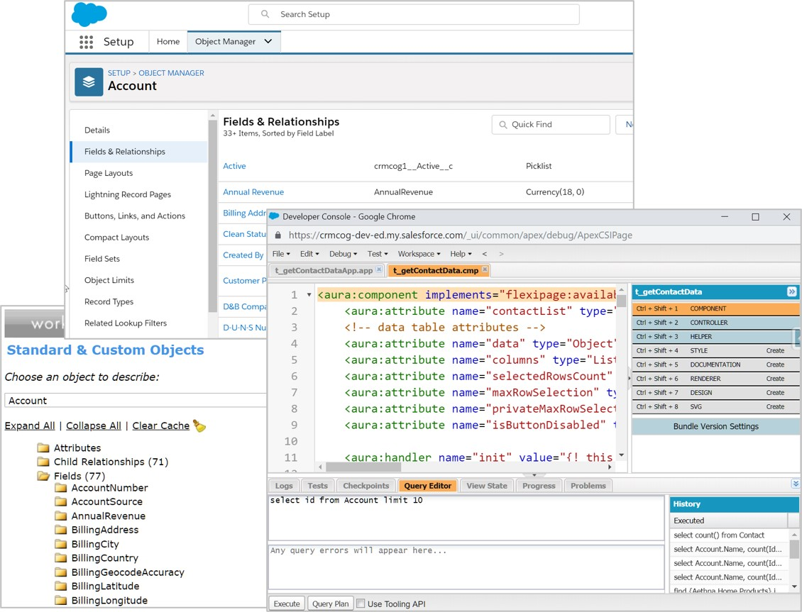
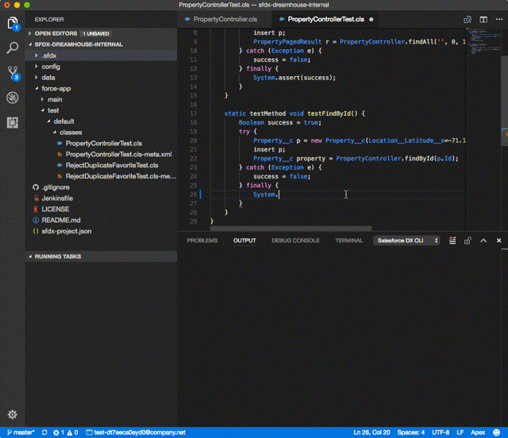
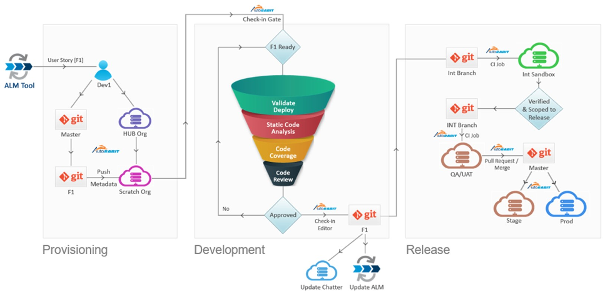

# Tools for Developers

Salesforce enables you to perform all customization through a browser -

- Configuration through Clicks on UI + Developer Console + Workbench have been deemed adequate for configuration
- All configuration is affected and maintained on the Salesforce platform



That should work for low to medium complexity organisations just fine. But you have to bear in mind a few limitations -

- No version control – it may be harder to roll back changes safely and quickly depending on what you are doing
- Multiple developers can step on to each others’ work – slows the development iterations
- Difficult to track changes across environments (e.g. support team changes configuration in production that is not reflected back in Development)

If you are willing to go a step further, you unlock the powerful new tools on supported Integrated Development Environments (IDEs).

- Use tools from Salesforce and third party to build sophisticated applications
- Developers leverage tools that are familiar to them to quickly build, version control & deploy changes
- Perform development without impacting work from other teams on same org – easy rollout & rollback

Here's what you could do with a combination of Salesforce and "typical"\* third party tools -

| Work type       | Tools                                                                                                                                         | Alternatives                                                                                                                                                                                                                               |
| --------------- | --------------------------------------------------------------------------------------------------------------------------------------------- | ------------------------------------------------------------------------------------------------------------------------------------------------------------------------------------------------------------------------------------------ |
| Customization   | - VS Code + Salesforce CLI <br>- Static code analysis: Checkmarx & [PMD-Apex](https://pmd.sourceforge.io/pmd-5.5.2/pmd-apex/rules/index.html) | - Alternatively Use VS Code + ForceCode if you cannot use packages\* <br> - [Code scan](https://www.codescan.io/), [Checkmarx](https://security.secure.force.com/security/tools/forcecom/scanner) & [Clayton](https://www.getclayton.com/) |
| Version control | - Git                                                                                                                                         | - Self-hosted or on GitHub / Bitbucket / Gitlab                                                                                                                                                                                            |
| Deployment      | - Jenkins <br> - Third party                                                                                                                  |                                                                                                                                                                                                                                            |
| Testing         | - Jasmine / Mocha + LTS <br>- Selenium<br>                                                                                                    |                                                                                                                                                                                                                                            |
| Data            | - Dataloader<br>- Mulesoft                                                                                                                    | - Although Informatica w/ Salesforce connector is really good, future may be uncertain?                                                                                                                                                    |

_\* Opinionated_

Other third party options -

| Type                                             | Name              | Details                                                                                                                                                                                                                                                              |
| ------------------------------------------------ | ----------------- | -------------------------------------------------------------------------------------------------------------------------------------------------------------------------------------------------------------------------------------------------------------------- |
| IDE                                              | Illuminated Cloud | - Plugin for IntelliJ IDEA <br>- Features available in Eclipse IDE w/ better UX <br>- \$65/license                                                                                                                                                                   |
| IDE                                              | Cloud-based IDEs  | -[cloud9](https://c9.io/)[](https://www.aside.io/login) <br>- [aside.io](https://www.aside.io/login)                                                                                                                                                                 |
| IDE                                              | Welkin Suite      | - Provides a Salesforce plugin <br>- Extensive feature set incl. support for all customization, log downloads etc.                                                                                                                                                   |
| Deployment - migration /configuration mgt. tools | Multiple          | -Custom flow using Jenkins & friends[](https://www.flosum.com/) <br>-[Flosum](https://www.flosum.com/), [Copado](https://www.copado.com/) <br> -[Autorabit](https://www.autorabit.com/), [Gearset](https://gearset.com/)<br>- [Clickdeploy](https://www.copado.com/) |
| Deployment - Data                                | Multiple          | - Custom flow using data loader<br> - Dataloader.io<br> - Informatica<br> - Mulesoft                                                                                                                                                                                 |

## Salesforce CLI and DX

Salesforce Developer Experience (DX) enables easier development using your favourite IDE (VSCode - Salesforce has official extensions) and a CLI that talks to your Salesforce org through APIs.

This method of development can be super helpful -

- Create multiple dev sandboxes for development and enable a standard, streamlined, "no stepping on toes" development in individual sandboxes (optional - more than one developer can use a single dev sandbox and make things difficult for everyone)
- Easy version control - changes go into version control system before finding their way to Salesforce application (they can be streamlined that way and a one-step process for a developer in day-to-day activities)
- Manage changes better by grouping them in projects. Split code into manageable chunks rather than deal with entire repository/org
- Easier to use unlocked and locked packages help
- Developers leverage tools that are familiar to them to quickly build, version control & deploy changes

Salesforce CLI -

- helps manage deployment process from command line
- combines functions of Metadata API, Tooling API and Data API


Use CLI to -

- create / manage projects and manage development process end to end
- create scratch orgs and retrieve/push changes to scratch org
- create & access environments (as part of Devops cycle)
- install packages
- run unit tests
- ..and combine with Ant tool to automate scripting of tasks

## VSCode and Salesforce

VSCode is the greatest editor of all times.

So, it is only natural that Salesforce provides extensions to make development of Salesforce applications easier on VSCode :)

Getting started is easy enough -

- Install VSCode
- Install [Salesforce Extensions for VSCode](https://marketplace.visualstudio.com/items?itemName=salesforce.salesforcedx-vscode)
- Connect this project to your instance and start working - the instance may be your dev org, or a scratch org that you can create in VSCode itself



Using VSCode, you can -

- interact with CLI within VS Code (`Ctrl + Shift + P` and start typing CLI commands)
- seamlessly work with scratch orgs and with sandboxes as well!
- create projects, and work on projects in our favourite editor
- see just beautiful Apex syntax highlighting and code completion can be
- use interactive debuggers
- work with Visualforce and Lightning components and pages

## Git

You would have seen Git mentioned against version control systems in a couple of places so far. It is the technology of choice for doing any kind of version control today, and Salesforce is no exception. That said, you can use any version control systems - we are just dealing with files in Salesforce development (like any other code file).

Git is a distributed version control system that has taken over the world -

- Code & change history exists in all repositories in equal measure. This is unlike the older centralised version control systems that had "clients" checking in code to one server
- Branch out code, perform changes independently, and merge branches back

The flow in Git looks like this -

1. Create new branch
   - Branch every feature and tag branches to identify them
1. Commit work
   - Commit work locally to a branch
   - Optionally squash branches before submission
1. Submit work
   - Push branch to server – open pull request (in GitHub)
   - Resolve conflicts (if any) with help from release manager/ others in team
   - Release manager approves work
   - Merge branch. The older branch may be deleted post merge

So, each developer essentially "branches out" code, performs changes independently, and merges changes back. The developer makes sure her local Git repository is in sync by doing a `git pull` periodically.

```
// clone repository
git clone https://github.com/prashanth1k/sfdc-lightning-for-impatient-developers.git

// create branch
git branch amazingfunctionbranch


/*
	MAKE CHANGES
	add sObject
*/

// add file to version control. This is required only the first time
git add <.. Path to automobile XML .. >

// commit local
commit -m "Added object Automobile"

// send to server
git push -u origin amazingfunctionbranch // or simply 'git push'

// Create pull request on GitHub

// Review changes

// Resolve conflicts

// Approve changes and merge branch

```

Using Git in Salesforce context follows the same practices as elsewhere.

- Developer creates scratch orgs that reflect the latest baseline
  ```
  sfdx force:org:create adminEmail=me@email.com edition=Developer username=admin_user@orgname.org
  ```
- Push local changes in editor to scratch org
  ```
  sfdx force:source:push
  ```
- Open org and do any tests
  ```
  sfdx force:org:open --path lightning -u <username/alias>
  ```

The code that you start scratch orgs with and any changes in code (which you push to scratch orgs) will go to version control system as well. Once you are done development + testing of changes, you merge the changes back to the remote repository.

## DevOps

DevOps = Development + Ops.

It is a set of practices that lay out the processes to move a requirement from "conception" to "go live", and do those processes in iterations while ensuring stability of the changes deployed in the past.

We aim to -

- standardise
- streamline
- simplify (not necessarily - but we love to put this term in IT)
- automate

.. the processes involved therein.

DevOps is typically implemented by a combination of -

1. ALM tools - manage requirements, sprints, project management, testing and go-live activities
1. Version control tools - Control code / configuration changes during development and migrations at each stage
1. Code / data migration tools: migrate code and/or data across environments
1. Other automation tools - perform static code analysis, perform automated tests, etc.

From Wikipedia -

> DevOps is a set of practices that combines software development and information-technology operations which aims to shorten the systems development life cycle and provide continuous delivery with high software quality.

DevOps in Salesforce is pretty much the same.

1. ALM tools play a part in overall project management and supporting processes
1. Salesforce CLI, IDE and version control systems help in streamlining development and in easier deployments
1. Use a combination of test automation, code analysis tools to ensure code quality assurance

<br>_src: salesforce.com_

### Metrics

The thing about Devops is that once you are done with the first step, everyone and their neighbour's cat are interested to check out "how it's working".

So.. metrics.

Here are a few sample metrics that can tell you whether everything's fine.

| Sample Metrics          | Description                                                              |
| ----------------------- | ------------------------------------------------------------------------ |
| Lead time               | Time from requirement acceptance (start of work item) to go-live         |
| Cycle time              | Iterate development through go-live                                      |
| Deployment time         | Time from initiation of deployment through completion                    |
| Deployment frequency    | How often deployment is done. Deployments have to be small and numerous! |
| Deployment success rate | Deployment successes vs. failures - production                           |
| Time to recover         | Time to effectively roll-back changes                                    |

## References

### Read

1. [Develop in any org in VS Code](https://github.com/forcedotcom/salesforcedx-vscode/wiki/Develop-Against-Any-Org-in-Visual-Studio-Code)

2. [VS Code + DX tips and tricks](https://github.com/forcedotcom/salesforcedx-vscode/wiki/Tips-and-Tricks)

3. [VS Code tips](https://github.com/Microsoft/vscode-tips-and-tricks)

4. [Git handbook](https://guides.github.com/introduction/git-handbook/)

### Watch

1. [Getting started on VS Code](https://www.salesforce.com/video/1768045/)

### Do

- Complete on Trailhead.

  - [Get started with Salesforce DX](https://trailhead.salesforce.com/content/learn/trails/sfdx_get_started)

- VSCode

  - Learn how VS Code can benefit humankind: [VS Code can do that](https://vscodecandothat.com/)
  - [AppExchange Partner Basics](https://trailhead.salesforce.com/en/content/learn/modules/isvforce_basics)

- Git
  - [Learn Git branching](https://learngitbranching.js.org/)

## Workshop

Complete the following tasks.

| No. | Type    | Description                       | Time (hrs) |
| --- | ------- | --------------------------------- | ---------- |
| 1   | Do      | Configuration                     | 1          |
| 2   | Do      | Apex                              | 1          |
| 3   | Do      | Visualforce & Lightning           | 1          |
| 4   | Do      | Static code analysis              | 1          |
| 5   | Present | Discuss learnings and preferences | 1          |

### Configuration

1. Add field / do modifications for at least 3 objects created earlier - use Force Code
2. Do same configuration changes using SFDX

### Apex

1. Create Apex trigger and class in IDE
2. Create test classes
3. Run tests
4. Deploy changes

### Visualforce & Lightning

1. Create VF page / modify existing VF page using IDE
2. Create/modify Lightning component using IDE

### Static Code Analysis

1. Use ApexPMD for static code analysis in IDE
2. Run CodeScan free version to find out any vulnerabilities. Discuss the report

## Teaching Aids

### Presentation

#### 1. Tools: sf-cog

&nbsp;

<iframe src="https://docs.google.com/presentation/d/e/2PACX-1vRkWnX6xZ1AQtSiyiqb7cBtUeRPaXDyFabFqaCabr7CmOjcMrKq5v30EkXWWzob0w/embed?start=false&loop=false&delayms=3000" frameborder="0" width="800" height="600" allowfullscreen="true" mozallowfullscreen="true" webkitallowfullscreen="true"></iframe>

[More info](/misc/pricing#sf-cog)
