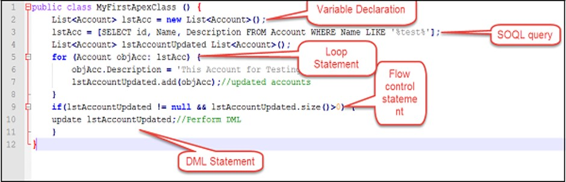

# Apex

While Salesforce can give you mere super powers, Apex literally makes you the God (in the salesforce ecosystem).

Apex is proprietary "scripting" language used in Salesforce which is a strongly typed (variables, function returns etc. must have types), object-oriented language.

Features -

- strongly integrated with SFDC data
- somewhat similar to Java.
- upgrades like rest of Salesforce
- Apex patterns and libraries can be created and used to provide easier scaling
- Apex runtime engine -
  - respects multitenancy - runs specific to your instance
  - applies limits to avoid unregulated resource consumption
- comes with a nice testing framework, where you can use abstractions and mocks

Apex can help you -

- Perform validation and process automation for Salesforce application
- Use flow and transaction control statements
- Integrate salesforce with external applications

## When to use Apex?

Apex is a business-layer function that helps retrieve/update data (you choose to apply/ignore security rules), run business logic, and create automation flows.

Apex can be written in -

- Classes (invoked by UI, other classes, triggers, etc.)
- Object triggers

Choosing configuration is preferred in salesforce considering the development simplicity and ease of maintenance. Typical use cases for Apex include -

- Perform complex validation over multiple objects as a single transaction/at the same time
- Perform updates / bulk updates with controlled rollback support
- Create complex automation not supported by process or flow
- Create web services to integrate with other systems
- Create email services to send bulk emails

## How does Apex work?

Developers write Apex against object triggers, reusable pieces of code in Apex classes and this developer-written code is compiled when the code is saved (or at deployment).

Apex code is stored as metadata and available for changes through metadata/tooling API.

At runtime, the compiled instructions are retrieved and executed in sequence within the standard control paradigm within Salesforce.


Apex code can contain -

- Variables that are typed – primitive / complex
- Control structures incl. loops, declarative flows
- Data operations through SOQL, SOSL, DML



## Components of Apex

Similar to any programming language, Apex has variables, constants, and control statements. It is tightly integrated to salesforce with ability to use queries on objects, update/delete records and run routines to integrate external services.

### Variables and constants

A constant refers to variable that will be set but not changed. e.g. `static final Integer answertoEverything = 42;`

Variable stores information that can be referenced later. A variable can be assigned a value and retains that value until the lifetime provided by scope (e.g. a function, a class).

Apex is strongly typed - variable have types associated with them. Following primitive data types are available in Apex -

- Blob
- Boolean
- Date
- Datetime
- Decimal
- Double
- ID - 18 character representation of record Id. E.g ID id='00300000003T2PGAA0’;
- Integer
- Long
- Object
- String
- Time

You define a variable thusly -

```java
Integer i;
```

You can also define multiple variables and assign values in one go -

```java
Integer i = 0, j, k = 1;
String foo;
```

Apex is case insensitive. So, this rings true.

```java

Integer i = 0;
System.assert(I == 0); // true
System.debug( I + 1 ); // valid

Contact c1;
CONTACT c2; // both are the same
```

We also have access to more complex types -

- Collections
- Object
- Enums
- Classes
- Interfaces

An "object" can be any data type that is supported – primitive, user-defined custom classes, sObject type. For e.g. -

```java
Object obj = new MyApexClass(); // Cast the object to the MyApexClass custom type.
MyApexClass mc = (MyApexClass)obj; // Access a method on the user-defined class.
mc.someClassMethod();
```

Classes, interfaces & enums are similar to any other object oriented programming language.

A collection in Apex can be: List, Set, or Map. Each of these have their uses.

**Lists**

- Ordered collection of elements
- Tagged against an index
- Any data type
- Elements can be sorted
- Array notations can be used for 1d lists

```java
// Create list - similar to salesforce provided example
List<Integer> myList = new myList<Integer>();

// add element
myList.add(42);

// get element
Integer i = myList.get(0);

// set the element at 0th position (i.e., first element) to 1
myList.set(0, 1);

// remove all elements
myList.clear();
```

**Sets**

- Unordered
- No duplicates
- Any data type
- No index – only iteration
- Iteration order deterministic - return same order for every iteration

```java
// Define a new set - similar to example provided by salesforce
mySet = new Set<Integer>();
// Add two elements to the set
mySet.add(l);
mySet.add(2);
// Assert that the set contains value
System.assert(mySet.contains(1));

// Remove value from set
mySet.remove(l);
```

**Maps**

- Key-value pair
- Key and value can be of any data type
- Iteration order is deterministic

```java
// Define a new map - similar to example provided by salesforce
Map<Integer, String> m = new Map<Integer, String> ;

// Insert two new key-value pairs in the map
m.put(l, 'First entry');
m.put(2, 'Second entry');

// Assert that the map contains a key
System.assert(m.containsKey(1));

// Retrieve a value using key
String value = m.get(2);
System.assertEquals('Second entry', value);

 // Return set with all keys in the map
Set<integer> s = m.keySet();
```

Variables can be defined anywhere in the block and will be available there after. Sub-blocks cannot redefine variable from parent block.

```java
Integer i;
{
   // Integer i; declaration is not allowed since parent has i
}
```

We will get back to scopes soon.

Read more -

- [Apex primitives](https://developer.salesforce.com/docs/atlas.en-us.apexcode.meta/apexcode/langCon_apex_primitives.htm)

## Control Statements

We can provide a controlled flow of logic using conditional statements and associated code blocks.

There are three common ways of achieving controlled flow -

### `if/else`

Conditional `if` statement similar to any other programming language. Code block is executed if a given condition is true.

```java

if ([Boolean_condition]){
    // if-block
}
else {
    // else-block
}

```

`else` is optional.

### `switch`

Use `switch` instead of a series of `if/else if` statements. It evaluates a given expression and executes one of the `when` blocks where the conditional expression evaluates to `true`. This is more elegant if nothing else.

```java
switch on_expression {
    when value1 {
        // when-block 1
    }
    when value2 {
        // when-block 2
    }
    when else {		  // default (but optional)
        // when-else-block 3
    }
}
```

- `switch` expr types can be any of Integer, Long, sObject, String, Enum
- `when` expr types - literal, sObject, enum
- No action if no `else` block is present
- There is **no** fall-through – exit loop after executing one of the blocks

### Loops

There are three ways of looping through a block of statement until a condition is satisfied -

- `do/while`
- `while`
- `for`

`while` and `do/while` enable similar functionality, except that `do/while` executes at least once (since the condition is checked at the end of the block).

```java

// do - while
do {
	statements
} while (boolean_condition);


// while
while (boolean_condition){
	statements
}

```

A `for` statement can iterate -

- until a given condition is satisfied
- through elements of an array or set
- records retrieved through an inline SOQL

```java
for (init; Boolean_exit_condition; increment){
	statements
}

for (variable : array_or_set) {
	statements
}

for (variable : [inline_soql_query]){
	statements
}
```

In all the loop control blocks -

- `break` exits loop
- `continue` moves to next iteration in all loops

For e.g.-

```java
for (variable : [inline_soql_query]){
	if (<record_with_zero_sales_found>) break;
}
```

## Workshop

Remember the golden rules of creating Apex code -

- Always create bulkified Apex
- All Apex classes MUST have 100% test coverage
- Mandated to use single trigger framework – can either utilize a simple call to class, use an interface, or use any of the trigger frameworks that you can lay your hands on
- Try to use / rewrite code using patterns & frameworks to learn more

Here are the activities for the day (or week!? :))

| No. | Type    | Description            | Time (hrs) |
| --- | ------- | ---------------------- | ---------- |
| 1   | Do      | Validation             | 3          |
| 2   | Do      | Automation             | 7          |
| 3   | Do      | Batch                  | 6          |
| 4   | Present | Discuss completed work | 1          |

### Validation

- Do not allow partner to request for new inventory if current stock is 200% of planned inventory
- Enable managers to apply adhoc discounts to sales and service orders. Capture discounts and discount reasons against sales and service orders – calculate discount percentage against a given code. Validate discount codes provided against a master list that is applicable for the customer.
- Do not accept free service if the last two consecutive services have been ‘missed’

### Automation

- Maintain partner inventory
  - Add inventory to partner when inventory request is fulfilled
  - Remove inventory upon sale or transfer to manufacturer/other partner
- Maintain partner bonus
  - If opportunity is won through partner, add +10 to Partner Bonus
  - For a positive feedback from client, add 1 to Partner Bonus
- Upon sales opportunity closure, send reminder to customers
  - Won: thank them for the sale. Remind to send feedback
  - Lost: thank them for the opportunity. Remind them to send feedback or just respond to current email on why they did not buy the vehicle
- Create a service schedule based on miles, vehicle model and sale date – get master data from hard-coded schedule in Apex, a static file or a maintenance schedule master table for vehicle
- Sum up discounts for an order. Put discounts > 15% on hold until approved by regional sales manager and/or regional service manager
- Apply discounts provided at parent level in quote or order to child line items
- Flag lead as duplicate if lead is not associated with existing account, but has same name and location. Capture duplicate reason
- Put warranty status on vehicle on hold if five consecutive services are missed

### Batch

- Send birthday wishes to customers over email using a defined template
- If a customer does not have any vehicle associated for more than 3 months – update status to ‘Dormant’
- If lead with same name and location is associated with more than 4 campaigns, flag lead as duplicate in all of latest campaigns. Capture duplicate reason.
- Send service reminders to customers through emails when service is due in the next week
- Flag scheduled service as ‘missed’ if today > service scheduled date + 10 days
- If price changes in the price book for vehicle or parts, change price in all open opportunities and service records
- Monthly batch to reconcile loyalty points based on sale and service records. Log all inconsistencies
- Cancel leads with reason code when after two weeks past campaign end date but lead does not have any associated opportunity
- Send discount code of 5% on service for active VIP customers who did not have any contact in the last twelve months

## Teaching Aids

### Presentation

#### 1. Apex: sf-cog

&nbsp;

<iframe src="https://docs.google.com/presentation/d/e/2PACX-1vSh5OHMxrWgp12qFXpzm1qZ0PqvT_mpY0Uhu5BKoV7j5qZPWCOCxB8oFz2aSdhw4w/embed?start=false&loop=false&delayms=60000" frameborder="0" width="800" height="600" allowfullscreen="true" mozallowfullscreen="true" webkitallowfullscreen="true"></iframe>

[More info](/misc/pricing#sf-cog)
