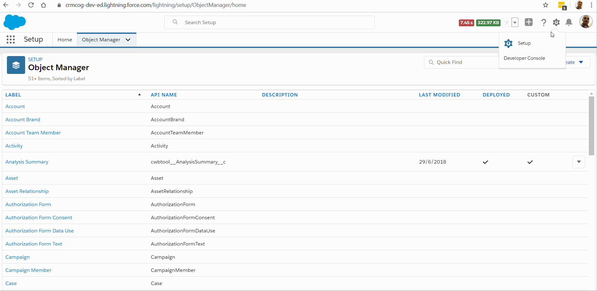
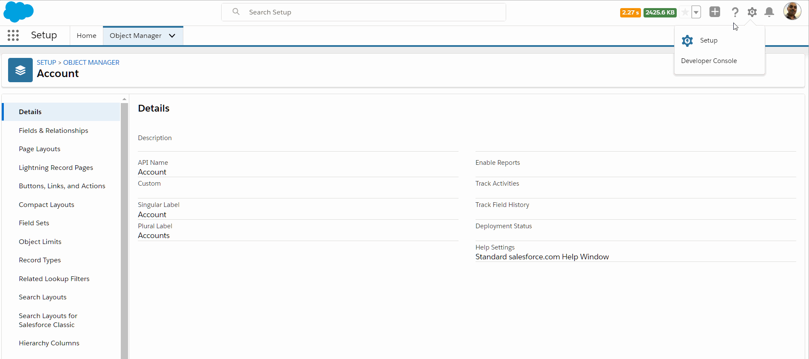
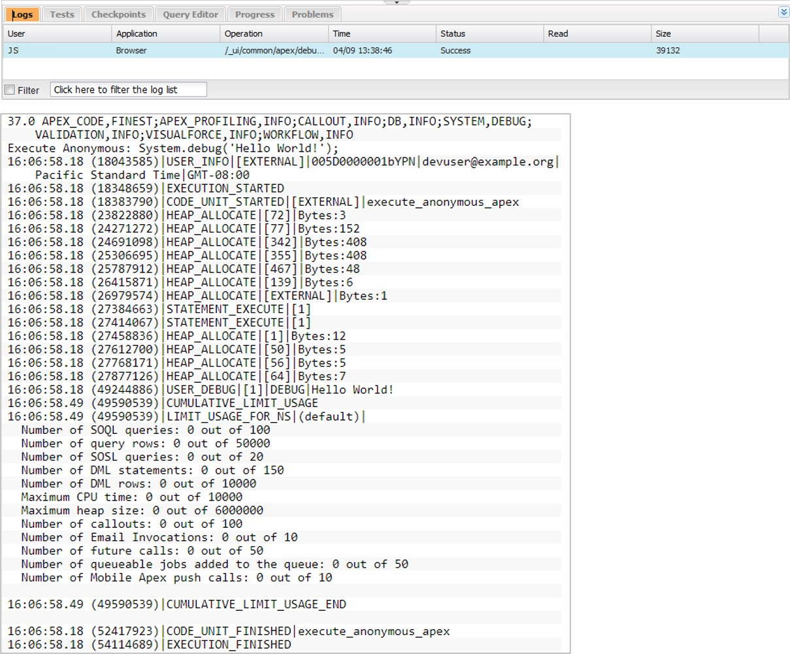
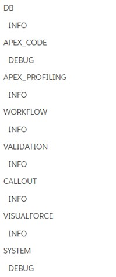

# Apex

While Salesforce can give you mere super powers, Apex literally makes you the God (in the salesforce ecosystem).

Apex is proprietary "scripting" language used in Salesforce which is a strongly typed (variables, function returns etc. must have types), object-oriented language.

Features -

- strongly integrated with SFDC data
- somewhat similar to Java.
- upgrades like rest of Salesforce
- Apex patterns and libraries can be created and used to provide easier scaling
- Apex runtime engine -
  - respects multitenancy - runs specific to your instance
  - applies limits to avoid unregulated resource consumption
- comes with a nice testing framework, where you can use abstractions and mocks

Apex can help you -

- Perform validation and process automation for Salesforce application
- Use flow and transaction control statements
- Integrate salesforce with external applications

## When to use Apex?

Apex is a business-layer function that helps retrieve/update data (you choose to apply/ignore security rules), run business logic, and create automation flows.

Apex can be written in -

- Classes (invoked by UI, other classes, triggers, etc.)
- Object triggers

Choosing configuration is preferred in salesforce considering the development simplicity and ease of maintenance. Typical use cases for Apex include -

- Perform complex validation over multiple objects as a single transaction/at the same time
- Perform updates / bulk updates with controlled rollback support
- Create complex automation not supported by process or flow
- Create web services to integrate with other systems
- Create email services to send bulk emails

## How does Apex work?

Developers write Apex against object triggers, reusable pieces of code in Apex classes and this developer-written code is compiled when the code is saved (or at deployment).

Apex code is stored as metadata and available for changes through metadata/tooling API.

At runtime, the compiled instructions are retrieved and executed in sequence within the standard control paradigm within Salesforce.


Apex code can contain -

- Variables that are typed – primitive / complex
- Control structures incl. loops, declarative flows
- Data operations through SOQL, SOSL, DML


You can execute most of the Apex examples below. While we will get to more "developer way" of creating and executing Apex code, one of the easier ways we execute adhoc Apex or test classes is by using "Execute Anonymous Window" in Debugger console.

1. Click **Setup** > **Debugger Console**
1. In the console popup, click **Edit** > **Open Execute Anonymous Window**
1. Type in code and click **Execute** to execute

For e.g..

```java
System.debug('hello world');
```

Clicking on **Execute** opens the debug log that shows the exact statement - like magic.



## Components of Apex

Similar to any programming language, Apex has variables, constants, and control statements. It is tightly integrated to salesforce with ability to use queries on objects, update/delete records and run routines to integrate external services.

### Variables and constants

A constant refers to variable that will be set but not changed. e.g. `static final Integer answertoEverything = 42;`

Variable stores information that can be referenced later. A variable can be assigned a value and retains that value until the lifetime provided by scope (e.g. a function, a class).

Apex is strongly typed - variable have types associated with them. Following primitive data types are available in Apex -

- Blob
- Boolean
- Date
- Datetime
- Decimal
- Double
- ID - 18 character representation of record Id. E.g ID id='00300000003T2PGAA0’;
- Integer
- Long
- Object
- String
- Time

You define a variable thusly -

```java
Integer i;
```

You can also define multiple variables and assign values in one go -

```java
Integer i = 0, j, k = 1;
String foo;
```

Apex is case insensitive. So, this rings true.

```java

Integer i = 0;
System.assert(I == 0); // true
System.debug( I + 1 ); // valid

Contact c1;
CONTACT c2; // both are the same
```

We also have access to more complex types -

- Collections
- Object
- Enums
- Classes
- Interfaces

An "object" can be any data type that is supported – primitive, user-defined custom classes, sObject type. For e.g. -

```java
Object obj = new MyApexClass(); // Cast the object to the MyApexClass custom type.
MyApexClass mc = (MyApexClass)obj; // Access a method on the user-defined class.
mc.someClassMethod();
```

Classes, interfaces & enums are similar to any other object oriented programming language.

A collection in Apex can be: List, Set, or Map. Each of these have their uses.

**Lists**

- Ordered collection of elements
- Tagged against an index
- Any data type
- Elements can be sorted
- Array notations can be used for 1d lists

```java
// Create list - similar to salesforce provided example
List<Integer> myList = new myList<Integer>();

// add element
myList.add(42);

// get element
Integer i = myList.get(0);

// set the element at 0th position (i.e., first element) to 1
myList.set(0, 1);

// remove all elements
myList.clear();
```

**Sets**

- Unordered
- No duplicates
- Any data type
- No index – only iteration
- Iteration order deterministic - return same order for every iteration

```java
// Define a new set - similar to example provided by salesforce
mySet = new Set<Integer>();
// Add two elements to the set
mySet.add(l);
mySet.add(2);
// Assert that the set contains value
System.assert(mySet.contains(1));

// Remove value from set
mySet.remove(l);
```

**Maps**

- Key-value pair
- Key and value can be of any data type
- Iteration order is deterministic

```java
// Define a new map - similar to example provided by salesforce
Map<Integer, String> m = new Map<Integer, String> ;

// Insert two new key-value pairs in the map
m.put(l, 'First entry');
m.put(2, 'Second entry');

// Assert that the map contains a key
System.assert(m.containsKey(1));

// Retrieve a value using key
String value = m.get(2);
System.assertEquals('Second entry', value);

 // Return set with all keys in the map
Set<integer> s = m.keySet();
```

Variables can be defined anywhere in the block and will be available there after. Sub-blocks cannot redefine variable from parent block.

```java
Integer i;
{
   // Integer i; declaration is not allowed since parent has i
}
```

We will get back to scopes soon.

Read more -

- [Apex primitives](https://developer.salesforce.com/docs/atlas.en-us.apexcode.meta/apexcode/langCon_apex_primitives.htm)

## Control Statements

We can provide a controlled flow of logic using conditional statements and associated code blocks.

There are three common ways of achieving controlled flow -

### `if/else`

Conditional `if` statement similar to any other programming language. Code block is executed if a given condition is true.

```java

if ([Boolean_condition]){
    // if-block
}
else {
    // else-block
}

```

`else` is optional.

### `switch`

Use `switch` instead of a series of `if/else if` statements. It evaluates a given expression and executes one of the `when` blocks where the conditional expression evaluates to `true`. This is more elegant if nothing else.

```java
switch on_expression {
    when value1 {
        // when-block 1
    }
    when value2 {
        // when-block 2
    }
    when else {		  // default (but optional)
        // when-else-block 3
    }
}
```

- `switch` expr types can be any of Integer, Long, sObject, String, Enum
- `when` expr types - literal, sObject, enum
- No action if no `else` block is present
- There is **no** fall-through – exit loop after executing one of the blocks

### Loops

There are three ways of looping through a block of statement until a condition is satisfied -

- `do/while`
- `while`
- `for`

`while` and `do/while` enable similar functionality, except that `do/while` executes at least once (since the condition is checked at the end of the block).

```java

// do - while
do {
	statements
} while (boolean_condition);


// while
while (boolean_condition){
	statements
}

```

A `for` statement can iterate -

- until a given condition is satisfied
- through elements of an array or set
- records retrieved through an inline SOQL

```java
for (init; Boolean_exit_condition; increment){
	statements
}

for (variable : array_or_set) {
	statements
}

for (variable : [inline_soql_query]){
	statements
}
```

In all the loop control blocks -

- `break` exits loop
- `continue` moves to next iteration in all loops

For e.g.-

```java
for (variable : [inline_soql_query]){
	if (<record_with_zero_sales_found>) break;
}
```

## Triggers: Introduction

So far we have gone through theory for the most part. Yes, we can write some DMLs, but how can we call them? How do we fit Apex in our objects?

That's where triggers come in.

Triggers enable Apex invocation for various operations on an object. The operations may be -

- Insert, Update, Upsert
- Merge
- Delete, Undelete

In each of these operations, custom actions can be performed at two instances

- Before – update/validate before committing records to DB
- After – opposite of before

So you have many possible actions -

- Insert - Before
- Insert - After
- Update - Before
- Update - After
- .. and so on

Triggers are supported on top-level standard objects, few standard child objects and all custom objects.

To create a new trigger -

1. Go to **Setup** > **Developer Console**
1. In the popup click on **File** > **New** > **Apex Trigger**
1. Provide the name of trigger and the object
1. Provide the operation and action, and provide trigger logic
1. Save. The trigger will now be triggered for the specified action :)



```java
trigger sssss on Account (before update) {
  // print hello in debug logs _before_ each time account is _updated_
  System.debug("hello");
}
```

As you can see -

1. You can create multiple triggers on same object - you just need to name them differently (but don't - see best practices)
1. You can populate the trigger body with variables, constants, control statements and what not - all of those are specific to the scope of that trigger
1. You can also call Apex classes - we will learn about them in a bit
1. You can also call services external to salesforce - these are called 'callouts'

## Trigger Implementation Considerations

A few key implementation considerations to keep in mind -

- Control structures incl. loops, declarative flows - these are same for triggers and classes
- Data operations in Apex are implemented using DML, SOQL, SOSL
- As you have guessed/seen by now - an `upsert` invokes both before & after of `update` OR `insert`. Similarly `merge` triggers before/after a `delete` event on losing record and `update` event on winning record
- Field history is not updated till the very end of execution. Field history is not recorded by triggers that run in system mode and update fields that are not ‘normally’ accessible by user
- Call outs need to be async and not blocking user actions
- Write meaningful unit tests and consider test coverage

Also, there are operations that do not "trigger triggers" -

- Cascading delete (in records where delete was not initially triggered)
- Cascading updates of child records that are reparented from a merge
- Mass address updates
- Mass approval request transfers
- Modify field data types
- Rename / replace picklists
- Mass division transfers
- Mass campaign data changes

## Trigger References

Read more on -

- [Trigger documentation](https://developer.salesforce.com/docs/atlas.en-us.apexcode.meta/apexcode/apex_triggers.htm)

## Classes: Introduction

Classes in Apex are reusable blocks of code which can be instantiated and used in triggers or other classes. Similar to their Java counterparts, classes -

- are templates from which objects (not Salesforce Objects, plain `objects`) are created
- can extend other classes
- implement interfaces
- can be virtual / abstract etc. (specified in definition modifiers)

Outer classes must have access modifier that signifies whether classes are accessible from external objects/classes – public, private etc.

But unlike popular OOP languages, Apex -

- does not support multiple inheritance
  - Implement one or more interfaces
  - Extend only one class

To create a new class -

1. Go to **Setup** > **Developer Console**
1. In the popup click on **File** > **New** > **Apex Class**
1. Provide the name of class

```java
public with sharing Class ContactAlert() {
    // send mail
}
```

In its full glory, a class may take any of the following forms -

```java
private | public | global
[virtual | abstract | with sharing | without sharing]
class ClassName [implements InterfaceNameList] [extends ClassName]
{
    // class body
}
```

A class can have one or more methods that implement functionality. These methods are called from the instance of class, i.e., an object.

A class may have no methods but have signatures - an interface. An interface can be implemented by another class to keep the whole reuse thing going strong.

## Class Implementation Considerations

- Objects are created from classes – similar to Java or any other OOP language. These objects will have methods that may or may not be accessible from external classes or triggers depending on their access modifier
- Class methods can have numerous DML statements. It is a good idea to streamline DML statements and control transaction rollback in case of local or global errors (Database methods)
- It is almost always a good idea to minimise database operations. You can use maps/lists for queries/ data storage, and pass along collections across method calls (including future methods). This can (or should) be preferred as compared to passing across a single record

- Classes are used to implement webservices that are consumed by external applications. Webservice methods must have global classes
  Use maps/lists for queries and pass along collections across method calls (incl. future methods)
  Interfaces – classes with no methods but only signatures

## Methods

Methods of a class implement the actual functionality. Class methods can be public or protected - this signifies whether methods are accessible from other classes.

```java
public class CoolApexClass {

   public String theThing;  // class variables

   public String getTheThing () {
       return theThing;
   }
}
```

You then call this class from other class, trigger or from anonymous window using the following block of code -

```java
CoolApexClass CoolApexClassInstance = new CoolApexClass();
CoolApexClassInstance.getTheThing();
```

A method may return no value, or a single value. The return type is mandatory if the method "returns a value", i.e, if it has no `void` prefix.

Methods can also be static. Static methods do not need objects, can be directly invoked from class variables.

```java
public class CoolApexClass {

   public static String theThing;  // class variables

   public static String getTheThing () {
       return theThing;
   }
}
```

Constructors, which execute by default whenever classes are instantiated, are also methods. Constructors have the same name as the class. Use them to initialize class variables or invoke initialization logic (e.g. set a variable, check conditions, etc.).

```java
public class CoolApexClass {

   public static String theThing;  // class variables

   public CoolApexClass () { // constructor
      theThing = 'The Thing'; //initialized at class invocation
   }
}
```

Constructors are optional - a "no argument" constructor is invoked if no constructor is specified.

Constructors can be overloaded.

```java
public class CoolApexClass {

   public static String theThing;  // class variable

   public CoolApexClass () { // constructor when no param
      theThing = 'The Thing'; // initialize to a default value
   }
   public CoolApexClass (String var) { // constructor invoked when param is provided
      theThing = var; // initialise to given value
   }
}
```

## Working with Data in Apex

The full power of Apex can only be unleashed when you start accessing Salesforce data. This is done primarily in three ways - SOQL, SOSL and DMLs.

### SOQL

SOQLs in Apex are used to -

- Query record within single object
- Traverse relationship b/w objects
- Perform aggregation (e.g. min, max)

You use `:` to bind variable values within SOQL.

```java

String accName = 'ABC Inc.';

List<Account> lstAccount = [SELECT Id, Name(SELECT Id, Name FROM Contacts) FROM 					Account WHERE Name = :accName];
System.debug('List of Accounts ' + lstAccount);

List<Opportunity> lstOpty = lstAccount[0].Opportunities__r;
System.debug('List of Opportunities ' + lstOpty;

```

As a practice always use `escapeSingleQuotes` method before passing any query string that directly or indirectly comes from user input. Also escape single quotes (`'`) by prefixing '\' (`\'`). This will treat the query string as a string and prevent SOQL/SOSL injection attacks.

Read more on [SOQL documentation](https://developer.salesforce.com/docs/atlas.en-us.apexcode.meta/apexcode/langCon_apex_SOQL.htm).

### SOSL

Use SOSL in Apex to -

- Search text across objects / fields
- Search result will be a list of sObjects and contained search results within each sObject

For e.g. -

```java
String searchquery='FIND\'ABC*\'IN ALL FIELDS RETURNING Account(id,name),Contact, Lead';

List<List<SObject>>searchList=search.query(searchquery);

```

.. will search for 'ABC' in all strings across Account, Contact and Lead objects, and return the result.

### Dynamic SOQL and SOSL

We have used a hard-coded SOQL / SOSL statement in the previous examples. We can also create SOQL/SOSL string in runtime and use that in the same code. This is particularly useful when you want to work with dynamically determining sObjects, changing the query fields, or filter criteria in runtime.

Note that dynamic SOQL permits simple bind variables (e.g. string) but not variable fields - you cannot use a bind value that is coming from Apex.

See below examples -

```java
Account acc = Database.query(string-limit-to-1);

// typically used in list context
List< Account> lstAcc = Database.query(string);

String myTestString = 'TestName';
List<sObject> sobjList = Database.query('SELECT Id FROM MyCustomObject__c WHERE Name = :myTestString');

```

```java
String searchquery = 'FIND\'Edge*\'IN ALL FIELDS RETURNING Account(id,name),Contact, Lead';
List<List<SObject>>searchList = search.query(searchquery);

```

## DML and Database Methods

Use DML to -

- Perform insert, update, delete, upsert, merge of data
- Create and access sObjects like any other objects
  - Use the sObjects types to represent the type of object
  - Store sObject data in variables and manipulate them

A simple example -

```java
Account a = new Account(Name='Account Example');
insert a;
```

A more substantial example of using DML -

```java
// List to hold the new contacts to update.
List<Contact> updatedList = new List<Contact>();
List<Contact> conList = [Select Department , Description from Contact];
for(Contact con : conList) {
    if (con.Department == 'Finance') {
        con.Description = 'New description';
        // Add updated contact sObject to the list.
        updatedList.add(con);
    }
}

// Call update on the list of contacts in one DML call
update updatedList;

```

While a DML is super useful, more complex situations often choose database methods, which are super-powered DMLs -

- System methods that provide superior control
- All operations in DML supported by Database methods as well

For example -

```java
// Create the list of sObjects to insert
List<Account> acctList = new List<Account>();
acctList.add(new Account(Name='Acme1'));
acctList.add(new Account(Name='Acme2'));

// DML statement
Database.SaveResult[] srList = Database.insert(acctList, false);

// Iterate through each returned result
for (Database.SaveResult sr : srList) {
    if (sr.isSuccess()) {
        // Operation was successful, so get ID of processed record
        System.debug('Inserted account. Account ID: ' + sr.getId());
    }
    else {
        // Operation failed, so get all errors
        for(Database.Error err : sr.getErrors()) {
            System.debug('The following error has occurred.');
            System.debug(err.getStatusCode() + ': ' + err.getMessage());
            System.debug('Account fields w/ error: ' + err.getFields());
        }
    }
}
```

Use Database methods –

- for partial commits in processing of large record sets
- specific methods like SOQL methods & empty recycle bin

Read more in [DML documentation](https://developer.salesforce.com/docs/atlas.en-us.apexcode.meta/apexcode/langCon_apex_dml.htm).

## Dynamic DML

Similar to dynamic SOQL/SOSL, dynamic DMLs -

- Create sObjects dynamically at runtime
- Though variable is of type sObject, it has to be cast before actual use (will conform to strong typing)

See below examples -

```java
// Get a new accountAccount
a = new Account();

// Get token for accountSchema.sObjectType
tokenA = a.getSObjectType();

// Token is cast back into an Account
Account b = (Account)tokenA.newSObject();
```

```java
public class DynamicSObjectCreation {
	public static sObject createObject(String typeName) {
		Schema.SObjectType targetType =Schema.getGlobalDescribe().get(typeName);
	       if (targetType == null) {
	            // throw an exception
		}

		// Instantiate an sObject with the type passed
		return targetType.newSObject();
	}
}
```

## Governor Limits

Salesforce enforces hard and soft limits for Apex creation and execution (per transaction and time-limited basis).

- Apex code runs as part of atomic transactions
  - Apex transaction (or 'execution context') is set of operations that is committed in one go. Boundary: trigger, anonymous code, web service or VF page.
  - DML operations are either committed or rolled back
- Governor execution limits put boundaries on runaway consumption of resources
  - Use email alerts to notify when Apex uses 50% of governor limits
- Governor limits fall into two categories –
  - Per transaction
  - Other – e.g. 24 hour limits
- Certified packages on AppExchange get their own limits
  - Per namespace limit increases as you use more no. of packages
  - Cross namespace limits exist: are 11 times per namespace limits

A few key limits are provided below -

**Key Limits: Per Transaction**

| Description                                  | Sync Limit | Async Limit <br> _(same as sync if blank)_ |
| -------------------------------------------- | ---------- | ------------------------------------------ |
| Total SOQL queries issued                    | 100        | 200                                        |
| Total records retrieved by SOQL queries      | 50,000     |                                            |
| Total SOSL queries issues                    | 20         |                                            |
| # DML statements issues                      | 150        |                                            |
| # Callouts                                   | 100        |                                            |
| # Future calls                               | 50         |                                            |
| Heap size                                    | 6 MB       | 12 MB                                      |
| CPU time                                     | 10K ms     | 60K ms                                     |
| Max execution time for each Apex transaction | 10 min     |                                            |

<br>

**Key Limits: Overall**

| Description                                         | Limit                                                |
| --------------------------------------------------- | ---------------------------------------------------- |
| # async Apex method executions (greater of the two) | 250K/24 hours <br> (or) number_licenses \* 200       |
| Max. Apex class scheduled concurrently              | 100                                                  |
| Batch Apex jobs queued or active concurrently       | 5                                                    |
| Maximum size of callout request or response         | 6 MB (sync) / 12 MB (async)                          |
| For loop list batch size                            | 200                                                  |
| Max size of Apex class or trigger                   | 1 million characters                                 |
| Max size of code used by all Apex code in org       | 6 MB                                                 |
| # push notifications for mobile app                 | 50K (SFDC app) <br>35K (Custom) <br>5K (AppExchange) |

See up-to-date information and more limits on [Apex Governor Limits documentation](https://developer.salesforce.com/docs/atlas.en-us.apexcode.meta/apexcode/apex_gov_limits.htm).

## Apex and OOP

Apex supports classes, interfaces, keywords, annotations and casting.

As in any object oriented language -

- Class = template
- Object (not "salesforce object") = instance of a class

A class can contain –

- Zero or more methods
- Zero or more variables
- Code to perform validation, drive automation, expose services to external world, call out to external services, call other classes, exception types, and initialization code

Constructors are methods invoked when objects are created/instantiated from class (not mandated, empty when not defined).

You can declare method signatures through interfaces.

You can extend classes in Apex -

```java
Extending Classes
public virtual class Marker {
    public virtual void write() {
        System.debug('Writing some text.');
    }

    public virtual Double discount() {
        return .05;
    }
}


// Extension for the Marker class
public class YellowMarker extends Marker {
    public override void write() {
        System.debug('Writing some text using the yellow marker.');
    }
}
```

Or, you can also do some polymorphism magic -

```java
Polymorphism
Marker obj1, obj2;
obj1 = new Marker();
// This outputs 'Writing some text.'
obj1.write();

obj2 = new YellowMarker();
// This outputs 'Writing some text using the yellow marker.'
obj2.write();
// We get the discount method for free
// and can call it from the YellowMarker instance.
Double d = obj2.discount();


// Extension for the Marker class – one additional method
public class RedMarker extends Marker {
    public override void write() {
        System.debug('Writing some text in red.');
    }

    // Method only in this class
    public Double computePrice() {
        return 1.5;
    }
}
```

## Methods and Variables

Methods and variables are used in a class and can be instantiated for a class (static) or from the object. Method return value and variables are always strongly typed.

You can specify access modifiers for methods and variables. This will decide the scope for those methods/variables. Scope errors are shown at compile time.

- Private (default): method or variable accessible only within that class
- Protected: Visible to inner classes and classes that extend the parent class
- Public: Accessible to any Apex within application or namespace
- Global: Accessible to any Apex code that has access to class (class should also be global)

Methods / variables can be static but classes by themselves cannot be static. Such methods/variables are prefixed with `static` keyword. They are -

- are initialized when class is loaded
- not transmitted as part of view state for VF page

Static methods allowed in outer class only.

Instance variables / methods are methods and variables that are not prefixed with `static` keyword -

- created at time of class instantiation
- associated with object
- do not have access modifiers
- Local variable are local to block of code where they are declared. They have to be initialized before they are used.

## Property

A property is similar to a variable, but with special characteristics.

- Supports static and transient access modifiers in addition to standard modifiers supported by variables
- Cannot be defined on interface

For example -

```java
public class BasicClass {
   // Property declaration
   access_modifier return_type property_name {
      get {
         //Get accessor code block
      }
      set {
         //Set accessor code block
      }
   }
}

```

You can leave get/set empty to define automatic properties -

```java

public class AutomaticProperty {
   public double MyReadWriteProp { get; set; }
   public string MyWriteOnlyProp { set; }
}
```

## Interfaces

Interfaces are classes with method signatures. They are not directly used but other classes can "implement" them.

Interfaces -

- Provide a layer of abstraction.
- Separate out declaration with implementation

Interfaces are typically used in SFDC implementations of `Database.Batchable`, `Schedulable`, and in trigger/class patterns.

For example -

**Define an interface**

Interface below describes what a purchase order looks like.

```java
public Interface PurchaseOrder {
  // All other functionality excluded

  Double discount();
  // we provide a method signature - discount()
  // .. but don't implement it here
}
```

Another class implements interfaces by providing the method body. In our example -

```java
public class CustomerPurchaseOrder implements PurchaseOrder{
  // note `implement` keyword
  public Double discount() {
    // method signature exists in interface
    //.. but method body and functionality will be input here
    return 0.05; // 5% discount
  }
}
```

You can also have other classes implement the same interface. For example we can provide a different discount for employees -

```java
public class EmployeePurchaseOrder implements PurchaseOrder{
  public Double discount() {
    return 0.1; // 10% discount
  }
}
```

## Keywords

Apex provides the following keywords -

- `final`
- `instanceof`
- `super`
- `this`
- `transient`
- `with sharing`
- `without sharing`

| Keyword         | Characteristics                                                                                                                                                                                                                                                                                                                                                                                                                                                                                                                                                        |
| --------------- | ---------------------------------------------------------------------------------------------------------------------------------------------------------------------------------------------------------------------------------------------------------------------------------------------------------------------------------------------------------------------------------------------------------------------------------------------------------------------------------------------------------------------------------------------------------------------- |
| final           | - Assign value only once (constructor or at declaration) <br>- Mark static and final to define constants <br>- Non-final static variables are used to communicate state (but not shared across instances) <br>- Methods or classes cannot be final <br>                                                                                                                                                                                                                                                                                                                |
| instanceOf      | - Verify whether object is instance of particular class at runtime <br>- Make use of parent method in ext. class                                                                                                                                                                                                                                                                                                                                                                                                                                                       |
| super           | - Used by classes extended from virtual or abstract classes. Can be used in override methods alone                                                                                                                                                                                                                                                                                                                                                                                                                                                                     |
| this            | - `this` without parenthesis but with dot notation refers the class                                                                                                                                                                                                                                                                                                                                                                                                                                                                                                    |
| transient       | - Declare instance variables that can't be saved, & shouldn't be transmitted w/ VF page view state<br>- Also used in serializable classes -- controller, controller extensions<br>-Reduced view state size <br>- Few OOB objects are considered transient and not saved with viewstate: PageReferences, XmlStream classes, Collections automatically marked as transient only if the type of object they hold is transient (e.g. Savepoints collection), Most of the objects generated by system methods, such as Schema.getGlobalDescribe, JSONParser class instances |
| with sharing    | - Sharing rules for current user considered for Apex execution <br>- By default Apex runs in system content; this needs to be explicitly set (recommended)<br>- Exception: ExecuteAnonymous that uses current user permissions always                                                                                                                                                                                                                                                                                                                                  |
| without sharing | - Sharing rules are not enforced <br>- Declare a class as without sharing explicitly – even if it is default                                                                                                                                                                                                                                                                                                                                                                                                                                                           |

See examples below -

**`instanceOf`**

```java
if (Reports.get(0) instanceof CustomReport) {
    // Can safely cast it back to a custom report object
   CustomReport c = (CustomReport) Reports.get(0);
   } else {
   // Do something with the non-custom-report.
}

```

**`super`**

```java

public class Subclass extends Superclass {
  public override void printName() {
        super.printName();
        System.debug('But you can call me ' + super.getFirstName());
    }
}
```

**`this`**

```java
public class myTestThis {
  string s;
  {
      this.s = 'TestString';
  }
}
```

```java

public class testThis {

// First constructor for the class
   public testThis(string s2) {
   }

// 2nd constructor. No param
// This constructor calls the first 	constructor using the this keyword.
    public testThis() {
     		this('None');
    }
	}
```

**`transient`**

```java
public class ExampleController {

    DateTime t1;
    transient DateTime t2;

    public String getT1() {
        if (t1 == null) t1 = System.now();
        return '' + t1;
    }

    public String getT2() {
        if (t2 == null) t2 = System.now();
        return '' + t2;
    }
}
```

**`with sharing`**

```java
public with sharing class sharingClass {
	// Code here
}
```

`with sharing` considerations -

- Sharing setting of current class is enforced ; is not inherited / picked up from caller
- Inner and outer classes can be 'with sharing'. Inner classes do not inherit sharing setting
- Classes inherit sharing setting when extending /implementing another class

## Annotations

Annotations modify the way that a method or class is used. They are defined with an initial `@` symbol, followed by a keyword.

| Annotation         | Annotation                                                                                                                             |
| ------------------ | -------------------------------------------------------------------------------------------------------------------------------------- |
| @AuraEnabled       | @SuppressWarnings                                                                                                                      |
| @Deprecated        | @TestSetup                                                                                                                             |
| @Future            | @TestVisible                                                                                                                           |
| @InvocableMethod   | Apex REST annotations: <br>@RestResource(urlMapping='/yourUrl') <br>@HttpDelete<br>@HttpGet<br>@HttpPatch<br>@HttpPost<br>@HttpPut<br> |
| @InvocableVariable |                                                                                                                                        |
| @IsTest            |                                                                                                                                        |
| @ReadOnly          |                                                                                                                                        |
| @RemoteAction      |                                                                                                                                        |

Example -

```java
global class MyClass {
     @future
     Public static void myMethod(String a)
     {
          //long-running Apex code
     }
}
```

## Error Handling in Apex

Error handling anticipates and manages errors & any exceptional events that disturb normal flow.

### `try` / `catch`

In Apex, error handling and recovering from exceptions is implemented using `try`/`catch`/`finally` blocks.

Structure of code -

```java
try {
  // Try block
} catch (exceptionType variableName) {
  // Initial catch block. Catch or Finally block must be present
} catch (Exception e) {
  // Optional additional catch statement for other exception types.
  // General exception type, 'Exception' should be last when used
} finally {
  // finally block.
}

```

For example -

```java
try {
    Merchandise__c m = new Merchandise__c();
    insert m;
} catch(DmlException e) {
    System.debug('The following exception has occurred: ' + e.getMessage());
}

try {
    System.debug('Statement after insert.');
    // Insert other records
}
catch (Exception e) {
    // Handle this exception here
}

```

When exception occurs in code, it typically occurs in the `try` block –

- Control is transferred to `catch`
- DML operations in transaction are rolled back
- Control is finally transferred to `finally` block
- Execution is halted

Unhandled exceptions (if any) are shown to user, and an email alert is sent to developer in 'lastmodifiedby' field in failing class (this behaviour can be changed).

### Built-in Exceptions

You saw this code in `catch` -

```java
catch (Exception e) {
    // Handle this exception here
}
```

The `e` refers to a generic exception. We can also catch specific exceptions - these may be built-in or custom.

Following are built-in exceptions -

- DmlException
- ListException
- NullPointerException
- QueryException
- SObjectException

To catch one or more types of exceptions -

```java
try {
    Merchandise__c m = new Merchandise__c();
    insert m;
} catch(DmlException e) {
    System.debug('The following exception has occurred: ' + e.getMessage());
}

```

### Exception Methods

In the `catch` block we 'catch' an `e` and use its methods to display something smart. In the examples so far we have primarily used `e.getMessage()`, which is one of the exception methods. There are other exception methods available to us - `getStackTraceString`, `getTypeName`,`getCause`, `getLineNumber`.

This is how exception methods show themselves in the logs -

```log
14:01:24:939 USER_DEBUG [20]|DEBUG|getNumDml=2
14:01:24:941 USER_DEBUG [23]|DEBUG|getDmlFieldNames=(Price, Total Inventory)
14:01:24:941 USER_DEBUG [24]|DEBUG|getDmlMessage=Required fields are missing: [Price, Total Inventory]
14:01:24:942 USER_DEBUG [23]|DEBUG|getDmlFieldNames=(Description, Price, Total Inventory)
14:01:24:942 USER_DEBUG [24]|DEBUG|getDmlMessage=Required fields are missing: [Description, Price, Total Inventory]

```

Some exceptions cannot be caught. Both catch & finally don't get executed in these cases. For e.g.

- License exceptions
- Exceeding limits (incl. SOQL)
- Assertion failed errors

## Bulkified Apex

WIP

## Differences - Apex and Popular OOPs

Here are a few differences between Apex and other popular programming languages like Java -

- Methods and classes are final by default
- Static methods and variables can be in top class only (not in inner classes)
- Inner classes behave differently
  - Is like a static Java class but may not be qualified with static keyword
  - Inner classes & interfaces can only be one level deep
- Private is default for methods and variables
- Public class = accessible by any Apex in application or namespaceGlobal = any Apex code that has access to class
- Interface methods are always global
- Exception classes must extend either exception or another user-defined exception (names should end with word 'Exception')
- Classes & interfaces can be declared in triggers and anon blocks, but only as local

## Security Rules

Data security is baked into every relevant component in Salesforce - Apex is no exception. But, as a developer, you can also choose to override security rules and perform actions - as and when called for.

We can classify security in Apex in four major buckets -

### Data Sharing Rules

Sharing rules applicable for logged-in user is optional in Apex. By default, Apex runs in what we call "system context" as opposed to the "user context". You can use Apex to access records, create or update records, even when the user's profile / permission sets do not grant those privileges.

While Apex exhibits these super powers by default, it is a general recommendation to use `without sharing` keyword explicitly and announce to the (developer) world your intentions with the class.

```java
public without sharing class iamsuperclass {

// Code here

}
```

But, in general, you should limit the practice to minimum. Use `with sharing` keyword to force Apex to function under user privileges and use the same sharing rules.

```java
public with sharing class iamnormalandokwithit {
    // Code here
}
```

Apex can also inherit sharing rules from the caller when that context is not directly available (e.g. for inner Apex classes, classes executing from an async or batch call).
In those cases, use `inherited sharing` to explicitly specify sharing instead of omitting keyword altogether

```java
public inherited sharing class InheritedSharingClass{
    public List<Contact> getAllTheSecrets(){
        return [SELECT Name FROM Contact];
    }
}
```

### Enforce Object & Field Permissions

Apex can access fields of an object, update fields, create records, and do such amazing things.

It is a recommended practice to check current user permission levels before permitting data operations in Apex. Use methods

- `Schema.DescribeSObjectResult` to check object permissions
- `Schema.DescribeFieldResult` for field permissions

```java
// check update permissions
if (Schema.sObjectType.Contact.fields.Email.isUpdateable()) {
   // Update contact phone number
}

//check read permissions
if (Schema.sObjectType.Contact.fields.Email.isAccessible()) {
   Contact c = [SELECT Email FROM Contact WHERE Id= :Id];
}

```

Note that sharing rules coexist with object & field permissions.

### Apex Managed Sharing

Typically we use sharing rules configurations to provide rule-based or data-driven sharing of records across roles. You may have also noted at the time that we can create sharing rules using Apex as well -

1. Evaluate conditions depending on the current context, or other data
1. Create sharing records. These records are created by the Salesforce provided tools as well - we just use the very same entity to grant privileges through Apex

```java
public class JobSharing {
   public static boolean manualShareRead(Id recordId, Id userOrGroupId){
        // Create new sharing object for the custom object Job.
        Job__Share jobShr  = new Job__Share();
	    // Set the ID of record being shared. & ID of group being granted access
      	jobShr.ParentId = recordId;
	    jobShr.UserOrGroupId = userOrGroupId;

        // Set the access level.
        jobShr.AccessLevel = 'Read';

        // Set rowCause to 'manual' for manual sharing.
        jobShr.RowCause = Schema.Job__Share.RowCause.Manual;

        // Insert the sharing record and capture the save result.
        Database.SaveResult sr = Database.insert(jobShr,false);
	//. . .
   }
}
```

While creating such Apex sharing rules, provide an 'Apex sharing reason' to specify a remark in the sharing record explaining why the data was shared (visible on object detail page). This can avoid a lot of headache in debugging the application!

Recalculation on any changes to sharing rules needs to be done through another Apex class.

### Class Execution

You can provide permissions to execute Apex in Classes to permission sets and profiles.


Apex will execute only for those users who have been granted the privileges - this may be considered an advantage to using trigger development patterns that heavily use Classes (see section on Trigger Patterns below). Trigger execution cannot be controlled in this way. You could, however, use controlled execution of code blocks within triggers or classes using your own code.

### View code in Class/Triggers

You may also have noted that users are not interested in "reading" Apex code. But, be aware that they could get those permissions if you have granted them `View Setup and Configuration`, which is typically granted for report configuration, and maybe a few additional super user tasks.

Developers, administrators or anyone else do not have access to code in Managed packages.

## Apex Testing

Apex provides testing framework to write unit tests, run tests, check results and validate code coverage.

Salesforce mandates that –

- Unit tests must cover 75% of Apex code and those tests complete successfully for deployment
- Every trigger must have coverage
- All classes and triggers must compile successfully

Salesforce runs all unit tests at multiple times -

- at the time of production deployment (all tests in org namespace)
- at the time of release upgrades

Deployments may fail and rolled back if you don't meet test coverage requirements.

Statements like `System.debug` and test methods/classes are not counted in code coverage. Also test classes do not count against the Apex code limit (6 MB).

Let's see an example. Consider the below class.

```java
public class TemperatureConverter {
    // Takes a Fahrenheit temperature and returns the Celsius equivalent.
    public static Decimal FahrenheitToCelsius(Decimal fh) {
        Decimal cs = (fh - 32) * 5/9;
        return cs.setScale(2);
    }
}
```

Simple enough class - convert value to a true metric :). Now, let's see the test class -

```java
@isTest
private class TemperatureConverterTest {
    @isTest static void testWarmTemp() {
        Decimal celsius = TemperatureConverter.FahrenheitToCelsius(70);
        System.assertEquals(21.11,celsius);
    }

    @isTest static void testFreezingPoint() {
        Decimal celsius = TemperatureConverter.FahrenheitToCelsius(32);
        System.assertEquals(0,celsius);
    }
    @isTest static void testBoilingPoint() {
        Decimal celsius = TemperatureConverter.FahrenheitToCelsius(212);
        System.assertEquals(100,celsius,'Boiling point temperature is not expected.');
    }

    @isTest static void testNegativeTemp() {
        Decimal celsius = TemperatureConverter.FahrenheitToCelsius(-10);
        System.assertEquals(-23.33,celsius);
    }

}
```

You are coding test class to -

1. Test the target class by providing various values and checking if the converted value is ok
1. Subject the target class to boundary conditions and evaluate whether things are still holding up

Let's also see an example with a trigger.

```java
trigger AccountDeletion on Account (before delete) {

    // Prevent the deletion of accounts if they have related contacts.
    for (Account a : [SELECT Id FROM Account
                     WHERE Id IN (SELECT AccountId FROM Opportunity) AND
                     Id IN :Trigger.old]) {
        Trigger.oldMap.get(a.Id).addError(
            'Cannot delete account with related opportunities.');
    }

}
```

The test class for the trigger looks like this -

```java
@isTest
private class TestAccountDeletion {
    @isTest static void TestDeleteAccountWithOneOpportunity() {
        // Test data setup
        // Create an account with an opportunity, and then try to delete it
        Account acct = new Account(Name='Test Account');
        insert acct;
        Opportunity opp = new Opportunity(Name=acct.Name + ' Opportunity',
                                       StageName='Prospecting',
                                       CloseDate=System.today().addMonths(1),
                                       AccountId=acct.Id);
        insert opp;

        // Perform test
        Test.startTest();
        Database.DeleteResult result = Database.delete(acct, false);
        Test.stopTest();
        // Verify
        // In this case the deletion should have been stopped by the trigger,
        // so verify that we got back an error.
        System.assert(!result.isSuccess());
        System.assert(result.getErrors().size() > 0);
        System.assertEquals('Cannot delete account with related opportunities.',
                             result.getErrors()[0].getMessage());
    }
}
```

### Running Tests

Once you are done writing test classes, it's time to run them.

Typically you run them through the IDE (e.g. VSCode) or with developer console during development or when targeting specific test class.

When using developer console..

1. In Developer Console, select Test > New Test
1. Select Test class and hit Run.
1. Verify code coverage in the developer console window itself


In addition -

- you can execute tests through APIs
- use `ApexTestQueueItem` in an Apex class to run other Apex test classes
- Create a test suite to batch run tests
  - test suite is a collection of related/unrelated test classes that run together
  - create test suites to run every time there is a deployment or release upgrade
  - test suites can help execute all tests in one go
- Test classes get executed during deployment to verify coverage


### What to test?

You should test every Apex code that you write. It should go through all flow paths and a typical recommendation is to aim for 100% test coverage.

- While typical transactional classes and triggers are written to act on a single record, we should subject those to two kinds of tests -
  1. Test against single record (as it will in real-world)
  1. Test against 200 records (any Apex code can be executed against 200 records in a batch)
- You should also test for both positive and negative scenarios. Design test cases that fail the target Apex class or trigger, and pass tests on those failures.
- Test for security rules against users and privileges. Test classes using restricted users rather than running them under admin / super users

## Test Considerations

Here are a few things to consider while designing and developing your tests -

### Pre-existing data vs test data

Test classes don't 'normally' test classes/triggers on pre-existing data - there are exceptions.

You can make "real" data visible to test classes by using a simple decorator in your test class -

```
@isTest(SeeAllData=true)
```

Note that the annotation can exist at the test class or test method level -

- If test class has access to pre-existing data, so will the test methods
- It is possible to annotate method with SeeAllData=true even if class has the value as false

### Data for testing

Using real data for testing is typically not the norm, and in fact recommendations are strongly made against it.

However, some pre-existing data is always visible to test classes -

- Profile
- Organization
- AsyncApexJob
- CronTrigger
- RecordType
- ApexClass
- ApexTrigger
- ApexComponent
- ApexPage

Instead of using real data, you -

1. let tests execute in their own world
1. create your own test data for testing - prior to running tests
1. execute tests against the test data

Data created by test classes are not committed to DB. But, do note that the test data temporarily exists in the same DB - so custom constraints may throw errors while creating test data (e.g. for custom duplicate checks).

You can follow a few good practices to standardize test data and make it easier on yourself.

#### Use test data setup

Create test data using methods with `@testSetup`.

- Test setup method executed first in the test class before any other methods (there can be only one test setup method in class)
- Can be used only for data created for tests (i.e., non pre-existing data)

#### Create test data in a standard helper/factory

Create test data using an utility class.

Or make it better by using a "test data factory" to standardize test data creation. This speeds up authoring test classes and entire testing process, while keeping things adhering to pre-defined standards.

```java
@isTest
public class TestDataFactory {
    public static void createTestRecords(Integer numAccts, Integer numContactsPerAcct) {
        List<Account> accts = new List<Account>();

        for(Integer i=0;i<numAccts;i++) {
            Account a = new Account(Name='TestAccount' + i);
            accts.add(a);
        }
        insert accts;

        List<Contact> cons = new List<Contact>();
        for (Integer j=0;j<numAccts;j++) {
            Account acct = accts[j];
            // For each account just inserted, add contacts
            for (Integer k=numContactsPerAcct*j;k<numContactsPerAcct*(j+1);k++)    {
                cons.add(new Contact(firstname='Test'+k,
                                     lastname='Test'+k,
                                     AccountId=acct.Id));
            }
        }
        insert cons; // Insert all contacts for all accounts
    }
}
```

#### Use test data from file

Use static resource to store data file and use that file for loading test data. This approach is commonly used when developers see need to control test data sets or data quality / variety.

```java
List<sObject> ls = Test.loadData(Account.sObjectType, 'myResource');

```

### More!

Also note that -

- Test methods don't send emails
- Any callouts need to be made through mock services (cannot call ext. services during testing)
- SOSL returns empty results. You can use `Test.setFixedSearchResults()` to define search results
- Test classes will not "see" changes to static variables in test classes or in target classes. They continue to see original value
- Chatter feed and field history tracking do not show changes in test data since they require data to be committed (you do remember our notes above stating that test classes don't commit data, don't you?)

## Testing Best Practices

Here we go again with more best practices..

- Create test class for each class and trigger
- Bulk data tests – test for at least 20-200 records depending on the use case for your Apex class
- Test as different users to validate relevant permissions and test security (`runAs` method)
- Test all branches / loops in target Apex
- Test using both valid and invalid inputs
  - Fail invalid inputs and treat failure as valid in assert
- Use System.assert to validate appropriate output
- Manage all exceptions
- Create all test data and use Test.start() to reset limits for the Apex testing
- Tests run in parallel. In case of data contentions / deadlock, check 'Disable Parallel Apex Testing' flag
- Rerun tests when Apex code changes in order to refresh code coverage
- Code coverage does not cover managed packages
- Code coverage may be impacted by-
  - Test failures: it is a good practice to aim for 100% rate so that unexpected test failures will not hold up deployment since you did not meet 75% coverage
  - Data dependency: if your tests use pre-existing data
  - Metadata: Ensure tests are run in environment similar to production so that metadata differences are minimized

## Debugging Apex and Salesforce

Salesforce and Apex provide debugging tools and support that can share more information about what happens during execution of a function.

To debug Apex specifically -

- use Developer console and have fun with debug logs. Logs open in log inspector in Developer console (they can also be downloaded)
- use your favourite IDE. A couple of them automatically download the log file after Apex execution - makes the process more seamless

Any uncaught exceptions are emailed to developer/specified support personnel.

### Debug Logs

You would have previously seen how debugging can be enabled for specific users and/or specific functions. Debug logs have to be enabled – they do not generate automatically unless you are executing Apex in the developer console :)

Debug logs contain information about Apex, and of course, the rest of Salesforce -

- Database changes, HTTP callouts
- Apex errors, Resources used by Apex
- Automated workflow processes, such as: Workflow rules, Assignment rules, Approval processes, - Validation rules
- Use class and trigger trace flags to generate detailed debug logs



For debugging Apex you write your code and debugging statements in Apex and run them to see the resulting logs.

- Class and trigger trace flags in Apex override other logging levels, including those set by user trace flags, but they don't cause logging to occur. However,developer console sets trace flag when it loads - so you have the automatic logging enabled when running Apex in the console.
- API requests without debugging headers generate transient logs (not saved unless there is another logging rule in effect)
- Entry points can set log levels (e.g. VF pages)

Limits apply to debug logs -

- Debug logs can be 5 MB or smaller (for larger logs, the older lines are removed)
- System logs retained for 24 hours, monitoring logs for 5 days
- Trace flags are automatically disabled if more than 250MB of log is generated within 15 min. Can be re-enabled after 15 min
- When logs occupy more than 250MB of space, Salesforce will disable editing of trace flags

### Debug Log Levels

Following debug log levels exist -

- NONE
- ERROR
- WARN
- INFO
- DEBUG
- FINE
- FINER
- FINEST

The below diagram shows default logging levels when no active trace flags are set -



### Debug Log Categories

| Log Category   | Description                                                                                                                                                                                                                                                                |
| -------------- | -------------------------------------------------------------------------------------------------------------------------------------------------------------------------------------------------------------------------------------------------------------------------- |
| Database       | Includes information about database activity, including every data manipulation language (DML) statement or inline SOQL or SOSL query.                                                                                                                                     |
| Workflow       | Includes information for workflow rules, flows, and processes, such as the rule name and the actions taken.                                                                                                                                                                |
| Validation     | Includes information about validation rules, such as the name of the rule and whether the rule evaluated true or false.                                                                                                                                                    |
| Callout        | Includes the request-response XML that the server is sending and receiving from an external web service. Useful when debugging issues related to using Lightning Platform web service API calls or troubleshooting user access to external objects via Salesforce Connect. |
| Apex Code      | Includes information about Apex code. Can include information such as log messages generated by DML statements, inline SOQL or SOSL queries, the start and completion of any triggers, and the start and completion of any test method.                                    |
| Apex Profiling | Includes cumulative profiling information, such as the limits for your namespace and the number of emails sent.                                                                                                                                                            |
| Visualforce    | Includes information about Visualforce events, including serialization and deserialization of the view state or the evaluation of a formula field in a Visualforce page.                                                                                                   |
| System         | Includes information about calls to all system methods such as the System.debug method.                                                                                                                                                                                    |

## References & Further Study

### Read

- [Apex Governor Limits](https://developer.salesforce.com/docs/atlas.en-us.apexcode.meta/apexcode/apex_gov_limits.htm)
- [Trigger patterns](https://developer.secure.force.com/cookbook/recipe/trigger-pattern-for-tidy-streamlined-bulkified-triggers)
- [Apex Developer Guide](https://developer.salesforce.com/docs/atlas.en-us.apexcode.meta/apexcode/apex_dev_guide.htm)
- [Bulkification of Apex](https://blog.jeffdouglas.com/2009/04/20/writing-bulk-triggers-for-salesforce/)
- [Bulkification in Flow](https://help.salesforce.com/articleView?id=vpm_admin_bulkification.htm&type=5)! – Understand concepts with better context
- [Apex testing documentation](https://developer.salesforce.com/docs/atlas.en-us.apexcode.meta/apexcode/apex_testing.htm)
- [Monitor debug logs](https://help.salesforce.com/HTViewHelpDoc?id=code_add_users_debug_log.htm), [Apex debug logs](https://developer.salesforce.com/docs/atlas.en-us.apexcode.meta/apexcode/apex_debugging_debug_log.htm)
- [Apex Exceptions](https://developer.salesforce.com/docs/atlas.en-us.apexcode.meta/apexcode/apex_exception_definition.htm)

### Watch

- [Introduction to Apex](https://www.youtube.com/watch?v=DGy-j2xHMsc)[](https://www.youtube.com/watch?v=1cO3O4yMv7w)
- [Salesforce Trigger](https://www.youtube.com/watch?v=1cO3O4yMv7w)[](https://www.youtube.com/watch?v=tsa8Z2S1Agc)
- [Apex Design Patterns](https://www.youtube.com/watch?v=tsa8Z2S1Agc)
- [Advanced Apex](https://www.youtube.com/watch?v=fLVJqg5HNCk)
- [Platform limits](https://www.youtube.com/watch?v=0wHRmS1j3r4)
- [Apex debugging deep-dive](https://www.youtube.com/watch?v=Ns61TOtbIDg)[](https://www.youtube.com/watch?v=O2TvQ3rtpV0)
- [Interactive debugging](https://www.youtube.com/watch?v=O2TvQ3rtpV0)
- [Realtime Debugger](https://www.youtube.com/watch?v=zqBt_ZPRilw)

### Do

1. Complete on Trailhead --

   - [Platform Development Basics](https://trailhead.salesforce.com/content/learn/modules/platform_dev_basics)[](https://trailhead.salesforce.com/content/learn/modules/apex_database)
   - [Apex Basics and Database](https://trailhead.salesforce.com/content/learn/modules/apex_database)
   - [Module: Triggers](https://trailhead.salesforce.com/content/learn/modules/apex_triggers)
   - [Unit: Generate logs in Developer Console](https://trailhead.salesforce.com/en/content/learn/modules/developer_console/developer_console_logs)
   - [Unit: Debugging Diagnostics](https://trailhead.salesforce.com/en/content/learn/modules/apex_basics_dotnet/debugging_diagnostics)

1. Follow groups/ topics --

   - [Apex](https://developer.salesforce.com/forums?dc=Apex_Code_Development)

1. Checkout debugging helpers – [Apex Debugger Chrome Extension](https://chrome.google.com/webstore/detail/apex-debugger/mpckkbblhbfngaininanfjpdfjhbncjo?hl=en)

## Workshop

Remember the golden rules of creating Apex code -

- Always create bulkified Apex
- All Apex classes MUST have 100% test coverage
- Mandated to use single trigger framework – can either utilize a simple call to class, use an interface, or use any of the trigger frameworks that you can lay your hands on
- Try to use / rewrite code using patterns & frameworks to learn more

See next chapter for workshop activities.
